# Performance-Analysis-And-Tuning

> 性能分析与优化学习记录
> 1. 知识整体概览，相关性能优化手段
> 2. 应用理论知识进行项目实战，性能分析与优化
> 3. 总结

## 目录

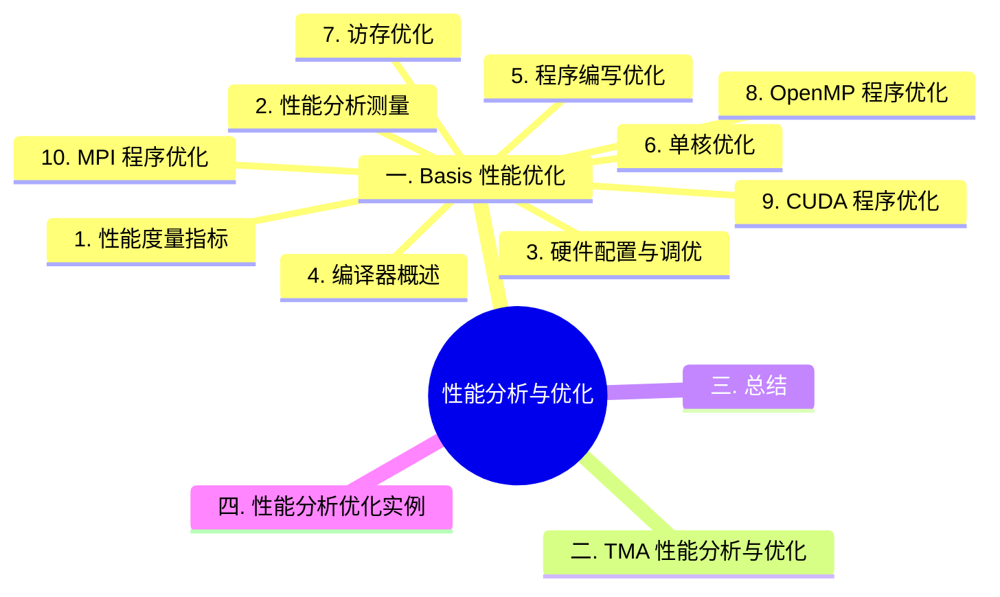

## 一. Basis 性能优化

### 1. [性能度量指标](docs/performance_metrics.md)

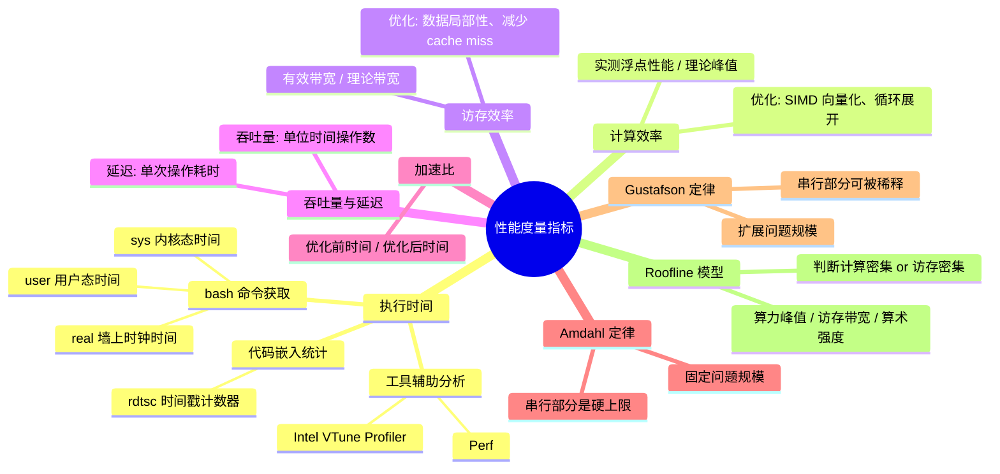

### 2. [性能分析测量](docs/performance_analysis.md)

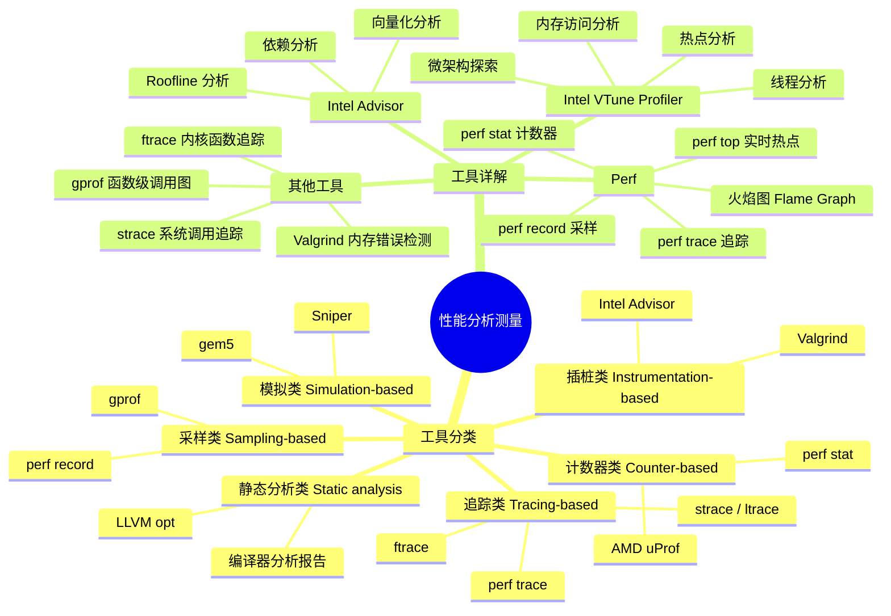

> 代码示例：[`basis/Measure/`](basis/Measure/) — 包含 
> `rdtsc.c`（时间戳计数器测量）、
> `loop_interchange_before/after.c`、
> `loop_unrolling_before/after.c` 等对比测试

### 3. [硬件配置与调优](docs/hardware.md)

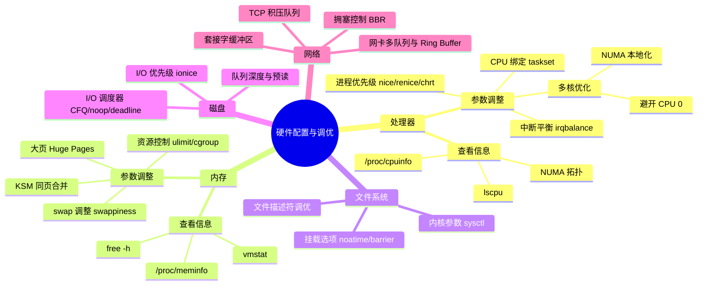

### 4. [编译器概述](docs/compiler.md)

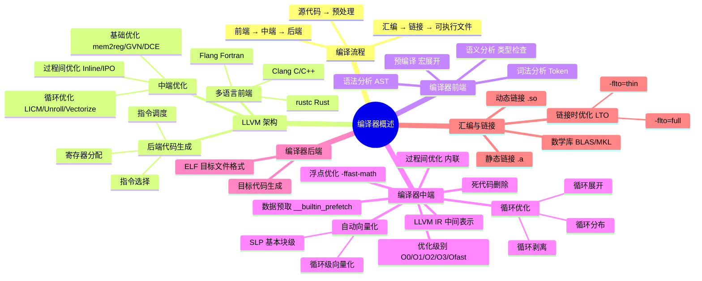

### 5. [程序编写优化](docs/program_optimization.md)

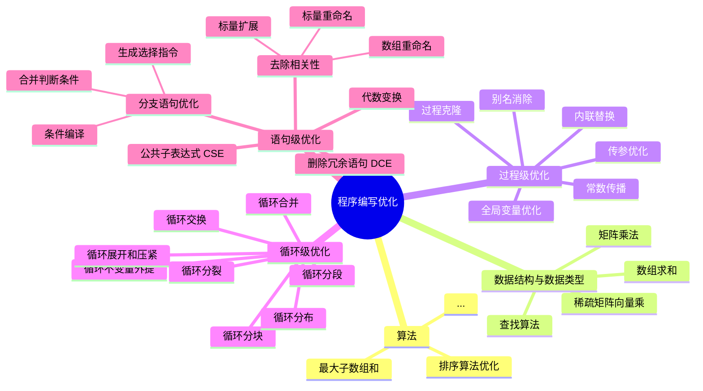

1. 算法 [`basis/Algorithm/`](basis/Algorithm/)
   - [`max_sum.cpp`](basis/Algorithm/max_sum.cpp) — 最大子数组和算法
   - [`sort.cpp`](basis/Algorithm/sort.cpp) — 排序算法优化
2. 数据结构与数据类型 [`basis/DataStructure/`](basis/DataStructure/)
   - [`add.cpp`](basis/DataStructure/add.cpp) / [`add_2.cpp`](basis/DataStructure/add_2.cpp) — 数组求和
   - [`matrix_mul.cpp`](basis/DataStructure/matrix_mul.cpp) — 矩阵乘法
   - [`mul.cpp`](basis/DataStructure/mul.cpp) — 乘法运算
   - [`search.cpp`](basis/DataStructure/search.cpp) — 查找算法
   - [`spmv.cpp`](basis/DataStructure/spmv.cpp) / [`spmv_intro.cpp`](basis/DataStructure/spmv_intro.cpp) — 稀疏矩阵向量乘
3. 过程级优化 [`basis/Intraprocedural/`](basis/Intraprocedural/)
   1. 别名消除 [`alias.c`](basis/Intraprocedural/alias.c)
   2. 常数传播 [`constant.cpp`](basis/Intraprocedural/constant.cpp)
   3. 传参优化 [`param_passing.cpp`](basis/Intraprocedural/param_passing.cpp)
   4. 内联替换 [`inline.cpp`](basis/Intraprocedural/inline.cpp)
   5. 过程克隆 [`procedure.cpp`](basis/Intraprocedural/procedure.cpp)
   6. 全局变量优化 [`global_var.cpp`](basis/Intraprocedural/global_var.cpp)
4. 循环级优化 [`basis/Loop/`](basis/Loop/)
   1. 循环不变量外提 [`invariant.cpp`](basis/Loop/invariant.cpp)
   2. 循环展开和压紧 [`unroll.cpp`](basis/Loop/unroll.cpp) / [`compaction.cpp`](basis/Loop/compaction.cpp)
   3. 循环合并 [`merge.cpp`](basis/Loop/merge.cpp)
   4. 循环分段 [`segment.cpp`](basis/Loop/segment.cpp)
   5. 循环分块 [`block.cpp`](basis/Loop/block.cpp)
   6. 循环交换 [`permutation.cpp`](basis/Loop/permutation.cpp)
   7. 循环分布 [`distribution.cpp`](basis/Loop/distribution.cpp)
   8. 循环分裂 [`splitting.cpp`](basis/Loop/splitting.cpp)
5. 语句级优化 [`basis/Statement/`](basis/Statement/)
   1. 删除冗余语句 [`dce.cpp`](basis/Statement/dce.cpp)
   2. 代数变换 [`algebraic_transformation.cpp`](basis/Statement/algebraic_transformation.cpp)
   3. 去除相关性 [`dependency.cpp`](basis/Statement/dependency.cpp)
      - 标量扩展 [`dependency_scalar_expansion.cpp`](basis/Statement/dependency_scalar_expansion.cpp)
      - 标量重命名 [`dependency_scalar_rename.cpp`](basis/Statement/dependency_scalar_rename.cpp)
      - 数组重命名 [`dependency_array_rename.cpp`](basis/Statement/dependency_array_rename.cpp)
   4. 公共子表达式优化 [`cse.cpp`](basis/Statement/cse.cpp)
   5. 分支语句优化 [`branch_optimization.cpp`](basis/Statement/branch_optimization.cpp)
      - 合并判断条件 [`condition_merge.cpp`](basis/Statement/condition_merge.cpp)
      - 生成选择指令 [`select_optimization.cpp`](basis/Statement/select_optimization.cpp)
      - 运用条件编译 [`conditional_compilation.cpp`](basis/Statement/conditional_compilation.cpp)

### 6. [单核优化](docs/single_core_optimization.md)

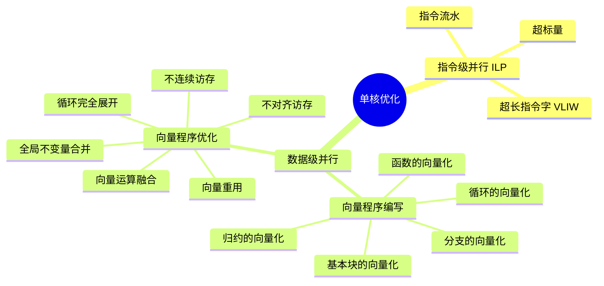

#### 指令级并行 [`basis/ILP/`](basis/ILP/)

1. 指令流水 [`pipeline.cpp`](basis/ILP/pipeline.cpp)
2. 超标量 — 参见 `pipeline.cpp` 中的多发射示例
3. 超长指令字 [`vliw.cpp`](basis/ILP/vliw.cpp)

#### 数据级并行

1. 向量程序编写
   1. 循环的向量化 [`loop_vectorization.cpp`](basis/ILP/loop_vectorization.cpp)
   2. 基本块的向量化 [`basic_block_vectorization.cpp`](basis/ILP/basic_block_vectorization.cpp)
   3. 函数的向量化 [`function_vectorization.cpp`](basis/ILP/function_vectorization.cpp)
   4. 分支的向量化 [`branch_vectorization.cpp`](basis/ILP/branch_vectorization.cpp)
   5. 归约的向量化 [`reduction.cpp`](basis/ILP/reduction.cpp)
2. 向量程序优化
   1. 不对齐访存 [`unaligned_memory_access.cpp`](basis/ILP/unaligned_memory_access.cpp)
   2. 不连续访存 [`non_contignuous_memory_access.cpp`](basis/ILP/non_contignuous_memory_access.cpp)
   3. 向量重用 [`vector_resuse.cpp`](basis/ILP/vector_resuse.cpp)
   4. 向量运算融合 [`vector_operation_fusion.cpp`](basis/ILP/vector_operation_fusion.cpp)
   5. 循环完全展开 [`loop_unroll.cpp`](basis/ILP/loop_unroll.cpp)
   6. 全局不变量合并 [`global_invariant.cpp`](basis/ILP/global_invariant.cpp)

### 7. [访存优化](docs/memory_optimization.md) [`basis/Memory/`](basis/Memory/)

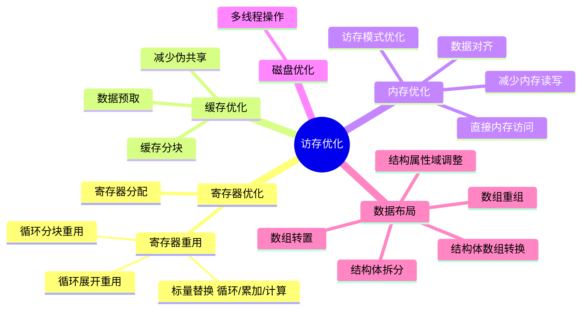

1. 寄存器优化 [`RegisterOptimization/`](basis/Memory/RegisterOptimization/)
   1. 寄存器分配 [`register_allocation.c`](basis/Memory/RegisterOptimization/register_allocation.c)
   2. 寄存器重用
      - 标量替换（循环） [`scalar_replacement_loop.c`](basis/Memory/RegisterOptimization/scalar_replacement_loop.c)
      - 标量替换（累加） [`scalar_replacement_accumulation.c`](basis/Memory/RegisterOptimization/scalar_replacement_accumulation.c)
      - 标量替换（计算） [`scalar_replacement_computation.c`](basis/Memory/RegisterOptimization/scalar_replacement_computation.c)
      - 循环分块重用 [`loop_tiling_register_reuse.c`](basis/Memory/RegisterOptimization/loop_tiling_register_reuse.c)
      - 循环展开重用 [`loop_unroll_register_reuse.c`](basis/Memory/RegisterOptimization/loop_unroll_register_reuse.c)
2. 缓存优化 [`CacheOptimization/`](basis/Memory/CacheOptimization/)
   1. 减少伪共享 [`false_sharing.c`](basis/Memory/CacheOptimization/false_sharing.c) → [`false_sharing_solution.c`](basis/Memory/CacheOptimization/false_sharing_solution.c)
   2. 数据预取 [`data_prefetch.c`](basis/Memory/CacheOptimization/data_prefetch.c) / [`help_thread_prefetch.c`](basis/Memory/CacheOptimization/help_thread_prefetch.c)
   3. 缓存分块 [`matrix_multiply.c`](basis/Memory/CacheOptimization/matrix_multiply.c) → [`matrix_multiply_cache_blocking.c`](basis/Memory/CacheOptimization/matrix_multiply_cache_blocking.c)
3. 内存优化 [`MemoryOptimization/`](basis/Memory/MemoryOptimization/)
   1. 减少内存读写 [`reduce_memory_access.c`](basis/Memory/MemoryOptimization/reduce_memory_access.c)
   2. 数据对齐 [`data_alignment.c`](basis/Memory/MemoryOptimization/data_alignment.c)
   3. 直接内存访问 [`indirect_memory_access.c`](basis/Memory/MemoryOptimization/indirect_memory_access.c)
   4. 访存模式优化 [`array_access_patterns.c`](basis/Memory/MemoryOptimization/array_access_patterns.c) / [`memory_access_optimization.c`](basis/Memory/MemoryOptimization/memory_access_optimization.c)
4. 磁盘优化 [`DiskOptimization/`](basis/Memory/DiskOptimization/)
   1. 多线程操作 [`multi_threaded_matrix_sum.c`](basis/Memory/DiskOptimization/multi_threaded_matrix_sum.c)
5. 数据布局 [`DataLayout/`](basis/Memory/DataLayout/)
   1. 数组重组 [`array_restructuring.c`](basis/Memory/DataLayout/array_restructuring.c)
   2. 数组转置 [`array_transposition.c`](basis/Memory/DataLayout/array_transposition.c)
   3. 结构属性域调整 [`struct_field_adjustment.c`](basis/Memory/DataLayout/struct_field_adjustment.c)
   4. 结构体拆分 [`struct_splitting.c`](basis/Memory/DataLayout/struct_splitting.c)
   5. 结构体数组转换 [`struct_array_conversion.c`](basis/Memory/DataLayout/struct_array_conversion.c)

### 8. [OpenMP 程序优化](docs/openmp_optimization.md) [`basis/OpenMP/`](basis/OpenMP/)

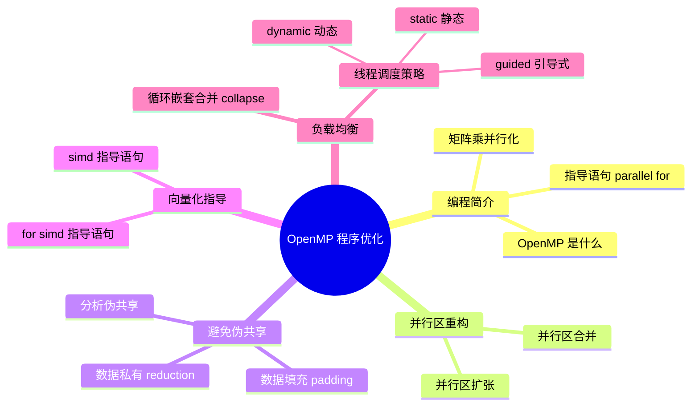

1. OpenMP 编程简介 [`Basics/`](basis/OpenMP/Basics/)
   1. OpenMP 是什么 [`serial_example.c`](basis/OpenMP/Basics/serial_example.c) → [`first_openmp_program.c`](basis/OpenMP/Basics/first_openmp_program.c)
   2. OpenMP 指导语句 [`parallel_for_basics.c`](basis/OpenMP/Basics/parallel_for_basics.c)
   3. OpenMP 版矩阵乘 [`matrix_multiply_serial.c`](basis/OpenMP/Basics/matrix_multiply_serial.c) → [`matrix_multiply_parallel.c`](basis/OpenMP/Basics/matrix_multiply_parallel.c)
2. 并行区重构 [`ParallelRegion/`](basis/OpenMP/ParallelRegion/)
   1. 并行区扩张 [`parallel_region_expansion.c`](basis/OpenMP/ParallelRegion/parallel_region_expansion.c)
   2. 并行区合并 [`parallel_region_merging.c`](basis/OpenMP/ParallelRegion/parallel_region_merging.c)
3. 避免伪共享 [`FalseSharing/`](basis/OpenMP/FalseSharing/)
   1. 分析伪共享 [`false_sharing_analysis.c`](basis/OpenMP/FalseSharing/false_sharing_analysis.c)
   2. 数据填充避免伪共享 [`false_sharing_padding.c`](basis/OpenMP/FalseSharing/false_sharing_padding.c)
   3. 数据私有避免伪共享 [`false_sharing_reduction.c`](basis/OpenMP/FalseSharing/false_sharing_reduction.c)
4. 向量化指导命令 [`Vectorization/`](basis/OpenMP/Vectorization/)
   1. simd 指导语句 [`simd_directive.c`](basis/OpenMP/Vectorization/simd_directive.c)
   2. for simd 指导语句 [`for_simd_directive.c`](basis/OpenMP/Vectorization/for_simd_directive.c)
5. 负载均衡优化 [`LoadBalancing/`](basis/OpenMP/LoadBalancing/)
   1. 循环嵌套合并调度 [`collapse_directive.c`](basis/OpenMP/LoadBalancing/collapse_directive.c)
   2. 线程调度配置策略
      - [`schedule_static.c`](basis/OpenMP/LoadBalancing/schedule_static.c) / [`schedule_dynamic.c`](basis/OpenMP/LoadBalancing/schedule_dynamic.c) / [`schedule_guided.c`](basis/OpenMP/LoadBalancing/schedule_guided.c)

### 9. [CUDA 程序优化](docs/cuda_optimization.md) [`basis/CUDA/`](basis/CUDA/)

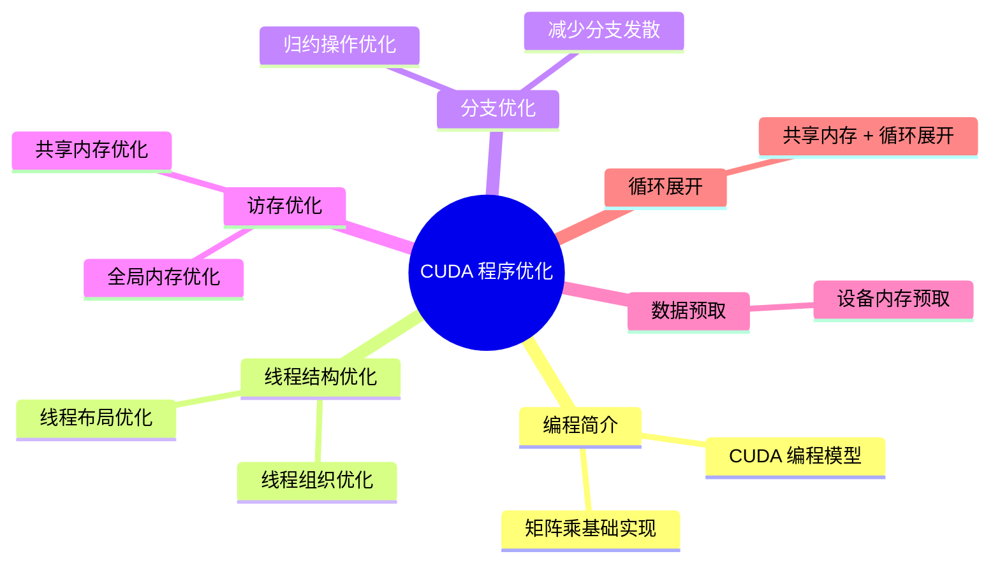

1. CUDA 编程简介 [`Basics/`](basis/CUDA/Basics/)
   1. CUDA 编程模型 [`cuda_programming_basics.cu`](basis/CUDA/Basics/cuda_programming_basics.cu)
   2. CUDA 版矩阵乘 [`matrix_multiply_basic.cu`](basis/CUDA/Basics/matrix_multiply_basic.cu)
2. 线程结构优化 [`ThreadStructure/`](basis/CUDA/ThreadStructure/)
   1. 线程组织优化 [`thread_organization.cu`](basis/CUDA/ThreadStructure/thread_organization.cu)
   2. 线程布局优化 [`thread_layout.cu`](basis/CUDA/ThreadStructure/thread_layout.cu)
3. 分支优化 [`BranchOptimization/`](basis/CUDA/BranchOptimization/)
   - [`reduce_divergence.cu`](basis/CUDA/BranchOptimization/reduce_divergence.cu) — 归约操作中的分支发散分析与优化
4. 访存优化 [`MemoryOptimization/`](basis/CUDA/MemoryOptimization/)
   1. 全局内存优化 [`global_memory_optimization.cu`](basis/CUDA/MemoryOptimization/global_memory_optimization.cu)
   2. 共享内存优化 [`shared_memory_optimization.cu`](basis/CUDA/MemoryOptimization/shared_memory_optimization.cu)
5. 数据预取 [`DataPrefetch/`](basis/CUDA/DataPrefetch/)
   - [`data_prefetch.cu`](basis/CUDA/DataPrefetch/data_prefetch.cu) — 设备内存预取优化
6. 循环展开 [`LoopUnroll/`](basis/CUDA/LoopUnroll/)
   - [`loop_unroll.cu`](basis/CUDA/LoopUnroll/loop_unroll.cu) — 共享内存 + 循环展开

### 10. [MPI 程序优化](docs/mpi_optimization.md) [`basis/MPI/`](basis/MPI/)

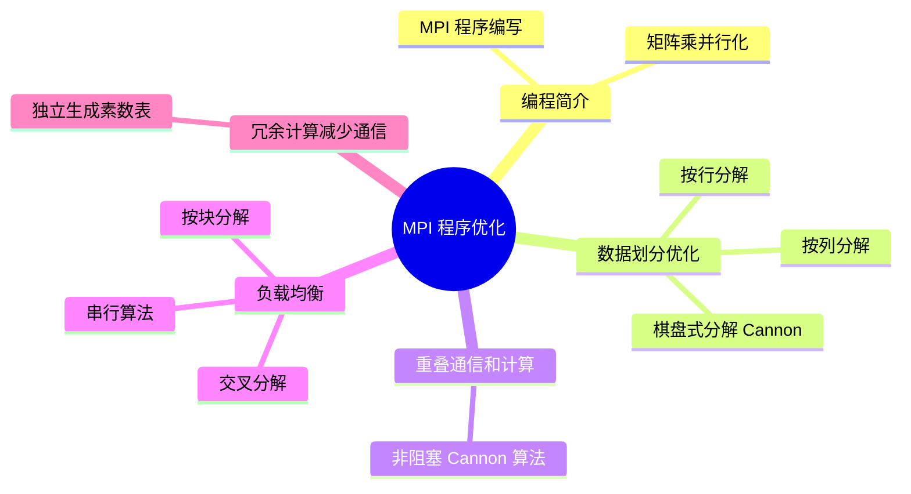

1. MPI 编程简介 [`Basics/`](basis/MPI/Basics/)
   1. MPI 程序编写 [`mpi_hello.c`](basis/MPI/Basics/mpi_hello.c)
   2. MPI 版矩阵乘 [`matrix_multiply_serial.c`](basis/MPI/Basics/matrix_multiply_serial.c) → [`matrix_multiply_basic_parallel.c`](basis/MPI/Basics/matrix_multiply_basic_parallel.c)
2. 数据划分优化 [`DataPartitioning/`](basis/MPI/DataPartitioning/)
   1. 按行分解 [`row_partition.c`](basis/MPI/DataPartitioning/row_partition.c)
   2. 按列分解 [`column_partition.c`](basis/MPI/DataPartitioning/column_partition.c)
   3. 棋盘式分解 [`cannon_algorithm_blocking.c`](basis/MPI/DataPartitioning/cannon_algorithm_blocking.c)
3. 重叠通信和计算 [`OverlapCommunication/`](basis/MPI/OverlapCommunication/)
   - [`cannon_algorithm_nonblocking.c`](basis/MPI/OverlapCommunication/cannon_algorithm_nonblocking.c) — 非阻塞 Cannon 算法
4. 负载均衡优化 [`LoadBalancing/`](basis/MPI/LoadBalancing/)
   1. 串行算法 [`prime_serial.c`](basis/MPI/LoadBalancing/prime_serial.c)
   2. 交叉分解 [`prime_interleaved.c`](basis/MPI/LoadBalancing/prime_interleaved.c)
   3. 按块分解 [`prime_block.c`](basis/MPI/LoadBalancing/prime_block.c)
5. 冗余计算减少通信 [`RedundantComputation/`](basis/MPI/RedundantComputation/)
   - [`prime_redundant.c`](basis/MPI/RedundantComputation/prime_redundant.c) — 每个进程独立生成素数表消除通信

## 二. [TMA 性能分析与优化](docs/tma.md)

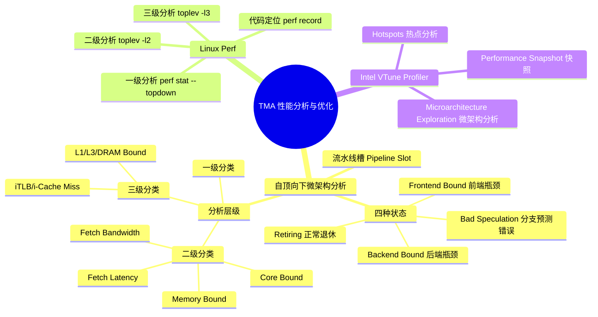

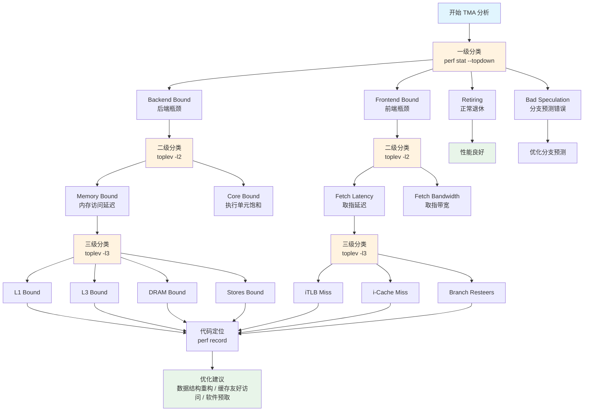

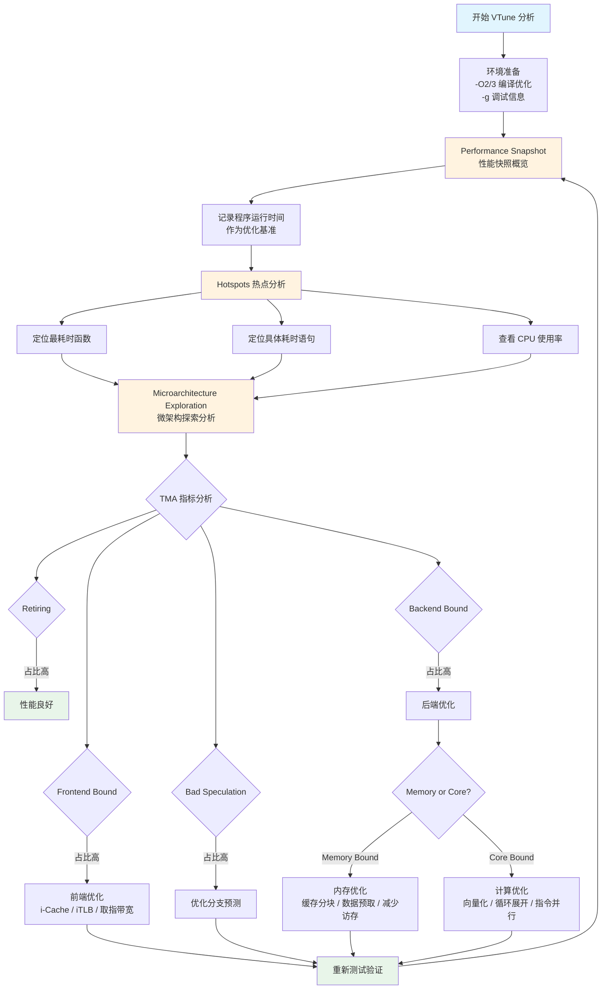

## 三. 总结

> 自己做电子笔记总是力求简洁明了，但貌似也因此，逐渐缺失了言语的组织与表达能力，实际敲字的时候多少还是有点话痨。在当下快节奏的环境下，或许呈现给别人看需要精炼，但自己的思考过程及学习过程中的一些想法仍是值得记录，过程中才会涌现更多的问题，而产生问题的过程在这个 AI 时代对于个人的提升显得更为重要了。

### 性能分析最佳实践

- 进行性能分析所使用程序应与实际生产环境保持一致，开启编译优化选项 `-O2/3`，`-g` 开启调试信息则为分析所必要
- 运行 benchmark 前应将 CPU 调频策略设为 `performance`，锁定最高频率，避免动态调频干扰: `sudo cpupower frequency-set --governor performance`
- 性能分析主要关注 `user` 时间，`real ≈ user + sys` 表示 CPU 密集型，`real >> user + sys` 表示存在 I/O 等待
- 先用 Amdahl 定律定位瓶颈（热点耗时），再用 Gustafson 定律评估扩展潜力，优化重点应放在占比最大的热点代码上
- TMA 分析流程: `perf stat --topdown` 一级分析 → `toplev -l2` 二级分析 → `toplev -l3` 三级分析 → `perf record` 代码定位

### 编译选项注意事项

- 日常开发建议 `-O2`，调试用 `-O0`，生产环境可考虑 `-O3`，`-Ofast` 可能影响浮点精度
- 使用 `-ffast-math` 时需评估精度损失，科学计算和金融领域应谨慎使用
- LTO 对大型项目收益显著，`-flto=thin` 适合增量编译，`-flto=full` 优化更彻底但链接慢
- 使用 `-Rpass=vectorize` 查看向量化成功信息，`-Rpass-missed=loop-vectorize` 查看失败原因

### 算法与数据结构

- 算法复杂度优先: 从 O(n³) 到 O(n) 的优化远超编译器优化或硬件升级
- 在满足精度要求的前提下选择更小的数据类型，小尺寸类型访问速度更快且缓存可容纳更多数据
- AoS 适合同时访问同一元素的多个属性，SoA 适合批量访问同一属性的多个元素（向量化更友好）

### 循环优化要点

- 循环交换: 将携带依赖的循环放在最内层，确保内层循环访问模式连续（行优先）
- 循环分块: 分块大小 S 需满足 `3 × S² × 8 ≤ C`（C 为缓存容量），即 `S ≤ √(C/24)`
- 循环展开会消耗更多寄存器资源，需注意避免过度展开导致寄存器溢出

### 访存优化优先级

- 优化顺序: 寄存器 > 缓存 > 内存 > 磁盘，从离处理器最近的层次开始效果最显著
- 全局变量会独占寄存器，应尽量改为局部变量; 控制单个函数的局部变量数量
- 使用 `alignas(64)` 避免伪共享，使用 `perf c2c` 分析缓存行争用
- 结构体压缩可大幅提升缓存利用率: 实测 40B → 8B，排序性能提升 7.5 倍
- 软件预取适用于访问模式可预测但不连续的场景，顺序访问时硬件预取器通常已足够

### 向量化优化

- 使用 `restrict` 关键字消除指针别名，帮助编译器安全优化
- 去除循环依赖: 使用标量扩展、标量重命名等技术
- 在数据中找寻并行性，而不是在代码中

### 并行优化注意事项

- OpenMP: 并行区应选择最外层循环，线程数建议不超过物理核心数
- OpenMP 调度策略: 规则循环用 `static`，递减型用 `guided`，随机型用 `dynamic`
- CUDA: 合理的二维线程布局（如 16×64 或 32×32）能显著提升性能，避免 (1,1024) 布局
- CUDA: 交错配对法替代相邻配对法可消除分支发散（实测快约 1.7 倍）
- MPI: 使用非阻塞通信实现通信与计算重叠，双缓冲区策略
- MPI: 避免死锁（使用 `MPI_Sendrecv`），确保缓冲区大小匹配，检查 MPI 函数返回值

### 硬件配置建议

- 将性能关键进程绑定到非 CPU 0 的核心，使用 `numactl` 绑定到特定 NUMA 节点
- 数据库服务器设置较低的 swappiness（10-30），内存密集型应用减少或禁用 swap
- 磁盘: 数据库用 deadline 调度器，虚拟机/SSD 用 noop 调度器
- 网络: 高并发增大 somaxconn，高带宽启用 BBR，万兆网络用多队列 + Ring Buffer

## 四. 性能分析优化实例

- 

## 参考

- [CPU 微架构](https://www.bilibili.com/video/BV1a2421M7Tz)
- [现代 CPU 性能分析与优化](https://github.com/dendibakh/perf-ninja)
- [cpp_lecture](https:github.com/gongyiling/cpp_lecture)
- [程序性能优化理论与方法](https://github.com/AdvancedCompiler/AdvancedCompiler)
- [Intel® VTune™ Profiler User Guide](https://www.intel.com/content/www/us/en/docs/vtune-profiler/user-guide/2025-4/overview.html)
