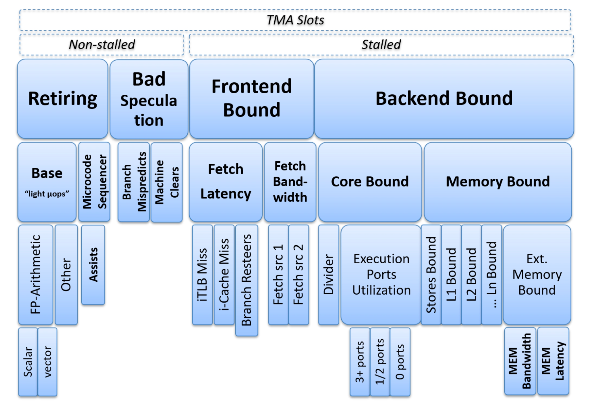

# Performance-Analysis-And-Tuning
性能分析与优化

个人学习过程，总是需经过三个阶段：首先对知识整体有一个概览；在此基础上，针对问题利用已知的理论进行分析；经过对知识实际的使用，对其加深理解。
故该文以上所述思路进行梳理，在第一部分罗列参考资料中所总结的性能优化手段；第二部分，按实际项目开发过程中，性能优化过程进行展开；第三部分性能分析进行总结。

## 1. 性能优化手段

### 编译器优化

- 内联优化
- 循环优化
- 向量化优化
- 并行化优化
- 数据预取优化

### 程序编写优化

- 算法优化
- 数据结构优化
- 过程级优化
    - 别名消除
    - 常数传播
    - 传参优化
    - 内联优化
    - 过程克隆
    - 全局变量优化
- 循环级优化
    - 循环不变量外提
    - 循环展开和压紧
    - 循环合并
    - 循环分段
    - 循环分块
    - 循环交换
    - 循环分裂
    - 循环倾斜
- 语句级优化
    - 删除冗余语句
    - 代数变换
    - 去除相关性
    - 公共子表达式优化
    - 分支语句优化

### 单核优化

- 指令级并行
- 数据级并行

### 访存优化

- 寄存器优化
- 缓存优化
- 内存优化
- 磁盘优化
- 数据布局

## 2. 性能分析与优化

### 自顶向下微架构分析

TMA: Top-Down Microarchitecture Analysis, 自顶向下微架构分析。

“流水线槽（pipeline slot）”是 Intel Top-Down 模型里人为定义的一个**“最小可观察时间单元”**，用来把“CPU 每周期到底干了多少活”量化成可计数的粒度。一句话：一个 slot 就是“一个物理核心在一个时钟周期内所能发射的一条 μOP 的位置”。

流水线槽划分为四种状态：

- Retiring: uOp 正常退休，表示执行效率高	
- Bad Speculation: uOp 因分支预测错误等被丢弃，浪费资源	
- Frontend Bound: 前端无法提供足够 uOp，流水线空转	
- Backend Bound: 后端资源不足，无法执行 uOp，流水线停滞	

CPU 前端：主要目的是有效地从内存中获取指令并解码，将准备好的指令送入 CPU 后端。

CPU 后端：负责指令的实际执行。

---



TMA 分析流程流程，自顶向下：

1. 一级分类

   - Retiring
   - Bad Speculation
   - Frontend Bound
   - Backend Bound

2. 二级分类

   - Backend Bound
       - Memory Bound, 内存访问延迟
       - Core Bound, 执行单元饱和、指令依赖
   - Frontend Bound
       - Fetch Latency
       - Fetch Bandwidth

3. 三级分类，具体的微架构事件

    - Backend Bound
       - Memory Bound
           - Stores Bound
           - L1 Bound
           - ···
       - Core Bound
           - Divider
           - ···
   - Frontend Bound
       - Fetch Latency
           - iTLB Miss
           - i-Cache Miss
           - Branch Resteers
           - ···
       - Fetch Bandwidth

### Linux Perf 中的 TMA

#### 一级分析

```shell
$ perf stat --topdown -a -- taskset -c 0 ./benchmark
Retiring: 25% | Bad Speculation: 2% | Frontend Bound: 8% | Backend Bound: 65%
```

瓶颈在 Backend Bound

#### 二级分析

```shell
$ toplev -l2 --core S0-C0 -- ./benchmark
Backend_Bound.Memory_Bound: 52%
Backend_Bound.Core_Bound: 13%
```

主要瓶颈是 Memory Bound

#### 三级分析

```shell
$ toplev -l3 --core S0-C0 -- ./benchmark
Memory_Bound.L3_Bound: 38%
Memory_Bound.DRAM_Bound: 14%
```

L3 缓存未命中是主因

#### 代码定位

```shell
$ perf record -e MEM_LOAD_RETIRED.L3_MISS ./benchmark
$ perf report
```

发现函数  foo()  中某数组访问模式导致跳步访问（stride access），破坏缓存局部性

优化建议：
- 重构数据结构（如结构体数组 → 数组结构体）
- 使用缓存友好的访问模式
- 启用软件预取（ prefetcht0 ）

### Intel VTune Profiler 中的 TMA


## 3. 总结


## 参考

- [CPU 微架构](https://www.bilibili.com/video/BV1a2421M7Tz)
- [现代 CPU 性能分析与优化](https://github.com/dendibakh/perf-ninja)
- [程序性能优化理论与方法](https://github.com/AdvancedCompiler/AdvancedCompiler)
