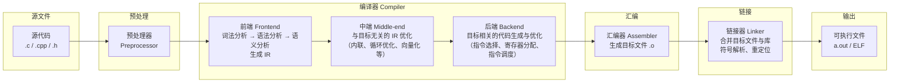
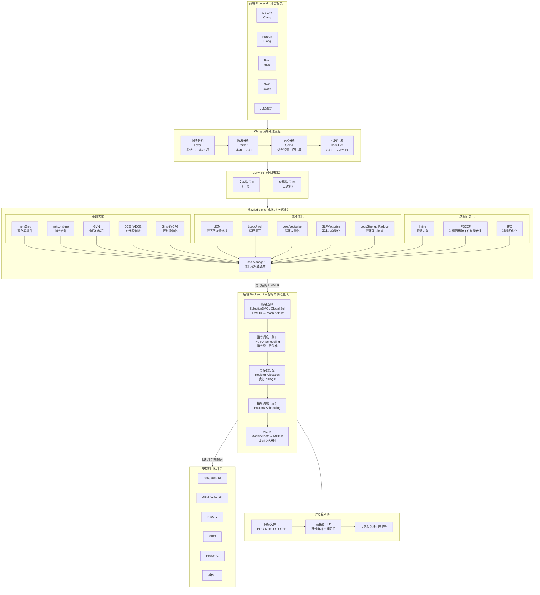
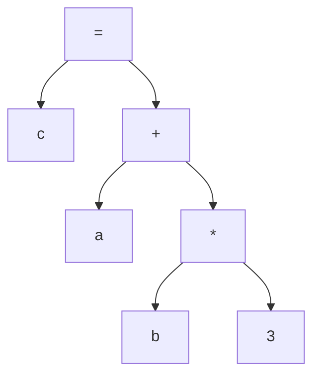
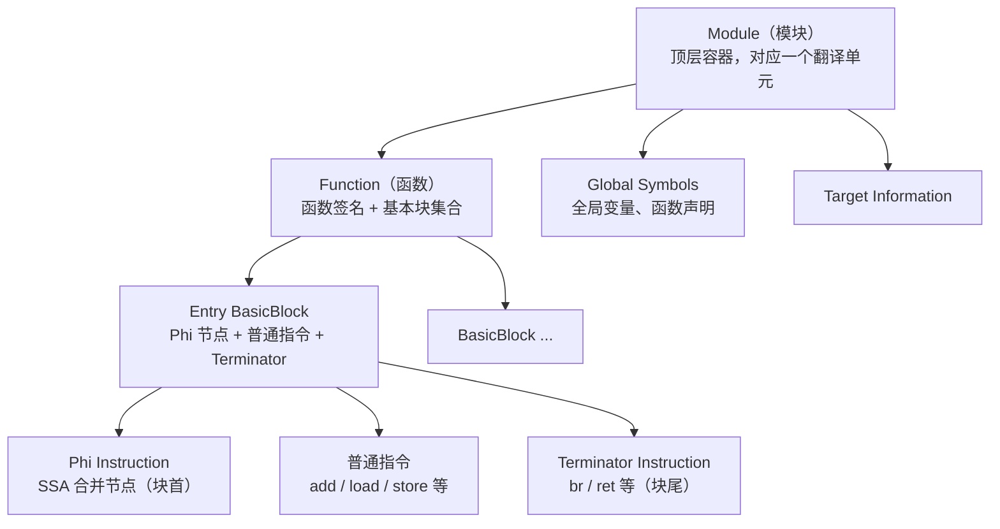
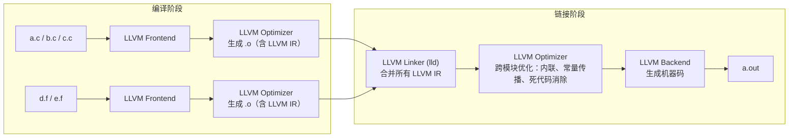

# 编译器概述

- [编译流程](#1-编译流程)
- [LLVM 编译器架构](#2-llvm-编译器架构)
- [编译器前端](#3-编译器前端)
  - [预编译](#31-预编译)
  - [词法分析](#32-词法分析)
  - [语法分析](#33-语法分析)
  - [语义分析](#34-语义分析)
  - [前端相关选项](#35-前端相关选项)
- [编译器中端](#4-编译器中端)
  - [中间代码](#41-中间代码)
  - [优化级别](#42-优化级别)
  - [死代码删除](#43-死代码删除)
  - [过程间优化](#44-过程间优化)
  - [自动向量化](#45-自动向量化)
  - [循环优化](#46-循环优化)
  - [浮点优化](#47-浮点优化)
  - [数据预取优化](#48-数据预取优化)
  - [中端相关选项](#49-中端相关选项)
- [编译器后端](#5-编译器后端)
  - [目标代码生成](#51-目标代码生成)
  - [目标文件格式](#52-目标文件格式)
  - [后端相关选项](#53-后端相关选项)
- [汇编与链接](#6-汇编与链接)
  - [汇编](#61-汇编)
  - [静态链接](#62-静态链接)
  - [动态链接](#63-动态链接)
  - [链接时优化](#64-链接时优化)
  - [数学库](#65-数学库)
  - [汇编与链接相关选项](#66-汇编与链接相关选项)

---

编译器是将高级语言源代码翻译为机器可执行代码的工具链。整个编译过程分为前端、中端、后端三个阶段：前端负责源代码解析与语义检查，中端进行目标无关的分析与优化，后端完成目标相关的代码生成。理解编译器的工作原理和优化手段，是进行程序性能调优的基础。

## 1. 编译流程



---

## 2. LLVM 编译器架构



---

## 3. 编译器前端

编译器前端将源代码翻译为统一的中间表示（LLVM IR），主要包含预编译、词法分析、语法分析、语义分析四个阶段。

### 3.1 预编译

预编译对源代码进行文本层面的替代与整理，生成不含宏定义、条件编译指令和注释的输出文件。主要处理：

1. **文件包含**：展开 `#include` 指令
2. **宏展开**：替换宏定义
3. **条件编译**：处理 `#if` / `#ifdef` 等指令
4. **删除注释**：去除所有注释

```shell
$ clang -E hello.c -o hello.i
```

### 3.2 词法分析

词法分析器读入源代码字符流，扫描并识别出一个个 Token（单词），Token 类型包括：

| 类型   | 说明                       | 示例                           |
| ------ | -------------------------- | ------------------------------ |
| 关键字 | 语言保留字                 | `int`、`float`、`if`、`sizeof` |
| 标识符 | 变量名、数组名、函数名等   | `a`、`foo`、`my_array`         |
| 运算符 | 算术、逻辑、关系运算符等   | `+`、`*`、`==`、`&&`           |
| 分隔符 | 标点符号                   | `,`、`;`、`(`、`)`             |
| 常数   | 整型、浮点型、字符型等常量 | `3`、`3.14`、`'a'`             |

对于语句 `c = a + b * 3;`，词法分析的结果为：

```
标识符(c) 运算符(=) 标识符(a) 运算符(+) 标识符(b) 运算符(*) 常数(3) 分隔符(;)
```

```shell
$ clang -fmodules -fsyntax-only -Xclang -dump-tokens file.c
```

### 3.3 语法分析

语法分析将 Token 序列组合为语法短语，检查是否符合语法规则，并构建**抽象语法树（AST）**。以 `c = a + b * 3` 为例：

文法规则：
- `<表达式>` = 常数 | 标识符 | `<表达式>` `+` `<表达式>` | `<表达式>` `*` `<表达式>`
- `<赋值语句>` = `<标识符>` `=` `<表达式>`

AST 结构：



将字符串格式的源代码转化为树状数据结构，更易于后续分析与优化。

```shell
$ clang -fmodules -fsyntax-only -Xclang -ast-dump file.c
```

### 3.4 语义分析

语义分析审查源代码是否存在语义错误——语法上正确但不符合语义规则的代码，例如使用未声明的变量。主要任务：

1. **静态语义审查**：声明检查、作用域检查
2. **上下文相关性审查**：标识符是否在当前上下文中合法
3. **类型匹配审查**：运算符的操作数类型是否匹配
4. **类型转换**：自动插入必要的类型转换节点

以 `c = a + b * 3` 为例，若 `b` 为 `float` 而 `3` 为 `int`，语义分析会在 AST 中插入 `inttoreal` 转换节点，将整型量转换为浮点量后再执行乘法运算。

### 3.5 前端相关选项

| 选项                | 功能                                       |
| ------------------- | ------------------------------------------ |
| `-E`                | 运行预编译阶段，生成预编译文件             |
| `-include <file>`   | 在预处理之前读取指定头文件                 |
| `-I <directory>`    | 添加 include 搜索路径                      |
| `-F <directory>`    | 添加框架 include 搜索路径                  |
| `-fsyntax-only`     | 仅做语法检查，不生成代码                   |
| `-dump-tokens`      | 词法分析，输出 Token 序列                  |
| `-ast-dump`         | 语法分析，输出抽象语法树                   |
| `-x <language>`     | 指定输入文件的语言类型                     |
| `-std=<standard>`   | 指定语言标准（如 `c11`、`c++17`）          |
| `-stdlib=<library>` | 指定 C++ 标准库（`libstdc++` 或 `libc++`） |
| `-fno-builtin`      | 禁用内建函数的处理和优化                   |
| `-emit-llvm -S`     | 运行编译阶段，生成 `.ll` 中间代码文件      |

---

## 4. 编译器中端

编译器中端对 LLVM IR 进行目标无关的分析与优化，是性能提升的核心阶段。

### 4.1 中间代码

LLVM IR 有三种存在格式：

| 格式     | 后缀  | 说明                   |
| -------- | ----- | ---------------------- |
| 内存表示 | —     | 编译过程中的运行时形式 |
| 位码     | `.bc` | 二进制存储格式         |
| 文本     | `.ll` | 可读的文本格式         |

LLVM IR 采用**静态单赋值（SSA）**形式，使用 LLVM 虚拟指令集。其层次结构：



- **Module**：顶层容器，由目标机器信息、全局符号和元信息组成
- **Function**：函数签名和若干基本块，第一个基本块为入口基本块
- **BasicBlock**：顺序执行的指令集合，只有一个入口和一个出口，最后一条指令为跳转或返回
- **Instruction**：LLVM IR 的最小可执行单位，分为操作指令和内建指令（`llvm.` 前缀，如 `llvm.prefetch`）

**示例：** 将 C 源码编译为 LLVM IR：

```c
// file.c
int a, b, c;
a = 2;
b = 4;
c = a + b * 3;
return c;
```

```llvm
; file.ll
define dso_local i32 @main() #0 {
entry:
  %retval = alloca i32, align 4
  %a = alloca i32, align 4
  %b = alloca i32, align 4
  %c = alloca i32, align 4
  store i32 2, i32* %a, align 4
  store i32 4, i32* %b, align 4
  %0 = load i32, i32* %a, align 4
  %1 = load i32, i32* %b, align 4
  %mul = mul nsw i32 %1, 3
  %add = add nsw i32 %0, %mul
  store i32 %add, i32* %c, align 4
  %2 = load i32, i32* %c, align 4
  ret i32 %2
}
```

IR 指令格式示例：`%add = add nsw i32 %0, %mul`

| 组成部分         | 示例         |
| ---------------- | ------------ |
| 目标寄存器       | `%add`       |
| 运算             | `add`        |
| 标志位           | `nsw`        |
| 类型             | `i32`        |
| 第一、第二操作数 | `%0`、`%mul` |

```shell
$ clang -emit-llvm -S file.c -o file.ll
```

### 4.2 优化级别

优化级别通过 `-O` 选项控制，级别越高优化越激进：

| 选项     | 说明                                                                                                      |
| -------- | --------------------------------------------------------------------------------------------------------- |
| `-O0`    | 无优化，编译最快，适合调试                                                                                |
| `-O1`    | 基础优化：`-instcombine`、`-simplifycfg`、`-loops`、`-loop-unroll`                                        |
| `-O2`    | 标准优化：在 `-O1` 基础上增加 `-inline`、`-fvectorize`、`-fslp-vectorize`                                 |
| `-O3`    | 激进优化：在 `-O2` 基础上增加 `-aggressive-instcombine`、`-callsite-splitting`、`-domtree`                |
| `-Ofast` | 极致优化：在 `-O3` 基础上增加一系列浮点优化（`-ffast-math`、`-fno-signed-zeros`、`-freciprocal-math` 等） |

> 日常开发建议使用 `-O2`，兼顾编译速度与运行性能。调试阶段使用 `-O0` 以保证变量可观察性。对性能敏感的生产环境可考虑 `-O3`，但需注意编译时间和二进制体积的增加。

### 4.3 死代码删除

死代码分为两类：
1. **不可达代码**：控制流上不可能执行到的代码
2. **无效代码**：可以执行，但其结果从未被使用

以以下代码为例，S2 处 `b = a` 的赋值对 `return c` 没有影响，属于死代码：

```c
#include <stdio.h>
#include <stdlib.h>
int main() {
    int a, b, c;
    a = rand();      // S1
    b = rand();
    c = a + b * 3;
    b = a;           // S2: 死代码，b 的值未被后续使用
    return c;
}
```

优化前后对比：

```llvm
; 优化前（关闭死代码删除）
store i32 %call, i32* %a, align 4
store i32 %call1, i32* %b, align 4
%0 = load i32, i32* %a, align 4
%1 = load i32, i32* %b, align 4
%mul = mul nsw i32 %1, 3
%add = add nsw i32 %0, %mul
store i32 %add, i32* %c, align 4
%2 = load i32, i32* %a, align 4    ; a 被重新加载
store i32 %2, i32* %b, align 4     ; b = a（死代码）
%3 = load i32, i32* %c, align 4
ret i32 %3

; 优化后（开启死代码删除）
store i32 %call, i32* %a, align 4
store i32 %call1, i32* %b, align 4
%0 = load i32, i32* %a, align 4
%1 = load i32, i32* %b, align 4
%mul = mul nsw i32 %1, 3
%add = add nsw i32 %0, %mul
store i32 %add, i32* %c, align 4
%2 = load i32, i32* %c, align 4
ret i32 %2                           ; 直接返回，b = a 被删除
```

```shell
$ clang dead.c -emit-llvm -S         # 生成 IR
$ opt file.ll -dse -S                # 执行死代码消除
```

### 4.4 过程间优化

过程间优化（IPO）涉及多个函数之间的变换与优化，内联优化是最常用的方法——将被调函数体直接嵌入调用处，消除函数调用开销并为后续优化创造更多机会。

```c
#include <stdio.h>
#include <stdlib.h>
#define N 256
int add(int* a, int* b) {
    int c;
    c = *a + *b;
    return c;
}
int main() {
    int sum, i;
    int a[N], b[N];
    for (i = 0; i < N; i++) {
        a[i] = rand() % 10;
        b[i] = rand() % 10;
    }
    for (i = 0; i < N; i++) {
        sum += add(&a[i], &b[i]);   // 循环内调用，内联收益高
    }
    printf("%d", sum);
}
```

**内联前**——循环中存在函数调用：

```llvm
for.body7:
  %call12 = call i32 @add(i32* nonnull %arrayidx9, i32* nonnull %arrayidx11)
  %add = add nsw i32 %call12, %sum.027
```

**内联后**——函数体直接展开，消除调用开销：

```llvm
for.body7:
  %2 = load i32, i32* %arrayidx9, align 4
  %3 = load i32, i32* %arrayidx11, align 4
  %add.i = add nsw i32 %3, %2       ; 原 add 函数体被内联
  %add = add nsw i32 %add.i, %sum.027
```

```shell
$ opt test.ll -S -inline -o test-new.ll
$ clang test.c -O2 -Rpass=inline
# test.c:17:12: remark: add inlined into main with (cost=-25, threshold=337) [-Rpass=inline]
```

### 4.5 自动向量化

自动向量化将串行代码转化为向量代码，利用数据级并行提升性能。LLVM 支持两种方法：

**循环级向量化**：将循环中多次迭代的操作合并为一条向量指令。通过 `-fvectorize` 开启，`-O2` 及以上默认开启。

```c
// 标量循环
for (j = 0; j < N; j++) {
    sum = sum + a[j];
}
```

```llvm
; 向量化后——每次处理 4 个元素
vector.body28:
  %vec.phi = phi <4 x i32> [ %6, %vector.body28 ], [ zeroinitializer, %vector.body ]
  %wide.load = load <4 x i32>, <4 x i32>* %5, align 16
  %6 = add <4 x i32> %wide.load, %vec.phi
  %index.next31 = add i64 %index30, 4
```

**基本块级向量化（SLP）**：在基本块内寻找可并行执行的同构标量操作，打包为向量操作。通过 `-fslp-vectorize` 开启。

```c
// 手动展开的同构操作
a[i]   = b[i]   + c[i];
a[i+1] = b[i+1] + c[i+1];
a[i+2] = b[i+2] + c[i+2];
a[i+3] = b[i+3] + c[i+3];
```

```llvm
; SLP 向量化后
%wide.load.b = load <4 x i32>, <4 x i32>* %5, align 16
%wide.load.c = load <4 x i32>, <4 x i32>* %7, align 16
%add.vec = add nsw <4 x i32> %wide.load.c, %wide.load.b
store <4 x i32> %add.vec, <4 x i32>* %10, align 16
```

等效伪代码：`a[i:i+3] = b[i:i+3] + c[i:i+3]`

| 方法     | 粒度   | 复杂度 | 开启选项          |
| -------- | ------ | ------ | ----------------- |
| 循环级   | 跨迭代 | 较低   | `-fvectorize`     |
| 基本块级 | 块内   | 较高   | `-fslp-vectorize` |

### 4.6 循环优化

**循环展开**：将循环体复制多份，减少分支判断开销，增大指令调度空间。

```c
for (j = 0; j < N; j++) {
    sum = sum + a[j];
}
```

展开后每次迭代处理 4 个元素，循环次数减少为原来的 1/4：

```llvm
for.body3:
  %add   = add nsw i32 %9, %sum.018       ; j
  %add.1 = add nsw i32 %10, %add          ; j+1
  %add.2 = add nsw i32 %11, %add.1        ; j+2
  %add.3 = add nsw i32 %12, %add.2        ; j+3
  %indvars.iv.next.3 = or i64 %indvars.iv, 4
```

```shell
$ clang unroll.c -O1 -funroll-loops
```

**循环分布**：将一个循环拆分为多个独立循环，使每个循环只包含一组相关的操作，消除循环依赖，便于后续向量化。

```c
for (i = 1; i < N; i++) {
    A[i] = i;           // 无依赖
    B[i] = 2 + B[i];    // 无依赖
    C[i] = 3 + C[i-1];  // 有循环依赖
}
```

循环分布后，A/B 的写入与 C 的计算被拆分到两个循环中，A/B 部分可向量化。

```shell
$ clang -O1 LoopDistribute.c -mllvm -enable-loop-distribute
```

**循环剥离**：将循环前几次迭代（通常因地址不对齐）剥离出来单独执行，使剩余循环满足向量对齐要求，常与循环展开配合使用。

```c
for (i = 0; i < N - 2; i++) {
    c[i + 2] = a[i + 2] + b[i + 2];   // c[2] 起始，地址可能不对齐
}
```

剥离前 `c[2]` 不满足 16 字节对齐，剥离 2 次迭代后剩余部分可向量化：

```
剥离前: c[2] c[3] c[4] c[5] | c[6] c[7] c[8] c[9]  (不对齐)
剥离后: c[2] c[3] | c[4] c[5] c[6] c[7]             (对齐)
```

```shell
$ clang test-peel.cpp -O2 -mllvm -unroll-peel-count=2
```

### 4.7 浮点优化

浮点运算因精度和舍入规则限制，编译器默认不做激进优化。使用 `-ffast-math` 可开启一系列浮点优化（归约向量化、除法转倒数乘法、忽略零符号等），但可能影响计算精度。

```c
float sum = 0;
float a[N];
for (j = 0; j < N; j++) {
    sum = sum + a[j];   // 浮点归约，无 -ffast-math 时无法向量化
}
```

```shell
# 无 -ffast-math：浮点归约循环无法向量化
$ clang ffast.c -fvectorize -O1 -Rpass-missed=loop-vectorize
ffast.c:10:18: remark: loop not vectorized [-Rpass-missed=loop-vectorize]

# 有 -ffast-math：浮点归约循环可以向量化
$ clang ffast.c -fvectorize -O1 -ffast-math -Rpass=loop-vectorize
ffast.c:10:18: remark: vectorized loop (vectorization width: 4, interleaved count: 1) [-Rpass=loop-vectorize]
```

> 使用 `-ffast-math` 时需评估精度损失对计算结果的影响。对于科学计算和金融领域等对精度敏感的场景，应谨慎使用或仅在验证精度后启用。

### 4.8 数据预取优化

编译器支持两种预取方式：

1. **自动预取**：编译器分析后自动插入预取指令（当前仅支持 AArch64 和 PowerPC）
2. **手动预取**：使用内建函数 `__builtin_prefetch(addr, rw, locality)`

| 参数       | 说明                                            |
| ---------- | ----------------------------------------------- |
| `addr`     | 预取的内存地址                                  |
| `rw`       | 0 = 预取读，1 = 预取写                          |
| `locality` | 0-3，数据的时间局部性（0 = 无，3 = 高度局部性） |

```c
for (i = 0; i < 10; i++) {
    __builtin_prefetch(arr + i, 1, 3);   // 预取写，高局部性
    arr[i % 10] = i;
}
```

```llvm
for.body:
  %add.ptr = getelementptr inbounds i32, i32* %arraydecay, i64 %idx.ext
  %2 = bitcast i32* %add.ptr to i8*
  call void @llvm.prefetch.p0i8(i8* %2, i32 1, i32 3, i32 1)
```

```shell
$ clang prefetch.c -emit-llvm -S
```

### 4.9 中端相关选项

**内联优化：**

| 选项                 | 功能                       |
| -------------------- | -------------------------- |
| `-inline`            | 打开内联函数功能           |
| `-finline-functions` | 对合适的函数进行内联       |
| `-inline-aggressive` | 链接时优化期间开启激进内联 |

**循环优化：**

| 选项                             | 功能             |
| -------------------------------- | ---------------- |
| `-funroll-loops`                 | 打开循环展开     |
| `-fno-unroll-loops`              | 关闭循环展开     |
| `-mllvm -unroll-count`           | 确定展开次数     |
| `-mllvm -unroll-peel-count`      | 设置循环剥离计数 |
| `-mllvm -enable-loop-distribute` | 打开循环分布优化 |

**向量化：**

| 选项                | 功能                             |
| ------------------- | -------------------------------- |
| `-fvectorize`       | 开启循环向量化优化               |
| `-fslp-vectorize`   | 开启基本块级向量化               |
| `-interleave-loops` | 循环向量化过程中启用循环跨幅访存 |

**浮点优化：**

| 选项                | 功能                                     |
| ------------------- | ---------------------------------------- |
| `-ffast-math`       | 开启一系列浮点优化功能                   |
| `-freciprocal-math` | 除法转倒数乘法（包含于 `-ffast-math`）   |
| `-fno-signed-zeros` | 忽略浮点零的符号（包含于 `-ffast-math`） |

**数据预取：**

| 选项                         | 功能                                  |
| ---------------------------- | ------------------------------------- |
| `-mllvm -loop-data-prefetch` | 开启自动预取（仅 AArch64 和 PowerPC） |

**优化信息输出：**

| 选项                              | 功能                    |
| --------------------------------- | ----------------------- |
| `-Rpass=vectorize`                | 显示向量化成功的信息    |
| `-Rpass=loop-unroll`              | 显示循环展开/剥离的信息 |
| `-Rpass-missed=loop-unroll`       | 显示循环展开失败的信息  |
| `-Rpass=loop-distribute`          | 显示循环分布的信息      |
| `-Rpass-analysis=loop-distribute` | 显示循环分布的分析信息  |

---

## 5. 编译器后端

编译器后端将 LLVM IR 转换为特定机器上的目标代码，涉及指令选择、寄存器分配、指令调度等。

### 5.1 目标代码生成

后端将中间代码变换为目标代码，形式包括：绝对指令代码、可重定位指令代码、汇编指令代码。工作内容涉及硬件功能部件的运用、机器指令的选择、数据类型变量的存储空间分配以及寄存器分配等。

以 `c = a + b * 3` 为例，从源码到 LLVM IR 再到 x86 汇编的完整流程：

```c
// file.c
a = 2;
b = 4;
c = a + b * 3;
```

```llvm
; file.ll
store i32 2, i32* %a, align 4
store i32 4, i32* %b, align 4
%0 = load i32, i32* %a, align 4
%1 = load i32, i32* %b, align 4
%mul = mul nsw i32 %1, 3
%add = add nsw i32 %0, %mul
store i32 %add, i32* %c, align 4
```

```asm
# file.s (x86_64)
movl   $2, -8(%rbp)          # a = 2
movl   $4, -12(%rbp)         # b = 4
movl   -8(%rbp), %eax        # eax = a
imull  $3, -12(%rbp), %ecx   # ecx = b * 3
addl   %ecx, %eax            # eax = a + b * 3
movl   %eax, -16(%rbp)       # c = eax
```

汇编指令格式：`addl %ecx, %eax` 由操作码（`addl`，加法操作）和两个操作数（`%ecx`、`%eax`）组成，结果存放在目标操作数 `%eax` 中。

```shell
$ clang -S file.c -o file.s
```

### 5.2 目标文件格式

目标文件是源代码编译后但未链接的中间文件，在 Linux 下采用 **ELF（Executable Linkable Format）** 格式存储，与可执行文件结构几乎相同。

ELF 文件结构：

| 组成部分          | 说明                                                 |
| ----------------- | ---------------------------------------------------- |
| **ELF 头**        | 文件基本属性：ELF 版本、目标机器型号、程序入口地址等 |
| **节头表**        | 描述各节的位置、大小、偏移等信息                     |
| **节（Section）** | ELF 头与节头表之间的实际数据                         |

ELF 文件中的主要节（Section）：

| 节名        | 说明                                                             |
| ----------- | ---------------------------------------------------------------- |
| `.text`     | 已编译程序的机器代码                                             |
| `.rodata`   | 只读数据（如 `printf` 的格式串）                                 |
| `.data`     | 已初始化的全局变量和局部静态变量                                 |
| `.bss`      | 未初始化的全局变量和局部静态变量（不占文件空间）                 |
| `.symtab`   | 符号表：本模块定义和引用的函数、全局变量信息                     |
| `.rel.text` | `.text` 节的重定位表：链接时需要修正的外部函数调用和全局变量引用 |
| `.rel.data` | `.data` 节的重定位表：本模块引用或定义的全局变量重定位信息       |
| `.debug`    | 调试符号表（需 `-g` 编译选项生成）                               |
| `.line`     | 源程序行号与 `.text` 中机器指令的映射                            |
| `.strtab`   | 字符串表：`.symtab` 和 `.debug` 中符号名、节名的存储             |

这十个节组成可重定位目标文件，通过链接器组合后形成可执行程序。

### 5.3 后端相关选项

**编译阶段：**

| 选项 | 功能                             |
| ---- | -------------------------------- |
| `-S` | 运行编译阶段，生成 `.s` 汇编文件 |

**数据选项：**

| 选项               | 功能                                       |
| ------------------ | ------------------------------------------ |
| `-malign-double`   | 在 struct 中将 double 对齐为双字（仅 x86） |
| `-mdouble=<value>` | 指定 double 类型数据的位数                 |

**目标平台选项：**

| 选项               | 功能                                        |
| ------------------ | ------------------------------------------- |
| `-march=<cpu>`     | 为特定处理器生成代码（如 `-march=native`）  |
| `-msse`            | 支持 MMX 和 SSE 内置函数和代码生成          |
| `-msse2`           | 在 `-msse` 基础上增加 SSE2 支持             |
| `-mavx2`           | 在 `-mavx` 基础上增加 AVX2 内置函数和指令集 |
| `--cuda-host-only` | 只编译 CUDA 的主机端代码                    |

**后端优化选项：**

| 选项                          | 功能                             |
| ----------------------------- | -------------------------------- |
| `-mfentry`                    | 在函数入口插入对 `fentry` 的调用 |
| `-mllvm -disable-x86-lea-opt` | 关闭 LEA 优化                    |

---

## 6. 汇编与链接

### 6.1 汇编

汇编器将汇编代码转换为机器指令，每个汇编语句对应一条机器指令，由 `.s` 文件生成 `.o` 目标文件。

```shell
$ clang -c file.s -o file.o
$ llvm-mc -filetype=obj file.s -o file.o
```

若有变量定义在其它目标文件中，只有链接时才能确定绝对地址。现代编译器将每个源文件编译为可重定位目标文件，最终由链接器合并为可执行文件。

链接的功能是将一个或多个目标文件及库文件合并为可执行文件。根据完成时机分为静态链接和动态链接。

```shell
$ clang a.o b.o -o ab.out
```

### 6.2 静态链接

静态链接在形成可执行程序前完成，链接器将外部函数所在的静态库直接拷贝到可执行文件中，执行时这些代码被装入进程的虚拟地址空间。

```c
// a.c
extern int shared;
int main(void) {
    int a = 100;
    add(&a, &shared);
    printf("%d", a);
}

// b.c
int shared = 1;
void add(int* a, int* b) {
    *a = *a + *b;
}
```

```shell
$ clang a.c -c -o a.o
$ clang b.c -c -o b.o
$ clang a.o b.o -o ab.out
```

### 6.3 动态链接

动态链接在程序运行时完成，将程序拆分成相对独立的部分，在执行时才链接在一起形成完整程序。

```c
// hello.h
void hello(char *s);

// hello.c
void hello(char *s) {
    printf("Hello %s\n", s);
}

// main.c
#include "hello.h"
int main(int argc, char** argv) {
    hello("ZZ");
    return 0;
}
```

```shell
$ clang -c -fPIC hello.c
$ clang -shared -fPIC hello.o -o libhello.so
$ clang main.c -L. -lhello -o a.out
```

**静态链接与动态链接对比：**

| 维度     | 静态链接                          | 动态链接                           |
| -------- | --------------------------------- | ---------------------------------- |
| 链接时机 | 形成可执行程序前                  | 程序执行时                         |
| 方式     | 地址与空间分配 + 符号解析与重定位 | 装载时重定位 + 地址无关代码（PIC） |
| 库扩展名 | `.a`                              | `.so`                              |
| 优点     | 启动和运行速度快，方便移植        | 节省内存和磁盘空间                 |
| 缺点     | 浪费内存和磁盘空间，模块更新困难  | 增加运行时链接开销，可移植性差     |

### 6.4 链接时优化

链接时优化（LTO）在链接阶段对多个目标文件进行跨模块优化，缩减代码体积并提升运行时性能。通过 `-flto` 选项指示编译器生成包含 LLVM 位码的 `.o` 文件，将代码生成延迟到链接阶段。



当链接器检测到 `.o` 文件为 LLVM 位码时，会将所有位码读入内存并链接，然后进行跨文件的内联、常量传播和更激进的死代码消除等优化。

`-flto` 的两种模式：

| 模式         | 说明                                                                | 特点                 |
| ------------ | ------------------------------------------------------------------- | -------------------- |
| `-flto=full` | 将所有目标文件的 LLVM IR 合并为一个大模块，整体分析优化后生成机器码 | 优化更彻底，速度较慢 |
| `-flto=thin` | 保持目标文件独立，按需从其他模块导入功能                            | 链接速度更快         |

> LTO 对大型项目收益显著，尤其是跨模块调用频繁的场景。`-flto=thin` 在保持大部分优化效果的同时，链接速度远快于 `-flto=full`，适合增量编译和大型工程。

**LTO 示例：**

```c
// a.h
extern int foo1(void);

// a.c
#include "a.h"
static signed int i = 0;
void foo2(void) { i = -1; }
static int foo3() { foo4(); return 10; }
int foo1(void) {
    int data = 0;
    if (i < 0) data = foo3();
    data = data + 42;
    return data;
}

// main.c
#include <stdio.h>
#include "a.h"
void foo4(void) { printf("Hi\n"); }
int main() { return foo1(); }
```

```shell
$ clang -flto -c a.c -o a.o
$ clang -c main.c -o main.o
$ clang -flto a.o main.o -o main
```

LTO 优化后，链接器可以跨模块分析：`foo2()` 从未被调用，`foo4()` 可被内联到 `foo3()`，`foo3()` 又可被内联到 `foo1()`，最终 `foo1()` 可被内联到 `main()` 中，消除所有函数调用开销。

### 6.5 数学库

数学库是科学计算、工程计算的核心基础软件。使用数学库可缩短开发周期并获取性能收益。

```c
#include <stdio.h>
#include <math.h>
#define PI 3.1415927
int main() {
    double a = (30 * PI / 180);
    a = sin(a);
    printf("%lf\n", a);
}
```

```shell
$ clang math.c -lm
```

**BLAS（Basic Linear Algebra Subprograms）** 是一组高质量的向量、矩阵运算子程序，开发者只需将计算抽象为矩阵、向量的基本运算，即可调用 BLAS 库函数而不必关心底层性能优化。

BLAS 三个层级：

| 层级    | 运算类型              | 示例           |
| ------- | --------------------- | -------------- |
| Level 1 | 向量-向量 / 向量-标量 | `dot`、`axpy`  |
| Level 2 | 矩阵-向量             | `gemv`、`symv` |
| Level 3 | 矩阵-矩阵             | `gemm`、`symm` |

BLAS 函数命名由三部分组成：**数据类型** + **矩阵类型** + **操作类型**。

数据类型：

| 前缀 | 含义       |
| ---- | ---------- |
| `s`  | 单精度实数 |
| `d`  | 双精度实数 |
| `c`  | 单精度复数 |
| `z`  | 双精度复数 |

矩阵类型：

| 后缀 | 含义           |
| ---- | -------------- |
| `ge` | 普通矩阵       |
| `gb` | 带状矩阵       |
| `sy` | 对称矩阵       |
| `he` | 自共轭矩阵     |
| `hb` | 自共轭带状矩阵 |
| `tr` | 三角矩阵       |
| `tb` | 三角带状矩阵   |

常用操作：

| 操作   | 说明                      |
| ------ | ------------------------- |
| `dot`  | 标量运算                  |
| `axpy` | 向量-向量操作             |
| `mv`   | 矩阵-向量乘积             |
| `sv`   | 解线性方程组（矩阵-向量） |
| `mm`   | 矩阵-矩阵乘积             |
| `sm`   | 解线性方程组（矩阵-矩阵） |

例如：`dgemm` = **d**（双精度）+ **ge**（普通矩阵）+ **mm**（矩阵乘积）

**Intel MKL（Math Kernel Library）** 是英特尔的数学核心函数库，包含 BLAS 等功能。使用时需引用 `mkl_cblas.h`。

```shell
# ICC 编译器链接 MKL
$ icc -mkl              # 并行链接（默认）
$ icc -mkl=sequential   # 串行链接
$ icc -mkl=cluster      # Cluster 库链接
```

**MKL 示例（矩阵乘法）：**

```c
#include <mkl_cblas.h>
#include <stdlib.h>

void init_arr(int N, double* a) {
    for (int i = 0; i < N; i++)
        for (int j = 0; j < N; j++)
            a[i * N + j] = (i + j + 1) % 10;
}

int main() {
    int N = 1000;
    double alpha = 1.0, beta = 0.0;
    double* a = (double*)malloc(sizeof(double) * N * N);
    double* b = (double*)malloc(sizeof(double) * N * N);
    double* c = (double*)malloc(sizeof(double) * N * N);
    init_arr(N, a);
    init_arr(N, b);
    cblas_dgemm(CblasRowMajor, CblasNoTrans, CblasNoTrans,
                N, N, N, alpha, b, N, a, N, beta, c, N);
    free(a); free(b); free(c);
    return 0;
}
```

**数学库优化：** 在性能要求苛刻的场景下，可将标量运算手动改为向量运算。以 `abs` 为例，使用 SSE 内建函数同时处理 4 个值：

```c
// 标量版本
for (i = 0; i < N; i++) {
    local = ref[i] - cur[i];
    sum += abs(local);
}

// 向量版本（SSE）
#include <x86intrin.h>
for (i = 0; i < N / 4; i++) {
    __m128i v0 = _mm_load_epi32(ref + 4 * i);
    __m128i v1 = _mm_load_epi32(cur + 4 * i);
    __m128i v3 = _mm_sub_epi32(v0, v1);
    __m128i v4 = _mm_abs_epi32(v3);
    int A[4];
    _mm_store_epi32(A, v4);
    sum += A[0] + A[1] + A[2] + A[3];
}
```

### 6.6 汇编与链接相关选项

**汇编：**

| 选项 | 功能                                           |
| ---- | ---------------------------------------------- |
| `-c` | 运行编译、汇编阶段，不链接，生成 `.o` 目标文件 |
| `-o` | 运行编译、汇编、链接阶段，生成可执行文件       |

**链接：**

| 选项             | 功能                                      |
| ---------------- | ----------------------------------------- |
| `-Bstatic`       | 静态链接用户生成的库                      |
| `-l<库文件>`     | 指定链接的库名（如 `libxyz.a` → `-lxyz`） |
| `-L<库目录>`     | 指定库的搜索目录                          |
| `-shared-libsan` | 动态链接 sanitizer 运行时                 |
| `-flto=<value>`  | 链接时优化模式：`full` 或 `thin`          |
| `-lm`            | 链接基础数学库                            |
