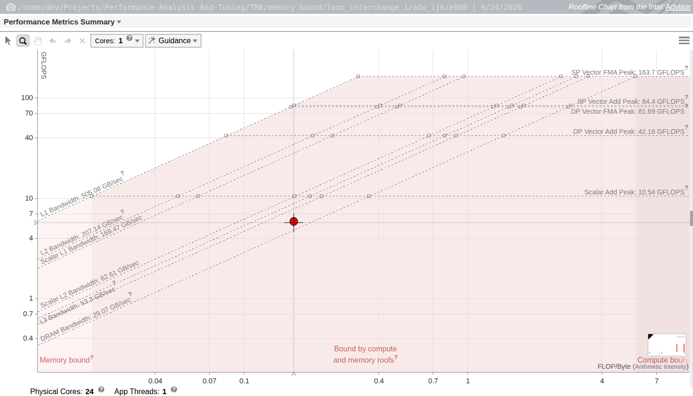
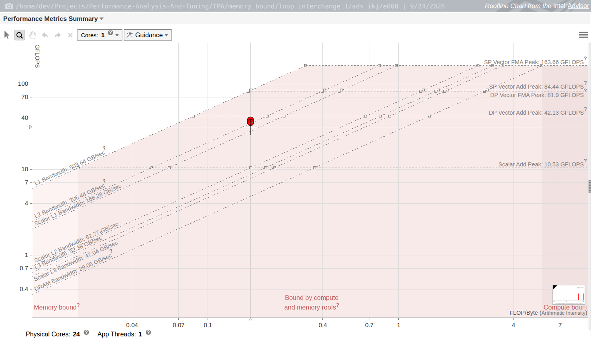
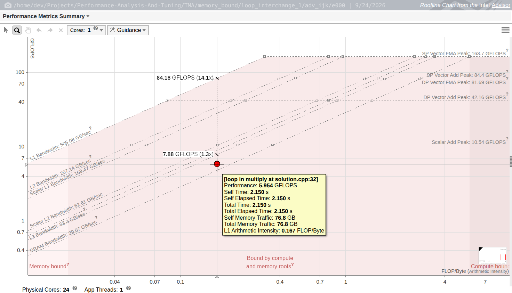
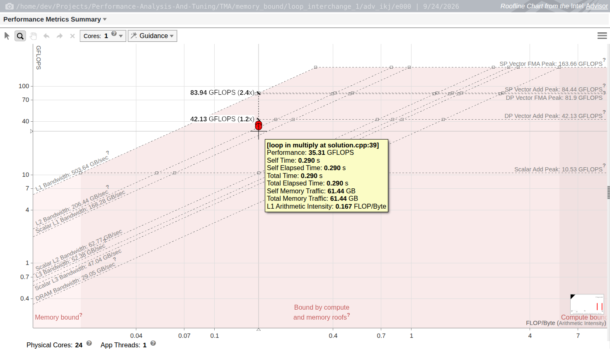

# Intel Advisor 性能分析指导

> 本文档是 Intel® Advisor 的使用指导，以 [`TMA/memory_bound/loop_interchange_1`](../TMA/memory_bound/loop_interchange_1/)（400×400 单精度矩阵乘法循环交换）为贯穿案例，记录**优化前 / 优化后**在 Advisor 下的完整分析过程与结论。
>
> 文中所有数值均来自本机实际采集，工程与报告落盘在 `TMA/memory_bound/loop_interchange_1/adv_ijk/`、`adv_ikj/`，可按第 9 章命令逐条复现。
>
> 采集环境：Intel® Advisor 2026.0.0 (build 616522) · Intel® Core™ Ultra 7 270K Plus (Arrow Lake, 24C/24T) · GCC 15.2.0 · Ubuntu

---

## 目录

1. [Advisor 能回答什么问题](#1-advisor-能回答什么问题)
2. [环境与前置条件](#2-环境与前置条件)
3. [命令行工作流总览](#3-命令行工作流总览)
4. [分析一：Survey — 热点与矢量化诊断](#4-分析一survey--热点与矢量化诊断)
5. [分析二：Trip Counts & FLOP 与 Roofline 模型](#5-分析二trip-counts--flop-与-roofline-模型)
6. [分析三：Memory Access Patterns (MAP)](#6-分析三memory-access-patterns-map)
7. [分析四：Dependencies — 矢量化与并行的阻碍](#7-分析四dependencies--矢量化与并行的阻碍)
8. [分析五：Suitability — 并行性建模与标注](#8-分析五suitability--并行性建模与标注)
9. [案例实战：loop_interchange_1 优化前后全链路分析](#9-案例实战loop_interchange_1-优化前后全链路分析)
10. [踩坑记录与勘误](#10-踩坑记录与勘误)
11. [速查表](#11-速查表)
12. [参考资料](#12-参考资料)

---

## 1. Advisor 能回答什么问题

Intel Advisor 的定位是**循环级（loop-level）优化导航**：它不告诉你"哪条指令慢了几个 cycle"，而是回答"这个循环值不值得优化、被什么限制、优化后离硬件上限还差多少"。

| 分析类型 | 回答的问题 | CLI 动作 | 案例中的结论 |
|---------|-----------|---------|-------------|
| **Survey** | 时间花在哪？哪些循环没向量化？ | `--collect=survey` | 100% 时间在 `multiply` 内层循环，类型为 `Scalar` |
| **Trip Counts & FLOP** | 循环迭代多少次？做了多少算/访存？ | `--collect=tripcounts --flop` | 内层 400 次迭代，AI = 0.167 FLOP/Byte |
| **Roofline** | 距离硬件算力/带宽上限还有多远？是算力受限还是访存受限？ | `--collect=roofline`（Survey + Trip Counts 一键） | 交换前受限在 L3/DRAM 斜线，交换后抬到 L2 屋顶 |
| **Memory Access Patterns (MAP)** | 访存步长是多少？缓存行利用率如何？footprint 多大？ | `--collect=map` | 交换前 5 处"常量步长 400"（严重度 3），交换后全部单位步长 |
| **Dependencies** | 循环携带依赖是否阻止矢量化/并行化？ | `--collect=dependencies` | 交换前内层循环 WAW 依赖（Error），交换后"无依赖" |
| **Suitability** | 加上线程后能加速多少？开销在哪？ | `--collect=suitability`（需标注） | 本案例为串行代码，未采集（见第 8 章） |
| **Offload / Projection** | 换到 GPU / 更大核数上会怎样？ | `--collect=offload`、`--collect=projection` | 本文不展开 |

**与 VTune / perf 的分工**（三者互补，不要互相替代）：

| 工具 | 视角 | 典型问题 | 输出粒度 |
|------|------|---------|---------|
| `perf` + TMA | 微架构计数器 | 瓶颈属于 Frontend/Backend/Memory/Core 哪一类 | 函数 / 指令 / 事件 |
| VTune | 完整 TMA 层级 + 内存访问 + 线程 | 瓶颈定位到具体调用栈与访存站点 | 函数 / 行 / 内存对象 |
| **Advisor** | **循环 + Roofline** | **这个循环离硬件上限多远？该往哪个方向优化？** | **循环站点（loop site）** |

一个实用的串联方式：`perf stat --topdown` 判定 Memory Bound → Advisor Roofline 判定"是带宽屋顶限制还是缓存层级限制" → MAP 判定"哪个数组的步长把带宽吃掉了" → 改代码 → 再跑一遍 Roofline 看数据点是否移动到了更高的屋顶下。

---

## 2. 环境与前置条件

### 2.1 加载环境变量

```bash
# 一次性设置 PATH、LD_LIBRARY_PATH、ITAWNN 等
source /opt/intel/oneapi/setvars.sh

# 验证
advixe-cl --version        # Intel(R) Advisor 2026.0.0 (build 616522) Command Line Tool
which advisor advisor-gui  # GUI 可执行文件
```

- `advixe-cl`：命令行采集/报告工具（本文主用）。
- `advisor` / `advisor-gui`：图形界面。无显示环境（服务器、容器）时只用 CLI 也能完成全部分析，最后 `--report=roofline` 导出交互式 HTML 报告在浏览器查看。

### 2.2 采样权限

Survey 依赖硬件性能计数器（PEBS 采样）：

```bash
cat /proc/sys/kernel/perf_event_paranoid   # 本机为 -1（完全放行）
# 临时放开（重启失效）：
sudo sysctl kernel.perf_event_paranoid=-1
# 或者给采集进程 CAP_PERFMON：sudo setcap cap_perfmon+ep $(which advixe-cl)
```

权限不足时 Survey 拿不到采样数据，表现通常是热点时间列全为 0 或直接报错（Trip Counts 类静态分析仍可用）——**采集前先确认这一项**。

### 2.3 编译选项（关键）

```bash
cmake -S . -B build -DCMAKE_BUILD_TYPE=Release \
      -DCMAKE_CXX_FLAGS="-g" -DCMAKE_C_FLAGS="-g"
cmake --build build --target lab -j8
```

| 选项 | 为什么必须 | 缺失后果 |
|------|-----------|---------|
| `-g` | Advisor 靠调试信息把采样点、循环、访存映射回源码行 | **报告里没有源码位置**，只显示 `[loop in power]`、`lab:0xc600` 这类地址，MAP/Dependencies 无法按行选择循环（本文 10.1 就是这个坑） |
| `-O3`/`-O2` | Roofline 要测"编译器实际生成的代码" | 用 `-O0` 分析出来的结论对发布版无效 |
| `-march=native` | 决定可用 SIMD 宽度，影响屋顶与矢量化判定 | 看不到 AVX2/AVX-512 矢量化 |
| 保留符号（不 `strip`） | 函数名归因 | 只剩地址 |
| `-fno-omit-frame-pointer`（可选） | `--stacks` 需要帧指针来回溯调用栈 | 调用栈图与 Roofline 的 "total data" 归因变差 |

> 调试符号只增加二进制体积，不改变生成代码，因此 `-g -O3` 的性能与纯 `-O3` 一致，可放心用于 benchmark 与采集。

### 2.4 减少测量噪声

```bash
sudo cpupower frequency-set --governor performance   # 锁频，避免调频抖动
taskset -c 0 ./build/lab                             # 绑单核，Roofline 单线程屋顶才有意义
# 关闭其它负载；Advisor 的 --benchmarks-sync 会串行化多个实例的微内核测量
```

### 2.5 一个必须知道的预期：采集开销

Advisor 用二进制插桩统计每条访存/运算指令，**墙钟会被放大一个数量级**。本案例实测：

| 版本 | 原生运行 | Advisor Roofline 采集下 | 放大 |
|------|---------|------------------------|------|
| i-j-k | 405 ms / iter | 3 887 ms / iter | ≈ 9.6× |
| i-k-j | 59.9 ms / iter | 527 ms / iter | ≈ 8.8× |

但报告里的 **Self Time 是按采样周期归一化的**，仍与原生耗时一致（i-j-k 报告 3.900 s ≈ 原生 4.05 s；i-k-j 报告 0.630 s ≈ 原生 0.599 s）。结论：**看比例和 Self Time，不看采集过程的墙钟。**

---

## 3. 命令行工作流总览

### 3.1 标准四步（Intel 官方 workflow，`advixe-cl --workflow` 输出）

```bash
# ① 找热点 + 矢量化诊断
advisor --collect=survey      --project-dir=./advi --search-dir src:r=./src -- ./bin/myApp
advisor --report=survey       --project-dir=./advi --search-dir src:r=./src --format=csv --report-output=./out/survey.csv

# ② 迭代次数 + FLOP/访存量（Roofline 的实测点来源）
advisor --collect=tripcounts --flop --project-dir=./advi --search-dir src:r=./src -- ./bin/myApp
advisor --report=tripcounts  --project-dir=./advi --format=csv --report-output=./out/tripcounts.csv

# ③ 循环携带依赖（需先选定循环）
advisor --collect=dependencies --project-dir=./advi --select=<循环> -- ./bin/myApp
advisor --report=dependencies  --project-dir=./advi --report-output=./out/dependencies.txt

# ④ 访存模式（步长、footprint、缓存行利用率）
advisor --collect=map --enable-cache-simulation --project-dir=./advi --select=<循环> -- ./bin/myApp
advisor --report=map  --project-dir=./advi --format=csv --report-output=./out/map.csv

# ⑤ 改代码 → 重新构建 → 回到 ①，用同一套命令对比前后
```

`②/③/④` 之前可以先用 `--mark-up-loops` 把热点循环"钉住"（选择会持久保存在工程里，供后续所有分析使用）：

```bash
advisor --mark-up-loops --select=solution.cpp:30,solution.cpp:31,solution.cpp:32 --project-dir=./advi
# 或按条件自动选：--loops="scalar,loop-height=0,total-time>1"   （loop-height=0 = 最内层）
```

### 3.2 常用全局选项

| 选项 | 作用 |
|------|------|
| `--project-dir=<dir>` | 工程目录；不存在则自动创建 `.advixeproj` |
| `--search-dir src:r=<dir>` | 源码搜索路径，`r` 表示递归。**采集与出报告时都要给**，否则源码关联会失败 |
| `--report=<type>` | `survey` / `top-down` / `tripcounts` / `roofline` / `roofs` / `map` / `dependencies` / `suitability` / `summary` / `all` |
| `--format=text\|csv\|xml` | 报告格式；CSV 便于脚本比对前后差异 |
| `--report-output=<file>` | 重定向到文件；`.html` 后缀 + `--report=roofline` 即导出交互式 Roofline 图 |
| `--show-all-columns` | CSV 输出全部列（默认只给摘要列，动态指令计数等都被裁掉） |
| `--select=` / `--mark-up-list=` | 按 `文件:行`、循环 ID 或条件（`scalar`、`has-issue`、`loop-height=0`、`top=N`、`total-time>N`）选择循环 |
| `--loop-call-count-limit=N` | 只分析前 N 个循环实例，**MAP/Dependencies 必备**（见 10.3） |
| `--stacks` | 采集调用栈，用于 Roofline 的 "total data"（含内层循环累计） |
| `--enable-cache-simulation` | 启用缓存模拟：Memory-Level Roofline、精确 footprint、miss 数、缓存行利用率 |

### 3.3 结果目录结构

```
adv_ijk/
├── adv_ijk.advixeproj          # 工程文件，可用 GUI 直接打开
├── annotations.advidb2         # --mark-up-loops / 标注的持久化结果
├── e000/                       # 实验 0（一次 collect 对应一个子目录）
│   ├── hs000/                  # Survey 结果（.advixe / .advisum / advisor-survey.txt）
│   ├── trc000/                 # Trip Counts & FLOP 结果
│   ├── mp000/                  # Memory Access Patterns 结果
│   ├── dp000/ dp001/           # Dependencies 结果
│   ├── report/                 # 内部报告缓存
│   └── source_cache/           # 采集时缓存的源码片段（保证事后仍能对上代码）
├── roofline.html               # 本文导出的交互式 Roofline 图
└── text/                       # 本文导出的 survey/tripcounts/map/roofs/dependencies 报告
```

在 GUI 中打开结果：

```bash
advisor-gui adv_ijk            # 或 advisor-gui adv_ijk/adv_ijk.advixeproj
```

GUI 主要视角（Perspective）：**Vectorization and Code Insights**（矢量化与代码洞察）、**CPU / Memory Roofline Insights**（Roofline）、**Memory Access Patterns / Refinement**、**Threading**、**Offload Modeling**。

---

## 4. 分析一：Survey — 热点与矢量化诊断

```bash
advisor --collect=survey --project-dir=adv_ijk --search-dir src:r=. -- ./build_ijk/lab
advisor --report=survey  --project-dir=adv_ijk --search-dir src:r=. --format=csv --show-all-columns --report-output=adv_ijk/text/survey.csv
advisor --report=top-down --project-dir=adv_ijk --report-output=adv_ijk/text/survey_topdown.txt
```

Survey 报告按"函数 → 循环嵌套"组织，读这几组列即可：

| 列 | 含义 | 判读 |
|----|------|------|
| `Total Time` / `Self Time` | 采样归一化时间 | Self Time 高的最内层循环才是优化目标 |
| `Type` | `Scalar` / `Vectorized (Body)` / `Vectorized (Peel)` / `Mixed` | `Scalar` 且 Self Time 高 = 首要目标 |
| `Why No Vectorization` | 编译器给出的未向量化原因 | **仅 Intel 编译器（ICX/IFX）有内容**；GCC 下为空（见 10.5） |
| `Vector ISA` / `Vector Length` | 实际使用的指令集与向量元素数 | `AVX2` + `Vector Length=8` = 256 bit |
| `Average/Min/Max Trip Count`、`Call Count` | 迭代次数与循环进入次数 | 判断"外层循环够不够并行粒度" |
| `Self GFLOPS`、`Self AI`、`Self GB/s`、`Self Memory GB` | Roofline 实测点的四个分量 | 见第 5 章 |
| `Dynamic loads/stores/loaded_bytes/stored_bytes` | 动态指令与字节数 | 前后对比时最有信息量的一列 |
| `Performance Issues` | Advisor 自动标注的问题（含 `Possible Inefficient Memory Access Pattern`） | 作为 `--select=has-issue` 的依据 |

**本案例 Survey 结果**（两个版本，内层循环）：

| 项 | 交换前 i-j-k | 交换后 i-k-j |
|----|-------------|-------------|
| 热点位置 | `[loop in multiply at solution.cpp:32]` | `[loop in multiply at solution.cpp:39]` |
| Self Time（两处调用点合计） | 2.150 s + 1.740 s = **3.890 s** | 0.340 s + 0.290 s = **0.630 s** |
| Type | `Scalar` | **`Vectorized (Body)`** |
| Vector ISA | — | **AVX2** |
| Vector Length | — | **8**（256 bit / 32 B） |
| Traits | — | **FMA** |
| 占程序总时间 | 99.7% | 100% |

两个版本的热点位置完全一致（都是 `multiply` 最内层），差别只在"是否已向量化"以及耗时。

---

## 5. 分析二：Trip Counts & FLOP 与 Roofline 模型

Roofline 是 Advisor 最有价值的视角：它把"这个循环有多快"换成"**这个循环离硬件上限还有几倍**"，并直接指出该往横向（减少流量）还是纵向（提高吞吐）努力。

### 5.1 模型回顾

- 横轴：**算术强度** AI = 浮点运算次数 / 访存字节数（FLOP/Byte）
- 纵轴：**性能**（GFLOPS）
- 斜线：各级存储带宽屋顶，性能 = 带宽 × AI（**AI 越低越受限**）
- 水平线：算力屋顶（峰值 FMA / Add 性能，按 SIMD 宽度与数据类型区分）
- 折点（ridge point）：AI\* = 峰值算力 / 峰值带宽；AI < AI\* 为访存受限，反之算力受限

Advisor 默认给出**缓存感知 Roofline（CARM）**：同时画 L1 / L2 / L3 / DRAM 四条斜线，因此可以判断"受限在哪一级存储"，而不只是"是不是 memory bound"。加上 `--enable-cache-simulation` 后升级为 **Memory-Level Roofline**（按模拟的各级流量分别落点）。

Advisor 官方对 FLOP 的统计是加权求和：`BASIC COMPUTE + FMA + BIT + DIV + POW + MATH`，数据类型由目标寄存器推断。所以本案例中"乘法 + 加法"被计为 2 FLOP，矢量化后融合成 FMA 仍是 2 FLOP——**AI 不因矢量化而改变**。

### 5.2 采集与导出

```bash
# 一键（= Survey + Trip Counts & FLOP，不支持 MPI；MPI 需分两条命令）
advisor --collect=roofline --flop --stacks --project-dir=adv_ijk --search-dir src:r=. -- ./build_ijk/lab
#   需要 Memory-Level Roofline 时再加：--enable-cache-simulation

# 硬件屋顶（由内置微内核实测）
advisor --report=roofs --format=csv --project-dir=adv_ijk --report-output=adv_ijk/text/roofs.csv

# 交互式 Roofline HTML（可在浏览器里缩放、看 tooltip、切 Cores 视图）
advisor --report=roofline --project-dir=adv_ijk --report-output=adv_ijk/roofline.html
#   可选：--with-stack（叠加调用栈）  --memory-level=L2_L3_DRAM  --data-type=float|int|mixed
```

### 5.3 本机硬件屋顶（`--report=roofs`，单线程列）

数据取自 `adv_ikj/text/roofs.csv`；`adv_ijk/text/roofs.csv` 的对应值差异 < 0.1%（如 DRAM 单线程 29.05 vs 29.07 GB/s、SP FMA 峰值 163.66 vs 163.70 GFLOPS），说明同机同批次的屋顶测量是稳定的。

| 屋顶 | 全 24 核 | 单线程 | 在 AI = 0.167 处折算成 |
|------|---------|--------|----------------------|
| DRAM Bandwidth | 39.04 GB/s | **29.05 GB/s** | 4.85 GFLOPS |
| L3 Bandwidth | 1257 GB/s | 52.38 GB/s | 8.75 GFLOPS |
| L2 Bandwidth | 4954 GB/s | 206.44 GB/s | **34.5 GFLOPS** |
| L1 Bandwidth | 12 087 GB/s | 503.64 GB/s | 84.1 GFLOPS |
| SP Vector FMA Peak | 3604 GFLOPS | **163.66 GFLOPS** | — |
| SP Vector Add Peak | 1864 GFLOPS | 84.44 GFLOPS | — |
| Scalar Add Peak | 381 GFLOPS | 10.53 GFLOPS | — |

> 折点 AI\* = 163.66 / 29.05 ≈ **5.63 FLOP/Byte**。本案例 AI = 0.167，距折点差 34 倍 → 典型的深度访存受限负载。

### 5.4 实测点是怎么来的（务必理解，否则会误读）

Advisor 的实测点 = **静态指令混合 × 动态执行次数 ÷ Self Time**：

```
GFLOPS  = Self GFLOP  / Self Time        例：12.800 GFLOP / 2.150 s = 5.954 GFLOPS
GB/s    = Self Memory GB / Self Time     例：76.8 GB / 2.150 s = 35.721 GB/s
AI      = Self GFLOP / Self Memory GB    例：12.800 / 76.8 = 0.167 FLOP/Byte
```

其中 `Self Memory GB` 按**逻辑访存字节**统计：本案例每完成一次 `result += a*b` 被记为 12 B（8 B load + 4 B store，见 `Dynamic loaded_bytes = 51.2 GB`、`stored_bytes = 25.6 GB`），而 FLOP 记为 2（一次乘 + 一次加，或一条 FMA），于是 **AI = 2 / 12 = 0.167 FLOP/Byte**。

**三个推论：**

1. AI 只由算法与数据类型决定，**与缓存命中、矢量化无关**。改步长、改循环顺序不会移动横坐标。
2. 想让点**向右移**（提高 AI）只能减少流量：分块/复用、数据压缩、算法改写。
3. 想让点**向上移**（同 AI 下更高 GFLOPS）要提高"实际交付的带宽"：连续访存、硬件预取、矢量化 load/store。

### 5.5 本案例 Roofline 对比

| 指标（内层循环，第一调用点） | 交换前 i-j-k | 交换后 i-k-j | 说明 |
|------------------------------|-------------|-------------|------|
| Self GFLOP | 12.800 | 12.800 | 计算量不变 |
| Self Memory GB | 76.800 | 76.800 | 逻辑访存量不变 |
| **Self AI (FLOP/Byte)** | **0.167** | **0.167** | 横坐标不动 |
| Self Time | 2.150 s | 0.340 s | 6.3× |
| **Self GFLOPS** | **5.954** | **37.651** | 纵坐标上移 6.3× |
| Self GB/s | **35.721** | **225.906** | 交付带宽提升 6.3× |
| 受限屋顶 | 位于 DRAM 屋顶（4.85）之上、L3 屋顶（8.75）之下 → 受限在 **L3/DRAM 边界** | 落在 **L2 屋顶（34.5 GFLOPS）** 上 | **瓶颈层级迁移** |
| Advisor 图上的"距屋顶"标注 | 距 Scalar-L3 屋顶 7.88 GFLOPS 为 1.3×、距 L1 屋顶 84.18 GFLOPS 为 14.1× | 距 DP Add 峰 42.13 GFLOPS 为 1.2×、距 L1 屋顶 83.94 GFLOPS 为 2.4× | 剩余空间被压缩 |



*交换前：数据点位于 AI ≈ 0.167、5.95 GFLOPS，落在 DRAM 与 L3 两条斜线之间的区域，深度访存受限（实测 35.7 GB/s 已略超单线程 DRAM 屋顶 29.05 GB/s，说明部分流量命中 L3）。*



*交换后：横坐标不变，纵坐标抬到 35–38 GFLOPS，落在 L2 带宽屋顶上。*

数据点 tooltip（Advisor 交互式 HTML 报告悬停得到）：





**读图结论（一句话）**：循环交换是一次"**纵向移动**"的优化——它没有减少一个字节的流量，而是让同样的流量以 6.3 倍的速率被交付（连续访存 + 硬件预取 + 向量 load/store），于是数据点从 L3/DRAM 斜线区跳到 L2 屋顶上；要继续提速，必须做"**横向移动**"（分块复用，把 AI 从 0.167 提到 O(block)），否则永远撞在带宽斜线上。

---

## 6. 分析三：Memory Access Patterns (MAP)

Survey/Roofline 告诉你"访存受限"，MAP 告诉你"**哪个数组、什么步长、多大 footprint**"。

```bash
# 1) 选定要深挖的循环（三行嵌套都选上，便于看层级归属）
advisor --mark-up-loops --select=solution.cpp:30,solution.cpp:31,solution.cpp:32 --project-dir=adv_ijk
#    或采集时直接给：--select=solution.cpp:32 / --select="has-issue" / --select="loop-height=0"

# 2) 采集（务必限制实例数，否则全实例插桩极慢）
advisor --collect=map --enable-cache-simulation --loop-call-count-limit=20 \
        --project-dir=adv_ijk -- ./build_ijk/lab

# 3) 出报告
advisor --report=map --format=csv --show-all-columns --project-dir=adv_ijk --report-output=adv_ijk/text/map.csv
advisor --report=map --project-dir=adv_ijk --report-output=adv_ijk/text/map.txt
```

采集结束时 CLI 会直接给出摘要（最有用的"一眼结论"）：

```
i-j-k：Analyzed Sites: 4
       Sites with unit and uniform strides only: 1
       Sites with constant and variable strides: 3     ← 存在坏步长
i-k-j：Analyzed Sites: 2
       Sites with unit and uniform strides only: 2
       Sites with constant and variable strides: 0     ← 全部连续
```

### 6.1 关键字段

| 字段 | 含义 | 判读 |
|------|------|------|
| `Strides Distribution` | 单位步长 / 非常量步长 / 常量步长三类占比 | 出现"常量步长"占比高 = 跨行/跨结构访问 |
| `Access Pattern` | `All Unit Strides` / `Mixed Strides` | `Mixed` 通常伴随缓存行浪费 |
| `Severity` | 0（正常）/1（提示）/3（最差） | 只看 3 |
| `Stride` | **元素个数**（不是字节） | 400 × 4 B = 1600 B/次，跨整行 |
| `Footprint Estimate` / `First Instance Site Footprint` | 单次循环实例触及的内存范围 | 与缓存层级对比即知命中层 |
| `Cache Misses` / `RFO Cache Misses` / `Dirty Evictions` | 缓存模拟给出的缺失/写分配/脏行回写（需 `--enable-cache-simulation`） | 每实例数量级 |
| `Cache Line Utilization` | 缓存行有效利用率 | 列访问理论值 ≈ 1/16；本次 CLI 导出中该列为空，需看 GUI 的 MAP 报告 |
| `Variable references` + `Access Type` | 定位到"哪个堆块/栈变量（按**分配点**标识）、读还是写" | 直接指出待优化数组 |

### 6.2 本案例 MAP 对比

**交换前 i-j-k（内层为 `k`）**

| 站点 | 步长分布 | 访问模式 | 每实例 footprint | 每实例 Cache Miss |
|------|---------|---------|-----------------|------------------|
| `loop_site_2/7`（内层 `k`） | 67% / 33% / 0% | Mixed Strides | **623 KB** | 425 |
| `loop_site_3`（中层 `j`） | 100% / 0% / 0% | All Unit Strides | 628 KB | 10 053 |
| `loop_site_4`（外层 `i`） | 25% / 75% / 0% | Mixed Strides | 2 MB | 29 953（+542 脏行回写） |

严重度 3 的访存记录（全部指向"跨整行访问"）：

| ID | Severity | Stride | 类型 | 访问 | 归属站点 | 对象（按分配点标识） |
|----|---------|--------|------|------|---------|--------------------|
| P1 | **3** | **400** | Constant stride | Read | `loop_site_4`（外层 `i`） | 块 @`solution.cpp:51` = `productNext` |
| P2 | **3** | **400** | Constant stride | Read | `loop_site_4` | 块 @`solution.cpp:50` = `productCurrent` |
| P3 | **3** | **400** | Constant stride | Read | `loop_site_2`（内层 `k`） | 块 @`solution.cpp:54` = `elementCurrent` |
| P4 | **3** | **400** | Constant stride | Read | `loop_site_7`（内层 `k`，另一调用点） | 块 @`solution.cpp:54` = `elementCurrent` |
| P5 | **3** | **400** | Constant stride | **Write** | `loop_site_4` | 块 @`solution.cpp:51` = `productNext` |

> Advisor 不输出源码变量名，而是用"堆块地址 + 分配处行号"标识对象。本例 `power()` 里共分配 4 个矩阵：`productCurrent`(:50)、`productNext`(:51)、`elementCurrent`(:54)、`elementNext`(:55)；结合调用点 `multiply(*productNext, *productCurrent, *elementCurrent)` 与 `multiply(*elementNext, *elementCurrent, *elementCurrent)` 即可还原出形参 `result`/`a`/`b` 的对应关系。

→ 内层一次迭代就跨越 400 个 float（1600 B），一个 64 B 缓存行含 16 个 float，只用 1 个 → **缓存行利用率 ≈ 6.25%**，单次内层循环实例把整个 623 KB 矩阵扫一遍，远超 L1（48 KB）与 L2（3 MB 但每核私有分区）的有效复用范围。

**交换后 i-k-j（内层为 `j`）**

| 站点 | 步长分布 | 访问模式 | 每实例 footprint | 每实例 Cache Miss |
|------|---------|---------|-----------------|------------------|
| `loop_site_2/6`（内层 `j`） | **100% / 0% / 0%** | **All Unit Strides** | **3 KB** | **52** |

| ID | Severity | Stride | 类型 | 访问 |
|----|---------|--------|------|------|
| P5/P6 | 0 | 1 | Unit stride | Read（行向量 `b[k][*]` / `a[i][*]`） |
| P7/P8 | 0 | 1 | Unit stride | Write（行向量 `result[i][*]`） |

→ 严重度 3 记录**全部消失**；每实例 footprint 从 623 KB 降到 3 KB（两个行向量），完全落进 L1；缓存缺失从 425 降到 52。

---

## 7. 分析四：Dependencies — 矢量化与并行的阻碍

```bash
advisor --collect=dependencies --project-dir=adv_ijk \
        --select=solution.cpp:30,solution.cpp:31,solution.cpp:32 \
        --loop-call-count-limit=5 -- ./build_ijk/lab
advisor --report=dependencies --project-dir=adv_ijk --report-output=adv_ijk/text/dependencies.txt
```

报告三段：`All Sites`（每个站点的依赖类型 + 步长分布）、`Problems`（Severity：`Error` / `Warning` / `Information`）、`Focused Observations`（定位到指令地址与变量）。

**本案例对比**

| 版本 | 内层循环依赖 | Advisor 判定 |
|------|-------------|-------------|
| i-j-k | `result[i][j] +=` 在内层 `k` 上反复读写同一标量 | `WAW:1`，`P9/P10` **Error: Write after write dependency** |
| i-k-j | 内层 `j` 上各元素互不相关 | `No Dependencies Found`，`All Unit Strides` |

i-j-k 的 WAW/归约依赖正是 GCC 报 `not vectorized: complicated access pattern` 的根因；i-k-j 消除依赖后，编译器才可能把内层循环向量化（第 9.9 节交叉验证）。

**依赖分析的注意事项**

- 无法判定的访存默认按"有依赖"处理（`--assume-dependencies` 是默认值）。确认无依赖时可用 `--no-assume-dependencies`，或用 `--set-parallel=solution.cpp:39` 手工声明、`--set-dependency=...` 反向强制。
- 归约（reduction）会被报成依赖，`--filter-reductions` 可单独标注为"可并行归约"。
- 变量在循环内初始化会被判为潜在依赖（`--filter-by-scope`），误报时可关闭。

---

## 8. 分析五：Suitability — 并行性建模与标注

Suitability 用于在**真正写线程代码之前**预测并行收益：通过源码标注声明"站点/任务/并行循环"，Advisor 统计站点开销、任务粒度、负载不均衡与依赖，给出模拟加速比。

```cpp
// 头文件：/opt/intel/oneapi/advisor/<ver>/include/advisor-annotate.h
//（它只是 ../sdk/include/advisor-annotate.h 的转发）
#include "advisor-annotate.h"

void multiply(Matrix &result, const Matrix &a, const Matrix &b) {
    zero(result);
    ANNOTATE_SITE_BEGIN(multiply_site)          // 定义一个可并行的站点
    for (int i = 0; i < N; i++) {
        ANNOTATE_TASK_BEGIN                     // 每次外层迭代封装成一个任务
        for (int k = 0; k < N; k++)
            for (int j = 0; j < N; j++)
                result[i][j] += a[i][k] * b[k][j];
        ANNOTATE_TASK_END
    }
    ANNOTATE_SITE_END(multiply_site)
}
```

2026.0 版 SDK 提供的宏（`grep define advisor-annotate.h` 可全量列出）：

| 宏 | 用途 |
|----|------|
| `ANNOTATE_SITE_BEGIN(name)` / `ANNOTATE_SITE_END(name)` | 定义并行站点（对应 GUI 的 Site 行） |
| `ANNOTATE_TASK_BEGIN` / `ANNOTATE_TASK_END`、`ANNOTATE_ITERATION_TASK`、`ANNOTATE_AGGREGATE_TASK` | 定义任务、迭代任务、聚合任务 |
| `ANNOTATE_LOCK_ACQUIRE` / `ANNOTATE_LOCK_RELEASE` | 声明锁，用于争用建模 |
| `ANNOTATE_REDUCTION_USES(var)` / `ANNOTATE_INDUCTION_USES(var)`、`ANNOTATE_OBSERVE_USES` / `ANNOTATE_CLEAR_USES` | 显式声明归约/归纳变量（正对应本案例 `result[i][j] +=` 这类累加） |
| `ANNOTATE_RECORD_ALLOCATION` / `ANNOTATE_RECORD_DEALLOCATION` | 供 Out-of-Core 分析识别用户内存分配器 |
| `ANNOTATE_DISABLE_OBSERVATION_PUSH/POP`、`ANNOTATE_DISABLE_COLLECTION_PUSH/POP` | 排除计时/采集噪声区 |

> "某个循环的第 n 层是否并行"通常**不写在源码里**，而是由 GUI 的 Annotation Assistant 勾选、或 CLI 的 `--mark-up-loops` + `--set-parallel=solution.cpp:37` / `--set-dependency=...` 声明，结果保存在工程的 `annotations.advidb2` 中。

```bash
advisor --collect=suitability --project-dir=adv_ikj -- ./build/lab
advisor --report=suitability --project-dir=adv_ikj --report-output=adv_ikj/text/suitability.txt
advisor --report=annotations --project-dir=adv_ikj     # 检查标注是否被识别
```

本仓库的 `loop_interchange_1` 是**纯串行**代码，Suitability 不是主线，**上面的命令未在本案例实际执行**（`adv_ijk/text/summary.txt` 里写的是 `Suitability: Not collected.`）。注意该报告表头列出的 4 个 `loop_site_*` 只是 `--mark-up-loops` 选中的循环（供 MAP/Dependencies 使用），**不是源码标注的并行站点**，两者不要混淆。Suitability 对应的实验是 [`TMA/memory_bound/false_sharing_1`](../TMA/memory_bound/false_sharing_1/) 与 OpenMP/MPI 系列。若只想评估"这个循环能不能并行"，用第 7 章的 Dependencies 更直接：**无循环携带依赖 = 可并行候选**。

---

## 9. 案例实战：loop_interchange_1 优化前后全链路分析

### 9.1 负载

400×400 单精度方阵求 `A^2021`（二进制幂，`power` 内部反复调用 `multiply`）：

```cpp
using Matrix = std::array<std::array<float, N>, N>;   // N = 400，行主序；单矩阵 400×400×4 B = 640 000 B（≈625 KiB）
```

**交换前（内层 `k`）** — `solution.cpp.ijk.bak`：

```cpp
for (int i = 0; i < N; i++)            // 行 30
    for (int j = 0; j < N; j++)        // 行 31
        for (int k = 0; k < N; k++)    // 行 32  ← 热点
            result[i][j] += a[i][k] * b[k][j];
```

**交换后（内层 `j`）** — `solution.cpp.ikj.bak`（当前仓库生效版本）：

```cpp
for (int i = 0; i < N; i++)            // 行 37
    for (int k = 0; k < N; k++)        // 行 38
        for (int j = 0; j < N; j++)    // 行 39  ← 热点
            result[i][j] += a[i][k] * b[k][j];
```

### 9.2 构建两个二进制（各自独立 build 目录，源码带 `-g`）

```bash
cd TMA/memory_bound/loop_interchange_1

# 交换前
cp solution.cpp.ijk.bak solution.cpp
cmake -S . -B build_ijk -DCMAKE_BUILD_TYPE=Release -DCMAKE_CXX_FLAGS="-g" -DCMAKE_C_FLAGS="-g"
cmake --build build_ijk --target lab -j8

# 交换后
cp solution.cpp.ikj.bak solution.cpp
cmake -S . -B build -DCMAKE_BUILD_TYPE=Release -DCMAKE_CXX_FLAGS="-g" -DCMAKE_C_FLAGS="-g"
cmake --build build --target lab -j8 && ./build/validate      # Validation Successful
```

### 9.3 基线（Google Benchmark，单核）

```bash
taskset -c 0 ./build_ijk/lab     # bench1/iterations:10   405.67 ms   ← 交换前
taskset -c 0 ./build/lab         # bench1/iterations:10    59.85 ms   ← 交换后  ⇒ 6.78×
```

### 9.4 完整采集命令（本文数据的来源）

```bash
# ---------- 交换前 i-j-k ----------
advixe-cl --collect=roofline --flop --stacks --project-dir=adv_ijk --search-dir src:r=. -- ./build_ijk/lab
advixe-cl --report=survey     --format=csv --show-all-columns --project-dir=adv_ijk --search-dir src:r=. --report-output=adv_ijk/text/survey.csv
advixe-cl --report=top-down   --project-dir=adv_ijk --search-dir src:r=. --report-output=adv_ijk/text/survey_topdown.txt
advixe-cl --report=tripcounts --format=csv --show-all-columns --project-dir=adv_ijk --report-output=adv_ijk/text/tripcounts.csv
advixe-cl --report=roofs      --format=csv --project-dir=adv_ijk --report-output=adv_ijk/text/roofs.csv
advixe-cl --report=roofline   --project-dir=adv_ijk --report-output=adv_ijk/roofline.html
advixe-cl --collect=map --enable-cache-simulation --select=solution.cpp:30,solution.cpp:31,solution.cpp:32 \
          --loop-call-count-limit=20 --project-dir=adv_ijk -- ./build_ijk/lab
advixe-cl --report=map --format=csv --show-all-columns --project-dir=adv_ijk --report-output=adv_ijk/text/map.csv
advixe-cl --collect=dependencies --select=solution.cpp:30,solution.cpp:31,solution.cpp:32 \
          --loop-call-count-limit=5 --project-dir=adv_ijk -- ./build_ijk/lab
advixe-cl --report=dependencies --project-dir=adv_ijk --report-output=adv_ijk/text/dependencies.txt

# ---------- 交换后 i-k-j（把目录换成 adv_ikj / ./build/lab，行号换成 37,38,39）----------
advixe-cl --collect=roofline --flop --stacks --project-dir=adv_ikj --search-dir src:r=. -- ./build/lab
advixe-cl --collect=map --enable-cache-simulation --select=solution.cpp:37,solution.cpp:38,solution.cpp:39 \
          --loop-call-count-limit=20 --project-dir=adv_ikj -- ./build/lab
advixe-cl --collect=dependencies --select=solution.cpp:37,solution.cpp:38,solution.cpp:39 \
          --loop-call-count-limit=5 --project-dir=adv_ikj -- ./build/lab
# ……报告命令同上
```

> ⚠️ **切换源码版本后再出报告**。Advisor 在报告阶段读取当前磁盘上的 `solution.cpp` 做源码关联；如果源码与二进制不是同一版本，行号会全部错位（本文 10.2 的错误结论就是这么来的）。

### 9.5 Survey 对比：矢量化与指令数

| 列（内层循环，第一调用点） | 交换前 i-j-k | 交换后 i-k-j | 变化 |
|---------------------------|-------------|-------------|------|
| Type / Vector ISA | `Scalar` / — | `Vectorized (Body)` / **AVX2** | ✅ |
| Vector Length / Traits | — / — | **8 / FMA** | ✅ |
| Self Time | 2.150 s | **0.340 s** | 6.3× |
| 算术指令（`Dynamic add` / `mul` / `fma`） | 19.2e9 / 6.4e9 / **0** | **0.8e9 / 0 / 0.8e9** | 乘加融合为向量 FMA |
| `Self Giga OP`（算 + 访存总操作量） | 32.000 | **14.400** | 2.2× |
| Dynamic loads | 12.8e9 | **1.6e9** | **8×** |
| Dynamic stores | 6.4e9 | **0.8e9** | **8×** |
| 字节数：`loaded_bytes` / `stored_bytes` | 51.2 GB / 25.6 GB | 51.2 GB / 25.6 GB | **不变** |
| `Self GFLOP` / `Self Memory GB` | 12.800 / 76.800 | 12.800 / 76.800 | **不变** |

**这张表是理解本次优化的核心**：矢量化让**访存指令数**减少 8 倍（loads+stores 19.2e9 → 2.4e9，一条 `vmovups` 搬 8 个 float），乘加融合把 6.4e9 次标量乘法归并为 0.8e9 条向量 FMA，但**字节数（51.2 GB + 25.6 GB）与 FLOP 数（12.8 GFLOP）一个都没少**。所以收益全部来自"单位时间能搬更多字节 / 发更多指令"，即纵向移动。

### 9.6 Roofline 对比

见第 5.5 节表格与三张图。程序级 CLI 摘要同样直观：

```
i-j-k：Program Elapsed Time 4.01s   CPU Time 4.01s   GFLOPS 5.74   GINTOPS 8.65
i-k-j：Program Elapsed Time 0.74s   CPU Time 0.74s   GFLOPS 31.31  GINTOPS 4.07
       Time in 2 Vectorized Loops: 0.63s
```

> `GINTOPS` 从 8.65 降到 4.07 是正常现象：地址计算等整数指令随矢量化一起被摊薄（一次向量迭代替代 8 次标量迭代），不必担心。

### 9.7 MAP 对比

见第 6.2 节：严重度 3 的"常量步长 400"记录从 5 条 → 0 条；内层站点步长分布 `67%/33%/0% Mixed Strides` → `100%/0%/0% All Unit Strides`；每实例 footprint `623 KB → 3 KB`；每实例缓存缺失 `425 → 52`。

### 9.8 Dependencies 对比

`WAW:1` + 2 条 `Error: Write after write dependency` → `No Dependencies Found`。

### 9.9 与编译器报告交叉验证

Advisor 的 `Type` 列已经正确识别出 AVX2 矢量化，但**"为什么没矢量化"这一列在 GCC 下是空的**（Advisor 只能读取 Intel 编译器的优化报告）。用编译器自己的诊断补齐因果：

```bash
c++ -O3 -march=native -ffast-math -std=gnu++17 -fopt-info-vec-all -c solution.cpp -o /dev/null
```

```text
# 交换前 i-j-k
solution.cpp:33:30: missed: not vectorized: complicated access pattern.
solution.cpp:26:6:  note: vectorized 0 loops in function.

# 交换后 i-k-j
solution.cpp:39:31: optimized: loop vectorized using 32 byte vectors
solution.cpp:39:31: optimized: loop versioned for vectorization because of possible aliasing
solution.cpp:26:6:  note: vectorized 1 loops in function.
```

因果链闭合：MAP 的"常量步长 400" + Dependencies 的 WAW 依赖 ⇒ GCC 判定 `complicated access pattern` ⇒ 0 个循环矢量化 ⇒ 标量执行 ⇒ 只有 5.95 GFLOPS。

> 若改用 ICX/IFX 编译，Advisor 的 `Why No Vectorization`、`Gain Estimate`、`Optimization Details` 列会自动填充；Intel 编译器加 `-qopt-report=5 -qopt-report-phase=vec` 可得同等信息。

### 9.10 与 TMA（perf / VTune）交叉验证

同一负载的 TMA 视角记录在 [`docs/loop_interchange_1.md`](loop_interchange_1.md)：优化前 `Backend Bound 43.1%`（其中 `Core Bound 41.2%`），优化后 `Backend Bound 64.5%`（`Core Bound 42.2%`、`Memory Bound 22.3%`）。

两个工具的口径不同，不要直接对数字：

- TMA 的百分比是**流水线 slot 的占比**，与墙钟无关；优化后总耗时缩短 6.8 倍，所以"百分比升高"不等于"变慢"。
- Advisor 的 Roofline 给出**绝对刻度**（5.95 → 37.65 GFLOPS，35.7 → 225.9 GB/s，并标明各条屋顶），因此更适合回答"优化后还剩多少空间"。
- 实践建议：**TMA 定位类别 → Advisor 定量距离 → 二者互相印证**。

### 9.11 结论与下一步

1. 循环交换的收益 = **6.78×**（405.67 ms → 59.85 ms），根因是把"列方向常量步长 400 + 归约依赖"变成"单位步长 + 无依赖"，从而 (a) 缓存行利用率 6.25% → 100%，(b) 触发 AVX2 矢量化与 FMA 融合，(c) 让硬件预取生效。
2. Roofline 判定瓶颈**层级发生迁移**：交换前实测 35.7 GB/s 落在单线程 DRAM 屋顶（29.05 GB/s）与 L3 屋顶（52.38 GB/s）之间，即受限在 L3/DRAM 边界；交换后 225.9 GB/s 已贴到 L2 屋顶（206.44 GB/s），距 SP FMA 峰值 163.66 GFLOPS 仍有 4.4×。
3. AI 恒为 0.167，说明**流量一点没减**。下一步唯一能继续大幅提速的方向是**横向移动**：循环分块（tiling）让 `i`×`j` 子块在 L1/L2 内复用，把 AI 提升到 O(block_size) 量级 —— 对应实验 [`TMA/memory_bound/loop_tiling_1`](../TMA/memory_bound/loop_tiling_1/)；再往上还有寄存器块 + SIMD、以及用 MKL/cBLAS 的打包内核。
4. 验证方式：改完再跑同一套 `--collect=roofline`，看数据点是否右移（AI 上升）并脱离 L2 斜线、逼近水平屋顶。

---

## 10. 踩坑记录与勘误

### 10.1 忘记 `-g`：报告里没有源码行

仓库里保留的旧工程 `advisor_ijk/`（早期采集）报告长这样：

```text
[loop in power at lab:0xc600]   No Information Available   67% / 33% / 0%   Mixed Strides
```

`build_ijk` 当时没加 `-g`，于是：函数只有 `[loop in power]`（`multiply` 被内联后无法区分调用点）、源码位置退化成模块地址、`--select=solution.cpp:32` 这类按行选择完全失效。加上 `-g` 重新构建后即恢复正常。

### 10.2 两个工程实际测了同一个二进制 ⇒ 得出"优化无效"的错误结论

旧文件 `TMA/memory_bound/loop_interchange_1/report/分析报告.md` 的结论是"循环交换后墙钟 392.16 ms → 392.04 ms，几乎无变化"。**这个结论是错的**（已在该文件顶部加了勘误块），成因是：`report/` 与 `report_ijk/` 两次采集测的是同一份 i-j-k 代码（`report/` 采集于源码/二进制尚未同步的时间点，其 Survey 总时间 3.900 s 与 i-j-k 完全一致，而 i-k-j 的正确值应为 0.630 s）。

正确数据（本文 9.3/9.5 实测）：

| | i-j-k | i-k-j |
|---|---|---|
| Google Benchmark | 405.67 ms | **59.85 ms** |
| Advisor Survey 总时间 | 3.900 s | **0.630 s** |
| 内层循环 GFLOPS | 5.954 | **37.651** |

**教训：对比实验必须逐层校验一致性** —— 源码版本、二进制、`--project-dir`、报告生成时间四者对齐。推荐做法：
1. 每个版本一个独立 build 目录 + 独立 project 目录（`build_ijk`/`build`、`adv_ijk`/`adv_ikj`）；
2. 采集完立刻出报告并检查"Type / Vector ISA"这类**离散判据**是否符合预期（若"优化后"仍显示 `Scalar`，几乎一定是测错了对象）；
3. 用 `--format=csv --show-all-columns` 落盘，前后 diff，避免肉眼看截断表格。

### 10.3 MAP / Dependencies 的开销会失控

它们对**每条访存指令**插桩。本案例内层循环共执行 6.4e9 次迭代、约 1.9e10 条访存指令，若分析全部实例则开销不可承受，因此必须限制实例数：

| 采集 | 本文用法 | 实测耗时 |
|------|---------|---------|
| MAP（3 个站点 + 缓存模拟） | `--loop-call-count-limit=20` | 3 m 48 s |
| Dependencies（3 个站点） | `--loop-call-count-limit=5` | 11 m 33 s |

进一步压缩：`--select` 只挑热点内层循环（别把外层循环全带上）、`--module-filter` 排除第三方库、`--no-record-mem-allocations` 关闭堆跟踪（代价：失去把步长归属到具体堆块的能力）、`--cachesim-sampling-factor=50` 降低模拟采样率。

### 10.4 采集过程的墙钟不是真实性能

见 2.5：插桩下 i-j-k 单迭代 3 887 ms（原生 405 ms）。判断"是否变慢/变快"请用 `Self Time`、`GFLOPS`、`GB/s`，或另跑一次 Google Benchmark。

### 10.5 GCC 下 `Why No Vectorization` / `Gain Estimate` 为空

Advisor 的矢量化诊断列依赖 Intel 编译器的优化报告（`-qopt-report`）。用 GCC 时只有 `Type`、`Vector ISA`、`Vector Length`、`Traits` 等由二进制反推的列可信，因果必须靠 `-fopt-info-vec-all`（或 Clang `-Rpass-analysis=loop-vectorize`）补齐。采集时若出现

```
advisor: Warning: Some target modules are not compiled with optimization enabled and with version 15.0 or higher of the Intel compiler
```

就是这个提示。

### 10.6 屋顶数值来自微内核实测，会漂移

两次采集（同一天、同一台机器）的 DRAM 单线程带宽为 29.07 GB/s 与 29.05 GB/s（差 0.08%），而更早一次采集（不同日期）给出 30.72 GB/s（差 5.7%）。ridge 点、屋顶折算随之变化。**同一组前后对比请使用同一批次采集的 `roofs.csv`**，不要跨机器/跨天混用。

### 10.7 单线程屋顶 vs 多线程实测

Roofline 图右上角的 `Cores: N` 视图与"App Threads"必须匹配：本案例 `lab` 是单线程，用 `taskset -c 0` 绑核后与"single-threaded"屋顶对应。若程序是多线程（OpenMP/MPI），要么改用全核屋顶，要么在 GUI 里把 Cores 视图调到实际线程数，否则会得出"超过硬件上限"的荒谬结论。MPI 场景另需注意：`--collect=roofline` 不支持 MPI，必须拆成 `survey` + `tripcounts` 两条命令，并考虑 `--benchmarks-sync`。

### 10.8 沙箱/权限限制导致采集失败

在受限环境（容器、agent 沙箱）中常见：

```text
advisor: Error: Data loading failed.
advisor: Error: Cannot create directory
```

原因是 Advisor 需要在工作目录之外写缓存与配置（`~/.advisor`、`/tmp` 等）。解决：在沙箱外执行，或放开 HOME 可写权限；同时确认 `perf_event_paranoid` 已放开（2.2）。

### 10.9 仓库 `.gitignore` 的宽模式会吃掉 Advisor 产物

本仓库忽略列表里有 `advisor*`、`report*`、`adv_*` 这类**无前导斜杠**的模式，它们会匹配**任意层级**中以该前缀开头的路径——包括 `assets/advisor_xxx.png` 这种配图。因此：

- 本文配图命名为 `assets/intel_advisor_roofline_*.png`（避开前缀）；
- 采集工程 `adv_ijk/`、`adv_ikj/` 与旧版 `advisor*/report*/` 均不入库，只保留本地；需要归档时请显式 `git add -f`，或改为 `advisor_*.advixeproj` 这类精确模式。

---

## 11. 速查表

### 11.1 命令

```bash
# 一键 Roofline（Survey + Trip Counts & FLOP）
advisor --collect=roofline --flop --stacks [--enable-cache-simulation] --project-dir=P --search-dir src:r=. -- APP

# 交互式 Roofline HTML / 硬件屋顶 CSV
advisor --report=roofline --project-dir=P --report-output=P/roofline.html
advisor --report=roofs --format=csv --project-dir=P --report-output=P/text/roofs.csv

# 热点（含全部动态计数列）
advisor --report=survey --format=csv --show-all-columns --project-dir=P --search-dir src:r=. --report-output=P/text/survey.csv

# 选循环 → 访存模式 / 依赖
advisor --mark-up-loops --select=file:line,file:line --project-dir=P
advisor --collect=map          --enable-cache-simulation --loop-call-count-limit=20 --project-dir=P -- APP
advisor --collect=dependencies --loop-call-count-limit=5 --project-dir=P -- APP

# 用条件自动选（免手工填行号）
advisor --collect=map --select="loop-height=0+total-time>1" --project-dir=P -- APP   # 最内层且耗时>1%
advisor --collect=map --select="has-issue" --project-dir=P -- APP                    # Advisor 标记过可疑的循环

# 打开 GUI 查看结果
advisor-gui P

# 全部动作/选项自查
advixe-cl --help ; advixe-cl --help collect ; advixe-cl --help report ; advixe-cl --workflow
```

### 11.2 判读规则

| 观察 | 含义 | 下一步 |
|------|------|--------|
| `Type=Scalar` 且 Self Time 高 | 未向量化热点 | 查 `Why No Vectorization` / 编译器报告；消除依赖与坏步长 |
| `Vector Length=8`、`Traits=FMA` | 已 AVX2 + FMA | 矢量化到位，别再往这个方向使劲 |
| AI 远小于 ridge 且点贴斜线 | 访存受限 | 减少流量（tiling / 数据压缩 / 算法改写） |
| 点接近水平屋顶 | 算力受限 | 换更高吞吐指令（AVX-512/AMX）、降精度、或换算法 |
| 同 AI 下 GFLOPS 上升、字节数不变 | 带宽利用率改善（步长/预取/矢量化） | 本案例即此类，属"纵向移动" |
| MAP `Severity=3` + 大 `Stride` | 跨行/跨结构访问 | 改循环顺序、AoS→SoA、数据打包 |
| 每实例 footprint 远超 L2 | 无复用的流式访问 | 分块使其回到 L1/L2 |
| `WAW/RAW` Error | 循环携带依赖 | 归约改写、私有副本、重排循环；确认安全后 `--set-parallel` |
| 屋顶被超过（>100% peak） | 线程数与屋顶口径不匹配 | 对齐 Cores 视图 / 用多线程屋顶 |

### 11.3 本案例一句话总结

> **循环交换不改变算术强度（AI 恒为 0.167 FLOP/Byte），它改变的是"同样的流量能被交付多快"**：步长从 400 → 1 让缓存行利用率从 6.25% → 100%、并消除了 WAW 依赖从而触发 AVX2+FMA 矢量化，实测点从 L3/DRAM 斜线区（5.95 GFLOPS / 35.7 GB/s）垂直抬到 L2 屋顶（37.65 GFLOPS / 225.9 GB/s），墙钟 405.67 ms → 59.85 ms（6.78×）。要再上一个台阶，必须让点**向右移** —— 分块复用（见 `loop_tiling_1`）。

---

## 12. 参考资料

- Intel® Advisor 官方指南：*Vectorization and Code Insights*、*CPU / Memory Roofline Insights*、*Memory Access Patterns*、*Threading* 各 perspective 章节；本机离线帮助 `/opt/intel/oneapi/advisor/2026.0/documentation/en/help/`（含 `Analyze CPU Roofline`、`Run CPU / Memory Roofline Insights Perspective from Command Line` 等条目）
- `advixe-cl --workflow`：Intel 官方推荐的两条工作流（Add SIMD parallelism / Add Threading Parallelism）
- 本仓库相关文档：[TMA 分析方法](tma.md)、[loop_interchange_1 实验记录](loop_interchange_1.md)、[loop_tiling_1 实验记录](loop_tiling_1.md)、[访存优化](memory_optimization.md)、[性能分析工具](performance_analysis.md)
- 案例数据落盘位置：`TMA/memory_bound/loop_interchange_1/adv_ijk/`、`adv_ikj/`（含 `roofline.html` 与 `text/*.csv`）
- Samuel Williams 等，*Roofline: An Insightful Visual Performance Model*（CACM 2009）；CARM（Cache-Aware Roofline Model, ICS'11）
