# Performance Ninja 课程笔记：现代 CPU 性能分析与优化

> 本文档基于 [Performance Ninja](https://github.com/dendibakh/perf-ninja) 课程的**视频字幕（SRT）**整理，严格按视频目录的课程顺序（01–27）组织，中文为主体、专业术语保留英文、相关框图使用 Mermaid 绘制。
>
> 课程定位：**不教算法与数据结构**，专注**低层 CPU 性能**——cache miss（缓存未命中）、branch misprediction（分支预测错误）、流水线 stall（停顿）等。核心能力是**用 profiler 找到瓶颈、把问题定位到一行源码，然后做针对性的代码变换**。
>
> 配套工具：Linux `perf`、Intel VTune Profiler、Intel Advisor。学习方法：**90% 时间在做实际的性能分析与调优**（每个实验配一段 ~5 分钟 intro 视频 + 一段 summary 视频，实践 30 分钟到 4 小时不等）。

> **前置要求与范围**：官方课程要求 **C++ 基本功为必须**，推荐先读 Denis 的《[Performance Analysis and Tuning on Modern CPUs](https://products.easyperf.net/perf-book-2)》，了解编译器/计算机体系结构/会读汇编是加分项。课程在 **Linux / Windows / macOS** 全平台支持，CI 覆盖 Intel Alder Lake、AMD Zen3、Apple M1。项目另有 **Rust**（[perf-ninja-rs](https://github.com/grahamking/perf-ninja-rs)）与 **Zig**（[perf-ninja-zig](https://github.com/JonathanHallstrom/perf-ninja-zig)）移植版。官方共 **26 个实验**，本文档覆盖其中**已配视频/字幕的 16 个**，其余 10 个见下节「完整课程地图」。

---

## 课程总览

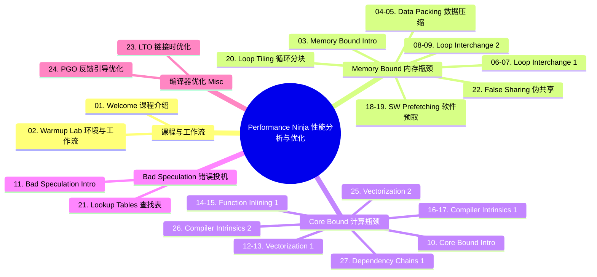

> 注：正文**严格按视频编号 01→27 顺序**展开；上图的「Memory Bound / Core Bound」等分组只是给每节打上的 TMA（Top-down Microarchitecture Analysis）分类标签，便于从宏观理解各主题归属，不改变课程讲授顺序。`04–05` 等「合并节」表示同一实验的 intro 与 summary 两段视频合为一节。

## 完整课程地图（官方 perf-ninja 全部实验）

官方 [perf-ninja](https://github.com/dendibakh/perf-ninja) 共 **26 个实验**，分五类（其中 CPU Frontend Bound 与 Data-Driven optimizations 目前**暂无实验**）。本文档覆盖**已配视频/字幕的 16 个**（下表「覆盖」列为对应节号）；其余 **10 个**尚无视频/字幕、本地仓库也尚未收录，此处给出官方一句话描述，作为后续补充的方向。

| 分类 | 实验 | 官方目录 | 覆盖 | 说明（未覆盖实验） |
|------|------|----------|------|--------------------|
| **Core Bound** | Vectorization 1 | `core_bound/vectorization_1` | 12–13 | — |
| | Vectorization 2 | `core_bound/vectorization_2` | 25 | — |
| | Function Inlining | `core_bound/function_inlining_1` | 14–15 | — |
| | Dependency Chains 1 | `core_bound/dep_chains_1` | 27 | — |
| | Dependency Chains 2 | `core_bound/dep_chains_2` | — | 随机粒子运动，`XorShift32` RNG 引入依赖链，按「块」处理整条链 |
| | Compiler Intrinsics 1 | `core_bound/compiler_intrinsics_1` | 16–17 | — |
| | Compiler Intrinsics 2 | `core_bound/compiler_intrinsics_2` | 26 | — |
| | Compiler Intrinsics 3 | `core_bound/compiler_intrinsics_3` | — | 求 3D 点平均位置（32→64 位扩展累加） |
| | Compiler Intrinsics 4 | `core_bound/compiler_intrinsics_4` | — | Mandelbrot 集，SIMD 下各像素迭代次数不同 |
| **Memory Bound** | Data Packing | `memory_bound/data_packing` | 04–05 | — |
| | Loop Interchange 1 | `memory_bound/loop_interchange_1` | 06–07 | — |
| | Loop Interchange 2 | `memory_bound/loop_interchange_2` | 08–09 | — |
| | Loop Tiling | `memory_bound/loop_tiling_1` | 20 | — |
| | SW memory prefetching | `memory_bound/swmem_prefetch_1` | 18–19 | — |
| | False Sharing | `memory_bound/false_sharing_1` | 22 | — |
| | Huge Pages | `memory_bound/huge_pages_1` | — | 有限元算子求值，gather-scatter 矩阵向量乘（桁架） |
| | Memory Order Violation | `memory_bound/mem_order_violation_1` | — | Otsu 阈值直方图，同色更新 store→load 串行化 |
| | Memory Alignment | `memory_bound/mem_alignment_1` | — | 矩阵乘 split load，行对齐到 cache line 边界 |
| **Bad Speculation** | Branches To CMOVs | `bad_speculation/branches_to_cmov_1` | — | 生命游戏，分支 → `cmov`/`csel` 谓词指令 |
| | Conditional Store | `bad_speculation/conditional_store_1` | — | 键值筛选，谓词存储消除分支 |
| | Replacing Branches With Lookup Tables | `bad_speculation/lookup_tables_1` | 21 | — |
| | C++ Virtual Calls | `bad_speculation/virtual_call_mispredict` | — | 虚调用目标预测错误，按类型分组 |
| **Misc** | Warmup | `misc/warmup` | 02 | — |
| | LTO | `misc/lto` | 23 | — |
| | PGO | `misc/pgo` | 24 | — |
| | Optimize IO | `misc/io_opt1` | — | 计算文件 CRC32 校验，IO 绑定，用 `mmap`/大块读 |
| **CPU Frontend Bound** | — | — | — | 官方暂无实验 |
| **Data-Driven** | — | — | — | 官方暂无实验 |

---

## 01. Welcome（课程介绍）

> 来源：`01. welcome.mp4`（`Performance Ninja -- Welcome Video.srt`，双语版为 `Welcome Video (1).srt`）

### 背景与原理

这门课由 Denis（课程作者，同时也是《Performance Analysis and Tuning on Modern CPUs》一书作者）讲授，是一门口径很窄、但非常深的**实践型**课程。它明确**不讨论算法和数据结构的选择**，而是聚焦于程序在 CPU 上运行时的**低层性能问题**：

- **cache miss**（缓存未命中）——数据不在缓存里，要去主存取；
- **branch misprediction**（分支预测错误）——CPU 猜错了分支方向，投机执行的结果被丢弃；
- 其他各种 **stall**（停顿）。

课程要教的代码变换包括：**vectorization（向量化）**、**loop unrolling（循环展开）**、**function inlining（函数内联）**等低层、与 CPU 相关的优化。

### 关键概念

| 维度 | 内容 |
|------|------|
| 核心技能 | 用 profiler 找热点 → **确定瓶颈类型** → **定位到一行源码** |
| 分析工具 | Linux `perf`、Intel VTune Profiler、Intel Advisor |
| 课程形态 | 实验（lab）+ 视频；intro 视频给「刚好够用」的提示，summary 视频讲解法 |
| 时间投入 | 单个实验约 30 分钟到 4 小时，取决于背景与实验复杂度 |
| 实验分组 | 按瓶颈类型分组（memory bound / core bound / bad speculation 等），一次只聚焦一种 |
| 复杂度梯度 | 同一主题可能有多个实验，例如 loop interchange 1 比 2 简单 |

### 关键结论

- 瓶颈要**定性**（是内存、计算还是分支预测）再动手，而不是盲目改代码。
- 把问题**收敛到一行源码**，是这门课反复训练的核心动作。
- 课程配套书籍《Performance Analysis and Tuning on Modern CPUs》（PDF 免费下载）。

---

## 02. Warmup Lab（环境搭建与工作流）

> 来源：`02. warmup lab assignment.mp4`（`Performance Ninja -- Warmup Lab Assignment.srt`）

### 背景与原理

Warmup 实验的目的不是学优化，而是**走通整条工作流**：

1. clone 仓库，建一个**私有分支**保存所有改动；
2. 构建 **Google Benchmark** 库（`tools` 目录有脚本），所有实验都基于它，**必须构建 release 版本**（否则计时不准）；
3. 用同一套命令构建、验证、跑基准，看到 baseline 计时。

需要改的文件命名为 **`solution.h` / `solution.cpp`**；也可以改 `CMakeLists.txt` 或新建文件。找问题的第一步是**采集性能 profile**——构建时加 `-g` 调试信息，才能在 profile 里看到源码行与对应生成的汇编。

### 实验与解法

- 热点函数是 `solution`：它**遍历数组累加所有元素**。而数组里的值是**顺序的**（0, 1, 2, 3, …），所以本质上在算「1 到 n 的和」。
- 解法：把循环换成**闭式公式** `sum(1..n) = n·(n+1)/2`，直接不再需要循环。
- 结果：**10× 以上提升**（视频中口头报 CI 上「94×」，另给出 23 ns → 1.3 ns 每迭代，两者不完全一致，属口误；本地实测见 [warmup 实验文档](warmup.md)，约 70×）。

### 工作流框图


### 关键结论

- 先走通流程（clone → build → profile → fix → CI），后续所有实验复用同一套动作。
- CI 默认只测你改动的那个实验；提交信息里加 `"check all"` 可强制全量测试。
- 本地机器与 CI 机器配置不同，测出的数字可能不一致——**以趋势和相对加速比为准**。

---

## 03. Memory Bound Intro（内存瓶颈概述）

> 来源：`03. memory bound intro.mp4`（`Performance Ninja -- Memory Bound Intro.srt`）

### 背景与原理

现代 CPU 执行指令极快。最坏情况下，一次访存**直达主存要花约 1000 个 CPU 周期**，这期间 CPU 本可以做约 1000 次整数加法。当一个程序发起了大量访存、并把大量时间花在等待数据上时，它就**被内存束缚（memory bound）**。

改善方向只有三条：**改善访存模式**、**减少访存次数**、**升级内存子系统**。

### 关键概念

**CPU 与 DRAM 的性能差距**：DRAM 性能每年提升约 **7%**，而 CPU 每年提升 **20–50%**——差距逐年拉大，这正是缓存存在的动机。

**内存层级（memory hierarchy）**：离 CPU 越近越快越小，越远越慢越大。典型现代 CPU 有**三级缓存**：

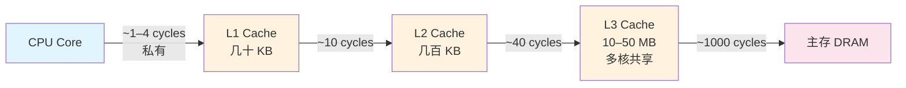

> 各级时延为数量级示意，实际值随架构而异。L1 通常是**每个核私有**；L2 可能私有或共享；L3 通常**多核共享**。指令缓存（L1i）与数据缓存（L1d）通常**分离**（互不干扰），L2/L3 则**统一**（指令+数据混合）。

**局部性（locality）**——缓存有效的前提是程序不会随机访存：

| 类型 | 含义 | 利用手段 |
|------|------|----------|
| **时间局部性** Temporal | 刚访问过的地址很快会再被访问 | 把工作集切成能塞进缓存的小块（blocking/tiling） |
| **空间局部性** Spatial | 访问某个地址时，附近地址也很快会被访问 | 利用 cache line：读 1 字节也会整块取回；数组连续迭代友好，链表不友好 |

**两条内存友好访存规则**：

1. **顺序访问**数据（sequential access）；
2. **避免把同一份数据从内存取多次**（reuse cache 里的数据）。

**示例——列优先 vs 行优先矩阵遍历**：写 `sum = row + col` 到矩阵每个格子时，若按**列优先**（先写一列再写下一列），访问是**跳步的**（stride）；把两层循环**交换**成行优先后，访问变连续，运行**快得多**。

### 关键结论

- 内存是性能的常见真实瓶颈：一次主存往返 ≈ 1000 周期，代价极高。
- 一切缓存优化都围绕两条局部性展开：**时间局部性**（复用）与**空间局部性**（顺序 + 邻近）。
- 本模块将覆盖数据压缩、循环交换、循环分块、软件预取、伪共享等 memory-bound 变换。

---

## 04–05. Data Packing（数据压缩）

> 来源：`04. data packing intro.mp4` + `05. data packing summary.mp4`（`Data Packing Intro/Summary.srt`）
> 实验文档：[data_packing.md](data_packing.md) · 源码：[../TMA/memory_bound/data_packing/](../TMA/memory_bound/data_packing/)

### 背景与原理

把数据结构变小（packing）→ 与主存之间搬运的字节更少 → 需要的 cache line 更少 → 缓存压力更小 → 内存层级利用更高效，往往带来加速。

**手段一：消除 padding（填充字节）**。C 结构体 `struct S { bool b; int i; short s; }` 占 **12 字节**，因为编译器会插入无用字节做**对齐**，保证成员访问高效（否则读 `i` 需要额外的移位等位操作）。**把字段按大小从大到小排序**即可消除 padding，12 字节 → **8 字节**。规则：**先放占空间大的类型**（int64/double），再 int32/float，依次类推。

**手段二：bit field（位域）**。三个 4 字节 int 的字段 = 12 字节；若取值范围很小（如 `a` ∈ 0–10 只需 **4 bit**，`b`/`c` ∈ 0–3 各 **2 bit**），用位域表达可把整个结构压到 **1 字节**。

**手段三：牺牲精度换尺寸**。位域不能用于浮点；但可用 `float` 替代 `double`（每个值省 4 字节）。**union** 也能省空间（多个成员共享同一块内存），但本实验不涉及。

### 实验与解法

- 打印结构体大小的编译期技巧（Scott Meyers 书里的老办法）：声明一个永远不会编译通过的空类 `TD`，用模板参数打印 `sizeof(s)`。结果是 **40 字节**（baseline）。
- **Step 1 — 字段按大小降序排序**：最大的在前（double/long long），再 int，再 short，最后 bool → **24 字节**。
- **Step 2 — double → float**：本实验不在乎浮点精度。但**尺寸不变**——`long long` 仍占 8 字节，编译器又补了 padding。
- **Step 3 — 位域**：看 `init.cpp` 里实际赋值的范围。元素 `l` 最大 **10000**（随机 int 生成到 100，100×100=10000）→ **16 bit** 够；`i`、`s` 各 **7 bit**；bool **1 bit**；再给 `i` 多 1 bit 避免留下空洞。最终 **8 字节**（从 40 字节）。

```text
baseline 结构体布局（示意，含 padding）：
  double d;  // 8B
  long long l;// 8B
  int i;     // 4B
  ...padding...
  最终 sizeof = 40 B

优化后（字段重排 + float + 位域）：
  sizeof = 8 B  （40B → 8B，缓存行利用率大幅提升）
```

### 优化结果

| 指标 | 优化前 | 优化后 | 变化 |
|------|--------|--------|------|
| 结构体大小 | 40 B | 8 B | **-80%** |
| benchmark 耗时 | 454 µs | 343 µs | ~1.3×（视频口头称「~20×」与计时不符，见下注） |
| L2 cache line 填充 | 6100 万 | <100 万 | 内存层级利用大幅改善 |

> ⚠️ 数字说明：视频中口头说「约 20×」，但给出的 454→343 µs 实际约 1.3×，两者矛盾，属口误。本地实测（[data_packing.md](data_packing.md)）为 **7.5×**。这里如实记录视频数字供参考。

### 关键结论

- 有趣的一点：**TMA 在这里并不把 memory bound 判为主瓶颈**——因为排序算法引入了大量 **branch misprediction**。要用专门的计数器（**拉进 L2 的 cache line 数**，6100 万 → <100 万）来**佐证**内存层级确实被更高效地利用了。
- 压缩数据结构是「**减字节 → 减 cache line → 减缓存压力**」的连锁反应。

---

## 06–07. Loop Interchange 1（循环交换）

> 来源：`06. loop interchange 1 introduction.mp4` + `07. loop interchange 1 summary.mp4`
> 实验文档：[loop_interchange_1.md](loop_interchange_1.md) · 源码：[../TMA/memory_bound/loop_interchange_1/](../TMA/memory_bound/loop_interchange_1/)

### 背景与原理

**循环交换（loop interchange）** = 交换嵌套循环的次序，其**主要目的是改变循环嵌套的访存模式**——往往只是「交换两行」。

典型场景：两个**完美嵌套**的循环，最内层对数组做**步长访问（strided access）**（访问第 0、n、2n、3n… 个元素），对缓存不友好。交换内外层后变成**顺序访问**，缓存友好、明显变快。完美嵌套时交换很容易；非完美嵌套时（下一节）就难了。

**TMA 定位路径**：一级分析显示 bound by CPU backend；再往下一层看，**memory 与 compute 都 bound**——足以判断是 memory bound（详见附录 A）。

**Google Benchmark 的一个坑**：默认迭代次数可变，两次 profile 做的工作量不同、无法公平比较（墙钟相同但迭代次数不同）。要显式指定**固定跑 10 次迭代**再比较。

**Intel Advisor 之旅**（本节教学重点）：
- **Survey → Summary**：显示耗时、使用的向量指令集、线程数；**72% 的代码是标量、26% 是向量**。
- 同一源码行的同一循环在热点里**出现两次**：函数 `multiply` 被 `power` 调用两次，都被内联，但其中**一次被编译器向量化** → 同一循环有两个版本（标量 + 向量）。这次向量化**并非最优**（仍有很多 gather/scatter，带来额外代价）。两个版本都被编译器**展开（unroll）**了。
- **Code Analytics（指令混合）**：标量循环里 **53% 是 load/store、只有 11% 是真正计算**；向量版本计算占比更低，**仅 5%**。
- **Trip count（行程计数）**：循环体执行次数。标量版本预期 400（常量 `N=400`），工具报 **80**——因为循环被**展开 5×**（5×80=400）。当无法从源码推得次数时尤其有用。
- **Roofline 模型**：水平线=计算峰值上限，斜线=各级内存带宽上限；红点=标量循环，黄点=向量循环；目标是让点**向屋顶移动**。标量循环表现极差——低于标量浮点峰值、甚至没够到 DRAM 带宽。
- **Memory Access Pattern 分析**：报告访存**步长（stride）**。汇编里一条访存指令的步长是常量 **2000**（展开 5× 且 5×400=2000），远非顺序访问。

### 实验与解法

热点最内层在 `multiply` 函数：一个**点积**，累加矩阵 `a` 某行与矩阵 `b` 某列的乘积，写进 `result[i][j]`。

```text
访问分析：
  result[i][j]  →  循环不变量（没有 k 下标）
  a[i][k]       →  顺序访问 ✓
  b[k][j]       →  步长访问 ✗  ← 问题所在
```

因为循环是**完美嵌套**的，可以直接交换。**解法：把 `j` 与 `k` 两层循环对调**。交换后：

```text
  result[i][j]  →  顺序访问 ✓
  a[i][k]       →  循环不变量
  b[k][j]       →  顺序访问 ✓
```

### 优化结果

| 指标 | 优化前 | 优化后 | 变化 |
|------|--------|--------|------|
| 耗时 | 766 ms | 116 ms | **>6×** |
| Memory Bound 指标 | ~30% | 22% | **-8 个百分点** |
| 实测 FLOPs | 1.7 GFlops | 19 GFlops | ~11× |

> Intel Advisor 修复后：算术强度（arithmetic intensity，横轴）几乎不变（算法没变），但 FLOPs 从 1.7 升到 19 GFlops（纵轴上升）；即便如此**仍未触顶**。本地实测（[loop_interchange_1.md](loop_interchange_1.md)）为 6.9×。

### 关键结论

- **一行循环交换**就把点积内核里的步长列访问变成顺序访问 → 6×+，memory-bound 指标降 8 个百分点。
- 步长访问是缓存性能的大敌；判断一个访问是否友好，看它**是否连续递增**。

---

## 08–09. Loop Interchange 2（循环交换：非完美嵌套）

> 来源：`08. loop interchange 2 introduction.mp4` + `09. loop interchange 2 summary.mp4`
> 实验文档：[loop_interchange_2.md](loop_interchange_2.md) · 源码：[../TMA/memory_bound/loop_interchange_2/](../TMA/memory_bound/loop_interchange_2/)

### 背景与原理

上一节处理了**完美嵌套**；本节处理**非完美嵌套**——需要交换但循环不是完美嵌套。

**示例**：打印一张表每列元素之和。自然的写法是外层遍历列，对每列累加各行值、打印、再进下一列。与上一节一样，**访存模式不佳**。此时：
- **不能直接交换循环**（那样编译不过）；
- **不能只翻转下标**（会打印出错误结果）。

外层循环里其实有**三个顺序且相互依赖的阶段**：(1) 把值**初始化**为 0，(2) **累加**， (3) **打印**。

**打破依赖链**：不要每列算完立刻打印，而是**先存中间结果、移向下一列**，等**所有列**都算完再统一打印——这需要**每列一个累加器**（而不是单个临时变量）。这样循环嵌套就**没有跨迭代依赖**，于是可以**循环分布（loop distribution）**——把嵌套拆开，让累加循环变成**完美嵌套**。然后**交换行列两层**，访存模式变最优，问题实质上被转化为一个**向量加法**（现代 CPU 极擅长）。代码更长，但**快得多**。

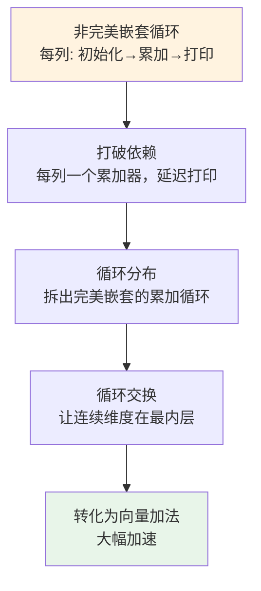

### 实验与解法

图像处理风格的内核，热点行位于三层嵌套循环中，含两个访存：`input` 与 `kernel`。`kernel` 访问没问题；`input` 访问**有问题**——`i` 每增 1，位置偏移 `width`（图像宽度，一个较大的数）→ 步长访问。

- 先定性：**50% 的执行资源浪费在等数据上**，很糟。
- 定位：`perf record` 或 `--run-sample` 都指向同一行。
- 最外层循环（`c`）含三段**独立**部分：第一/三段处理边界像素，中间一段（最重）处理其余像素 → 外层循环可**分布成三个独立循环嵌套**。
- 目标是把**连续维度 `c` 放到最内层**（把 `r` 放最内没用，仍是步长访问）。

**分步配方**（对应 intro 的概念）：

1. **加宽累加器**（累加器数组 `dot` 要**动态分配**避免栈溢出）；
2. 验证正确性；**分布中间那段循环**（无跨迭代依赖）；
3. **进一步加宽累加器**，把嵌套分布成**两个独立嵌套**；
4. **交换 `c` 与 `r` 两层**——第二段立刻变成顺序访问；
5. 修第一段：分布它的中间循环、再分布它的最外层循环（benchmark 仍验证通过）；
6. 最后**交换问题循环**；
7. 进一步：**融合三个嵌套的最外层循环**；最后把 `dot` 移进最外层循环**减少内存占用**。

### 优化结果

| 指标 | 优化前 | 优化后 |
|------|--------|--------|
| 执行资源浪费 | 50% 等数据 | — |
| 运行时 | baseline | **>10× 更快** |
| 瓶颈 | memory bound | **不再 memory bound** |

> 本地实测（[loop_interchange_2.md](loop_interchange_2.md)）为 9.7×。

### 关键结论

- 非完美嵌套的通用套路：**验证 → 循环分布 → 加宽累加器 → 交换使连续维度最内 → 融合回并**。
- 循环分布（loop distribution）是把「无法交换的非完美嵌套」变成「可交换的完美嵌套」的关键桥梁。

---

## 10. Core Bound Intro（计算瓶颈概述）

> 来源：`10. core bound intro.mp4`（`Performance Ninja -- Core Bound Intro.srt`）

### 背景与原理

**Core Bound（计算瓶颈）** 代表**执行引擎内部、且并非由内存问题引起**的所有 stall。一次 load 未命中缓存属于 memory bound，不属于 core bound。

它有两个子类型：

1. **硬件计算资源短缺（限制吞吐）**——也叫 **执行端口争用（execution port contention）**：某些执行单元过载。例如 Skylake 核心上，**除法与开方只由单个除法器执行、被派发到 port 0**，这类指令**时延明显更长**，大量除法指令排队等待，拖累性能。
2. **指令间依赖（增加时延）**——**依赖链（dependency chain）**。最简例子是**遍历链表 = 指针追逐（pointer chasing）**：即使所有链表节点都分配得很近，也**必须先加载完第 n 个才能加载下一个**——本质上就是串行的，CPU 无法凭空并行。现代 CPU 本来**一次能并行发出几十个访存**，但这种情况不行。

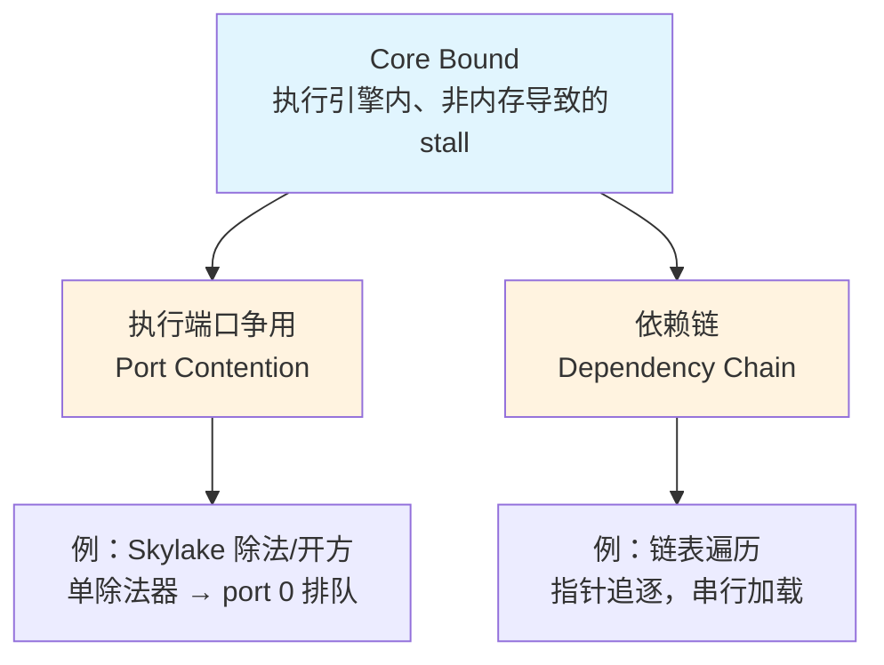

### 关键结论

- 端口争用的现实建议：如果软件必须做大量除法，要么**换除法器更多的 CPU**，要么**卸载到加速器**。
- 数据流依赖链也很难修，往往需要**改写算法**。
- 本模块聚焦知名优化：**函数内联、向量化、编译器 intrinsics** 等——目标是**减少总指令数，或换成更好的汇编指令**。严格说它们不总属于 core bound，但归类合理；低效计算是现实瓶颈的重要来源——**编译器很聪明，但有时我们主动强制某些变换能做得更好**。

---

## 11. Bad Speculation Intro（错误投机概述）

> 来源：`11. bad speculation intro.mp4`（`Performance Ninja -- Bad Speculation Intro.srt`）

### 背景与原理

在 **TMA（自顶向下微架构分析）** 里，**bad speculation 是四大类之一**。CPU 靠**统计数据和启发式**预测程序行为，多数时候很准，但**一旦猜错，代价就落到 bad speculation**。它分两个子类：**branch misprediction（分支预测错误）** 与 **machine clears（机器清空）**。

**五级流水线（简化）**：`fetch（取指）→ decode（译码）→ issue（发射，仅当输入就绪且执行资源可用）→ execute（执行）→ commit（提交/退休，把结果写回寄存器或内存）`。各级并行处理不同指令。

**分支示例** `if (a < b) foo(); else bar();`：加载 `a`、加载 `b`、比较、分支。译码器不知道调用哪个函数（要到执行时才知道）。**若不投机**，只能等 → **每个分支浪费 3 个周期**。**若投机**：猜一个方向（比如 `foo`），记录投机执行的指令，继续执行直到分支真实结果揭晓——

- 猜对：当作无事发生，**省下 3 个周期**；
- 猜错：所有投机工作作废、**不能 commit**，这些指令被标记为 **non-retiring**（执行了但不提交，等效于 no-op）——这就是**冲刷流水线（flush the pipeline）**，现代处理器上约 **15–20 周期**（取决于流水线深度）。

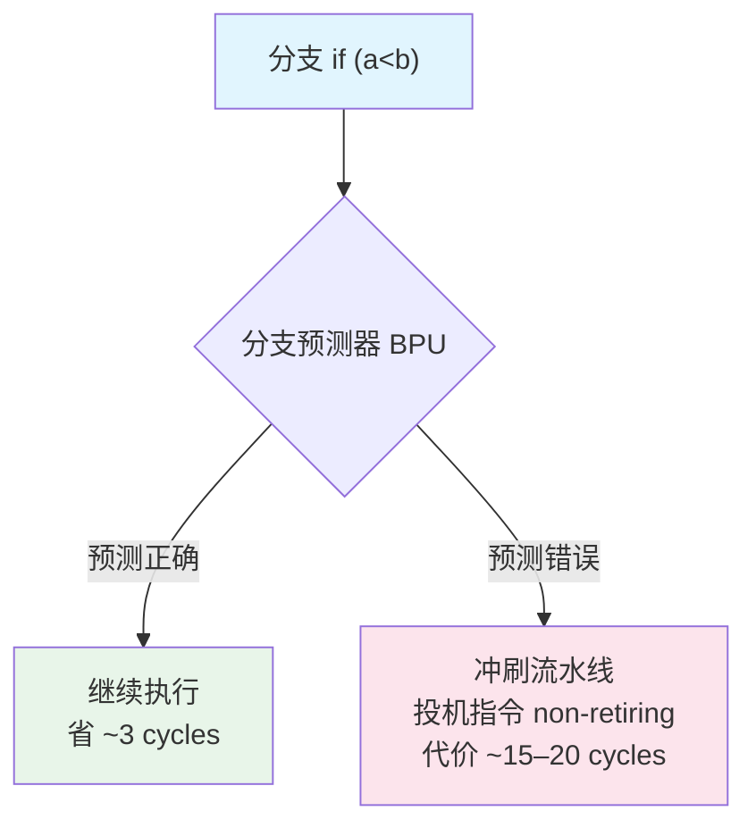

**BPU（branch predictor unit，分支预测器）**：传统上依据**分支的历史**做预测——本质是一个**缓存**。新型 CPU 用**基于机器学习**的预测器，且常**每个核不止一个**。

**Machine clears（较罕见）**：
- **内存序冲突（memory-order conflict，"nukes"）**：多线程中，**另一个线程执行的 store 命中了本线程投机执行、尚未退休的 load**。示例：`if (a<b) { 从共享数组加载 y；用于计算；}`。预测分支成立 → 投机加载 `y` 继续跑；但 `b` 缓存全 miss、要等 DRAM，分支无法执行（输入未就绪），而 `if` 内代码仍可继续投机（无数据依赖）。多条指令停滞（超标量 CPU 常有**数百条在飞指令**）。此时**另一线程覆写了 `y`** → 本线程持有的值失效 → 这条 load 及之后的一切都要**重来**，丢弃大量工作。不常发生。
- **自修改代码（self-modifying code, SMC）**：程序投机执行了它自己正在覆写的代码。「CPU 架构师的持续头痛来源」。

### 关键结论

- 分支预测错误是四大 TMA 类别之一：猜对省 ~3 周期，猜错罚 **15–20 周期**的流水线冲刷。
- 本模块的对策是 **branchless（无分支）算法**，即下一节「查找表」的内容。

---

## 12–13. Vectorization 1（向量化：序列比对）

> 来源：`12. vectorization 1 intro.mp4`（**无字幕**）＋ `13. vectorization 1 summary.mp4`（`Performance Ninja -- Vectorization1 Summary.srt`）
> ⚠️ 第 12 节（intro）无字幕，其「背景与原理」部分提炼自实验文档 [vectorization_1.md](vectorization_1.md) 与背景知识；第 13 节（summary）来自字幕。
> 实验文档：[vectorization_1.md](vectorization_1.md) · 源码：[../TMA/core_bound/vectorization_1/](../TMA/core_bound/vectorization_1/)

### 背景与原理

实验是一个 **Smith-Waterman 风格（仿射间隙惩罚）的 DNA 序列比对**算法，处理 **16 对长度为 200** 的序列。核心递推（每个单元格）为：

```text
score[row][col] = max(
    diagonal + match/mismatch,   // 对角线
    vertical_gap,                // 垂直间隙
    horizontal_gap               // 水平间隙
)
```

原始写法是**标量**的：外层循环依次处理 16 对序列，内层循环用 `int16_t` 逐个单元格计算。问题有二：

1. 内层 row 循环存在**循环依赖**（`last_diagonal_score` 依赖上一行，`last_vertical_gap` 同理），编译器**无法证明可安全向量化**；
2. 每次只算 **1 个 `int16_t`**，浪费了 SIMD 宽度（AVX2 一次可处理 16 个 `int16_t`）。

### 实验与解法（来自 summary 字幕）

- **Baseline：3006 µs**。TMA 一级显示 bound by CPU backend；二级显示**近 30% 的执行槽落在 core bound** → 提示存在**很长的依赖链**（呼应第 10 节）。这类程序不一定好提速，但有时能**改写算法暴露并行性**。
- 热点内层循环**完全是标量、无任何向量指令**（可用编译优化报告或 profile 里的汇编确认）。
- **关键观察**：外层循环每迭代只触碰**每个矩阵的一行**，下一次迭代对**下一对行做同样操作**——「同样的操作」暗示**不同内层迭代的计算可以并行**。

**解法——转置数据布局，让可并行的数据靠在一起，一次处理多条序列**：

1. 写函数**转置两个矩阵**（拷贝到转置矩阵；原地转置作为作业）；
2. 调用转置函数、创建转置矩阵，benchmark 仍验证通过（算法未变）；
3. **删掉最外层循环**（多条序列改并行处理），然后把所有临时值**加宽为向量**：`int16_t` → SIMD 类型；
4. 把每条语句改成循环：复制循环头、给每个表达式加下标 `k`（都加宽了），再**融合这些循环**；
5. 第二个嵌套更棘手，分两半加宽（声明可移出循环）；热点最内层循环里 `best_cell_score` 的**初始化要拆成两条语句**，其余语句加宽，`return` 前最后一条语句也变成循环。

**本质是把 AoS（Array of Structures）转成 SoA（Structure of Arrays）**，用 `std::array<int16_t, 16>` 当作「向量化的 score 类型」，一次处理 16 对序列的同一位置：

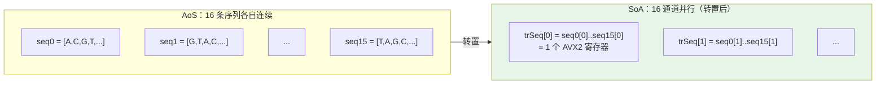

### 优化结果

| 指标 | 优化前 | 优化后 | 变化 |
|------|--------|--------|------|
| 耗时 | ~3006 µs | ~600 µs | **~5×** |
| 向量指令 | 无（全标量） | 大量 | 编译器成功自动向量化 |

> 本地实测（[vectorization_1.md](vectorization_1.md)）为 **2.1×**（830 µs → 396 µs），其分析指出加速未达 16× 理想值的原因：AoS→SoA 转置开销、显式 `for(k)` 循环未必被完全向量化、row 维仍残留依赖链、内存带宽限制等。

### 关键结论

- 当依赖链束缚了标量代码，**转置数据布局 + 把标量加宽为向量**、并行处理多条独立序列，就能让编译器**自动向量化**，得到约 5× 加速。
- 找并行性的原则：**在数据中找并行，而非在代码中**（16 对序列彼此独立，天然可并行）。

---

## 14–15. Function Inlining 1（函数内联）

> 来源：`14. function inlining 1 intro.mp4` ＋ `15. function inlining 1 summary.mp4`（**两节均无字幕**）
> ⚠️ 本节无对应字幕，内容提炼自实验文档 [function_inlining_1.md](function_inlining_1.md) 与背景知识。
> 实验文档：[function_inlining_1.md](function_inlining_1.md) · 源码：[../TMA/core_bound/function_inlining_1/](../TMA/core_bound/function_inlining_1/)

### 背景与原理

对 10000 个 `S{key1, key2}` 结构体排序。原始实现用 C 风格 **`qsort` + 函数指针回调**：

```text
qsort 的问题：
  qsort(arr, N, sizeof(S), compare)
                            ↓ 函数指针
  编译器无法内联 compare → 每次比较都有函数调用开销
  编译器无法对 compare 做特化优化
  qsort 在 glibc 中 → 跨库间接调用，L1i 指令缓存不友好
```

函数指针是**间接调用**，目标地址不固定，分支预测器也难以准确预测。10000 个元素排序约需 **~130,000 次比较**（O(N log N)），每次比较都付出间接调用开销。

### 实验与解法

用 **`std::sort` + lambda** 替代 `qsort` + 函数指针：

```c++
void solution(std::array<S, N> &arr) {
  std::sort(arr.begin(), arr.end(), [](const S &a, const S &b) {
    return a.key1 < b.key1 || (a.key1 == b.key1 && a.key2 < b.key2);
  });
}
```

**改进点**：lambda 是编译器可见的类型，`std::sort` 模板会把比较器**内联**进排序循环，消除调用开销；编译器还能对内联后的比较逻辑做常量传播、分支合并等进一步优化。

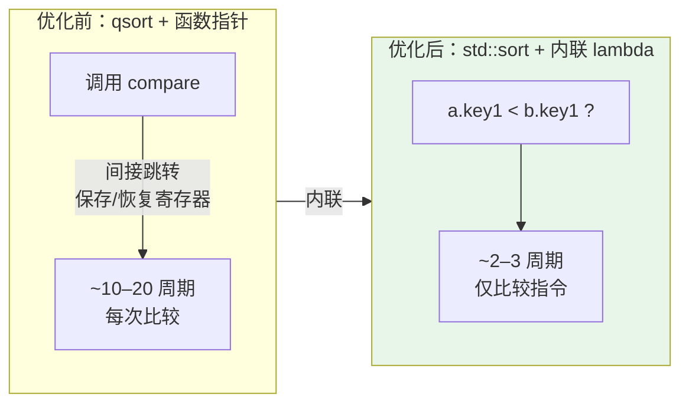

### 优化结果

| 指标 | 优化前 (qsort) | 优化后 (std::sort) | 变化 |
|------|---------------|-------------------|------|
| benchmark 耗时 | 558 µs | 342 µs | **1.63×** |
| Frontend Bound | 59.6% | 52.5% | -7.1% |
| Fetch Latency | 27.8% | 11.0% | **-16.8%** |
| Bad Speculation | 18.0% | 29.0% | +11.0% |

> 内联后 `Bad Speculation` 反而升高：内联的比较逻辑变复杂、分支更多；但这些分支的代价远低于间接函数调用的代价——整体仍是净收益。

### 关键结论

- **Fetch Latency 大幅下降**（27.8% → 11.0%）是主要收益：内联消除了间接调用，排序循环的指令落在连续地址，L1i 命中率提升。
- 内联的适用条件：**调用频率极高**（~13 万次）、**函数体很小**、**通过函数指针/虚函数调用**、**编译器可见定义**（lambda 同文件）。

---

## 16–17. Compiler Intrinsics 1（编译器内建函数）

> 来源：`16. compiler intrinsics 1 intro.mp4` + `17. compiler intrinsics 1 summary.mp4`
> 实验文档：[compiler_intrinsics_1.md](compiler_intrinsics_1.md) · 源码：[../TMA/core_bound/compiler_intrinsics_1/](../TMA/core_bound/compiler_intrinsics_1/)

### 背景与原理

**Compiler intrinsics（编译器内建函数）** 是「编译器翻译成特定汇编指令的特殊函数」，用来在**不写内联汇编**的前提下强制生成想要的指令。相比内联汇编，它**可读性更好、编译器能做类型检查、辅助指令调度、便于调试**。所有现代编译器都支持，但**并非每条指令都有对应的 intrinsic**（参考 Intel Intrinsics Guide / ARM 对应指南）。

**三种代价/注意点**：

1. **安全性**：普通 C++ 里编译器自动保证变换合法（如向量元素够不够、指针是否别名）；用 intrinsics 后这些都要**自己处理**。
2. **可移植性**：intrinsic 映射到平台特定汇编，跨架构需**回退路径**（SSE/AVX2/AVX-512/NEON 各一套）。
3. **可读性**：intrinsic 密集的代码接近汇编，难读。

**使用原则**：**优先写标准 C++ 让编译器优化**；只有在调整代码、加 pragma/编译提示都失败后，才**作为最后手段**用 intrinsics。

### 实验与解法

图像平滑算法，热点循环 Clang 12 **不向量化**。该循环其实是一个**前缀和（prefix sum）**问题：输出元素 i = 输入元素 `i-radius` 与 `i+radius` 之差，累积一个滑动和。编译器无法处理「向量化前缀和」这一步。

**向量前缀和**：标量前缀和很简单，但向量版需要 **log N 步**——把数组**移 1 位相加、再移 2 位相加、再移 4 位**……依次类推（8 元素则多一步「移 4 位相加」）。

```text
向量前缀和（4 元素示例）：
  原始        [a b c d]
  移 1 相加    [a  a+b  b+c  c+d]
  移 2 相加    [a  a+b  a+b+c  a+b+c+d]   ← 完成
```

**SSE 实现要点（每迭代 8 元素）**：
- 广播当前累加和到整个向量；
- 加载 64 位 = 8 个 8-bit 整数，加宽到 16-bit（输出是 16-bit 值），计算差值；
- 对 8 个元素做**串行前缀和**：移 1、移 2、移 4 三次移位相加（因字节序用**左移**）；
- 存结果，把最后一个输出值**广播**回「当前和」寄存器供下一迭代；
- 向量循环后，把位置前移已处理元素数，剩余用串行循环兜底。

### 优化结果

| 指标 | 优化前 | 优化后 | 变化 |
|------|--------|--------|------|
| 耗时 | 26.7 µs | 8 µs | **~3×** |

> 加分练习：用 AVX2 实现（预期比 SSE 略好）。本地实测（[compiler_intrinsics_1.md](compiler_intrinsics_1.md)）为 1.14×。

### 关键结论

- intrinsics 是「需要精确控制指令时的逃生舱」，但**代价是安全/可移植/可读性**，只该作为最后手段。
- 前缀和这类带依赖的归约，**向量化需要 log N 步移位相加**，是经典模式。

---

## 18–19. SW Memory Prefetching 1（软件预取）

> 来源：`18. sw memory prefetching 1 intro.mp4` + `19. sw memory prefetching 1 summary.mp4`
> 实验文档：[swmem_prefetch_1.md](swmem_prefetch_1.md) · 源码：[../TMA/memory_bound/swmem_prefetch_1/](../TMA/memory_bound/swmem_prefetch_1/)

### 背景与原理

缓存未命中代价高昂，现代 CPU 靠**硬件预取（hardware prefetching）** 透明地隐藏这部分时延：预取单元观察运行中的程序、识别重复访存模式、提前发出预取请求，且**无需编译器支持或 profile 数据**、能适应动态变化的数据集。

**局限**：硬件预取只对**硬件里实现的那一小撮访存模式**有效。对**本质随机**的访问，硬件无从知道该预取什么。

**软件预取**：在真正 load 之前插入预取提示（如 `__builtin_prefetch`），编译器把它翻译成一条硬件预取指令——本质是**一次「假 load」**，把目标地址拉进缓存，与前面的密集计算并行，从而减少/消除缓存未命中代价。

**关键时机**：提示必须**提前足够多**，但又**不能太早**（太早会把很久才用的数据提前拉进来污染缓存）。这个可用的时间区间叫 **prefetching window（预取窗口）**。


**注意点**：有时不可行（长依赖链直接到 miss 的 load，没有预取窗口）；误用会**挤掉有用的缓存行**；预取提示本身是一条指令、略增代码量；收益**不可移植**（要在每个关心的平台实测）。编译器普遍**保守**，不愿自动插软件预取——因为可能反而伤害性能。

### 实验与解法

哈希表 benchmark，**3200 万整数**（几乎肯定装不进 LLC），所以大多数 miss 发生在 `find` 方法——从大向量里随机 load 一个值。

- TMA 显示 **memory bound** → 先修内存问题是正确的。
- 洞察：**所有查找值事先已知**，所以可以**提前预取后续迭代的查找**。
- 实现：新增一个「预取而非查找」的哈希方法；在内核循环里每次迭代**预取后续若干次迭代的查找值**；**最后 16 个元素不做预取**（避免越界）。
- 用 `baseline.json` / `modify.json` + `compare.py` 对比。

### 优化结果

| 指标 | 优化前 | 优化后 |
|------|--------|--------|
| 运行时 | baseline | **-54%~55%** |

> 加分练习：调 look-ahead（提前量）找最优值。本地实测（[swmem_prefetch_1.md](swmem_prefetch_1.md)）为 3.1×。

### 关键结论

- 软件预取**专治「可预测但非顺序」的访问**（如随机哈希查找）；顺序访问时硬件预取器通常已足够。
- 牢记 intro 的忠告：**永远实测**（预取窗口、平台差异都可能翻转结论）。

---

## 20. Loop Tiling 1（循环分块）

> 来源：`20. loop tiling 1.mp4`（`Performance Ninja -- Loop Tiling 1.srt`，intro 与解法合一段）
> 实验文档：[loop_tiling_1.md](loop_tiling_1.md) · 源码：[../TMA/memory_bound/loop_tiling_1/](../TMA/memory_bound/loop_tiling_1/)

### 背景与原理

**循环分块（loop blocking/tiling）** = 把多维执行区间切成能塞进缓存的小块（tile）。若算法对多维数组做**步长访问**，很可能缓存利用率差。

**经典例子——矩阵乘法**：两个大矩阵装不进缓存，朴素代码性能差，因为矩阵 B 被**按列访问**——每次访问 B 的某个元素都可能拉进一条新 cache line，**可能挤掉之后还要用的数据**（cache eviction 问题）。把乘法切小块、让**两个 tile 一起完整装进缓存**，就避免了挤掉需要的数据。分块本质是「**在数据被驱逐出缓存前，把每条 cache line 里的数据充分利用完**」。

**tile 大小选择**：可针对缓存层级的不同级别分块（取决于问题、以及是否与其他线程共享缓存）。强烈建议用 **Roofline 模型**做实验。

### 实验与解法

矩阵转置。自动向量化失效，因为输出矩阵被**按列写**。解法：加**两个外层 tile 循环**，保留**两个内层循环处理单个 tile 内的元素**：

```text
for (tile 的行)          ← 新增外层
  for (tile 的列)        ← 新增外层
    for (tile 内行)      ← 原内层
      for (tile 内列)    ← 原内层
```

用 `check_speedup.py`（传入实验名 `loop_tiling_1` 与 benchmark 库路径）对 solution 与 baseline 各跑**三次**对比。

### 优化结果

| 指标 | 结果 |
|------|------|
| 三次加速比 | **68%、68%、74%** |
| 最优 tile 大小 | **16**（两个 tile 都完整落进 L1d） |
| 最终限制 | **DRAM 带宽**（零算术、纯数据搬运） |

> 在讲师机器上 sweet spot 是 16，因为两个 tile 都能装进 **L1d**（最快、时延最低的缓存）。Roofline 上算术强度极低（除跳转外几乎没有算术），但性能「飙升」到 DRAM 带宽水平。本地实测（[loop_tiling_1.md](loop_tiling_1.md)）为 1.75×。

### 关键结论

- 分块让「连续维度 + tile 尺寸」同时适配缓存，是矩阵/图像类步长访问的通用解。
- **代价**：tile 大小要按平台显式指定（各缓存大小不同）、难维护 → 用**缓存无关算法（cache-oblivious，分治）** 是课后作业。

---

## 21. Replacing Branches with Lookup Tables（查找表替代分支）

> 来源：`21. replacing branches with lookup tables.mp4`
> 实验文档：[lookup_tables.md](lookup_tables.md) · 源码：[../TMA/bad_speculation/lookup_tables_1/](../TMA/bad_speculation/lookup_tables_1/)

### 背景与原理

bad speculation 指标高 → 大概率有**频繁被预测错的分支**。用 `--run-sample` 重跑 TMA，会在 **branch-mispredict 事件上采样**，直接指出问题分支：**100% 的分支预测错误都发生在 `histogram` 函数的 `map_to_bucket` 里**，其中**所有生成的分支都被频繁预测错**。

**问题形状**：桶边界是**质数**，无法用算术直接算出桶下标 → 只能写一串会被预测错的比较。对随机数据，**一次函数调用内可能连续猜错多次**（猜桶 1 → 错，再猜桶 5 → 实为桶 4）。

### 实验与解法

把**分支链替换成对 `buckets` 数组的查表**：值 v 直接作为大数组的下标，读那个位置、返回其值，外加一个**防越界的小检查**。

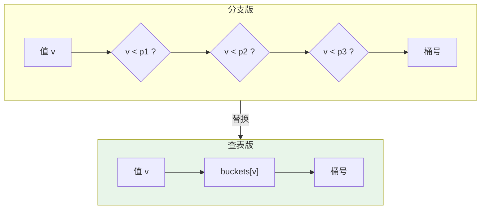

### 优化结果

| 指标 | 优化前 | 优化后 |
|------|--------|--------|
| 加速比 | — | **~8×** |
| Branch Mispredict 指标 | 高 | **几乎归零** |

**代价/时延权衡**（关键数字）：
- 分支版：最好情况 ~**0 周期**（预测正确），最坏情况一次 mispredict 罚 **~17 周期**（现代 CPU），一次调用可能错多次；
- 无分支版：读小 `buckets` 数组命中 **L1 缓存**，现代芯片访问时延约 **4 周期**——**所有情况都 ~4 周期**。这个「0-or-17」换「恒 4」是划算的。

> 本地实测（[lookup_tables.md](lookup_tables.md)）为 1.87×。

### 关键结论

- **分支不一定坏**——多数时候分支反而更好。**只在预测器频繁失败的地方去分支化**。
- 无分支代码把**控制依赖转成数据依赖**：分支时 CPU 可对两种结果之一投机、继续推进；数据依赖下投机停止（因为加载值范围巨大，0 到 100 万，无法预测，只能等）。
- 新加的越界检查分支**总是被命中**，所以被完美预测、「形同不存在」。
- 加分：变换输入分布（全落一个桶 / 两个桶）看谁赢；思考值域很大（0–10000）时如何分配填充大数组。

---

## 22. False Sharing（伪共享）

> 来源：`22. false sharing.mp4`（`[English] ... False Sharing [DownSub.com].srt`）
> 实验文档：[false_sharing.md](false_sharing.md) · 源码：[../TMA/memory_bound/false_sharing_1/](../TMA/memory_bound/false_sharing_1/)

### 背景与原理

多线程课程的第一个实验，聚焦**硬件级**的多线程性能问题。多线程性能问题大多源于**工作线程之间低效的通信**。「大规模并行」程序无需线程间通信、几乎线性扩展；现实程序用锁同步，而锁本身也可能成为瓶颈（另一主题）。本实验是**伪共享（false sharing）**。

**缓存一致性协议**：两个线程写同一内存位置时，各自把同一 cache line 拉进、改成不同值、再写回——到底存谁的值？若都自认为独占，一致性就丢了。所以多核 CPU 实现**缓存一致性协议**，最著名的是 **MESI**（Modified / Exclusive / Shared / Invalid），保证某条缓存项的更新会反映到其他线程的缓存里；核心之间经**超快总线（CPU interconnect）** 通信/共享更新。

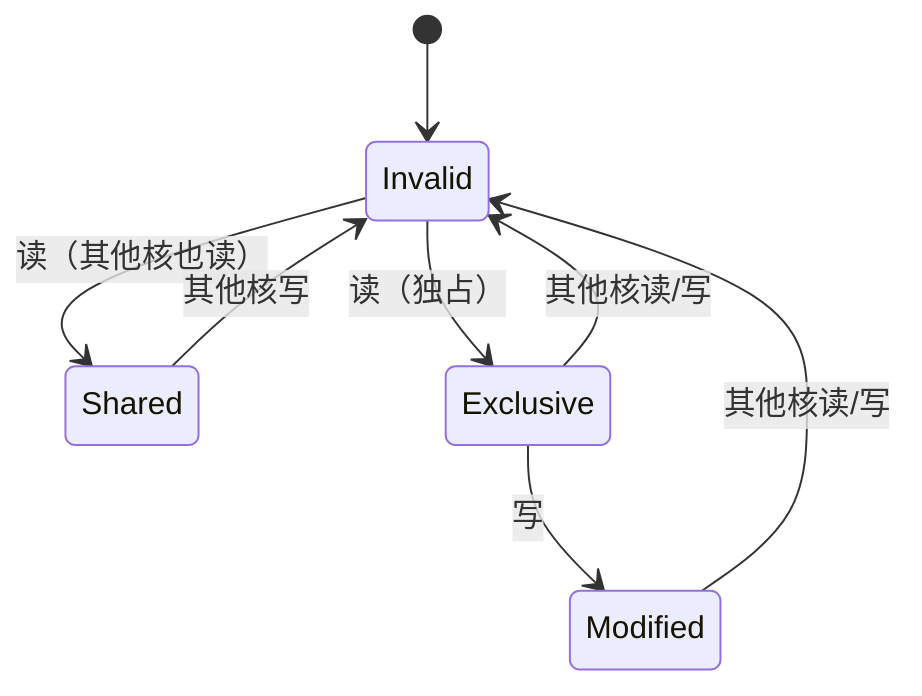

**真共享 vs 伪共享**：有了协议，正确性恢复，但**每次修改共享行都很贵**——核心要确认没有其他线程改过该行，若有则回退、重新取数、重试。两个线程更新**同一**内存位置 = **真共享**（相对好找）；两个线程更新**恰好落在同一 cache line 的不同变量** = **伪共享**——写的是独立位置，却**无法同时进行、实际被串行化**，抵消了多线程的收益。

### 实验与解法

多线程执行一段循环，每个线程更新**自己的累加器**；所有累加器是**同一个 `std::vector` 的元素**，在内存里连续排列——**落在同一 cache line 上**。

**工具 `perf c2c`（cache-to-cache）**：专治这类问题。关键指标：**13000 次 load**，其中「load 命中**其他核里被修改过的行**」的 **HITM 达 60%**。输出显示**单条 cache line**承载了所有争用；Pareto 表给出该行内**触发 HITM 的偏移**、加载指令的汇编地址、这些 load 的周期数（远大于普通 L3 miss）、函数名、源行。

**解法**：用 **`alignas(64)`**（包一个便利宏）让每个累加器**独占一条 cache line**。

### 优化结果

| 指标 | 优化前 | 优化后 |
|------|--------|--------|
| 运行时 | baseline | **-90%（近 8×）** |

> 本地实测（[false_sharing.md](false_sharing.md)）为 15.8×。

### 关键结论

- 伪共享是「**不同变量同一条 cache line**」导致的**隐形串行化**——CPU 利用率看着高，实则各线程在 cache 一致性命中上互相等待。
- 定位用 `perf c2c`（看 HITM），修复用 `alignas(64)` 或 padding 把共享的写目标隔开到不同 cache line。

---

## 23. Link Time Optimizations（LTO，链接时优化）

> 来源：`23. link time optimizations.mp4`（`[English] ... Link Time Optimizations [DownSub.com].srt`）
> 实验文档：[lto.md](lto.md) · 源码：[../TMA/misc/lto/](../TMA/misc/lto/)

### 背景与原理

多文件程序逐个编译，**所有优化发生在翻译单元（translation unit）内**，目标文件生成后不再优化。这错失了很多「看不到全程序」就无法做的优化。例如 `foo` 定义在 `b.cpp`、在 `a.cpp` 被调用——编译器看不到函数体，**无法内联**。把两者放同一文件能解决，但大项目不现实。

**合并方案（替代品）**：`CIL`、`TPP-Merge`（开源）把多个源合并成一个翻译单元——但**失去并行编译**、且各源无法用不同编译选项。

**LTO 如何工作**：每个源仍单独处理，但不编译成机器码，而是**停留在中间表示（IR）**。所有文件编译完后，把它们**合并（编译器术语叫 internalization）**成一个**含全程序单一模块的 bitcode 文件**。此时编译器能看到所有函数/变量，就能做以前做不到的变换（如内联 `foo`）。LTO 技术上属于编译器，虽然由**链接器**发起：链接器扫描输入、认领含 bitcode 的对象、把它们回传给优化器。

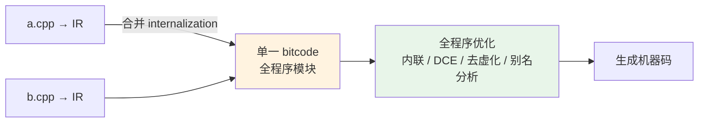

**LTO 使能的变换**：函数内联；更多**死代码消除（DCE）**（能看到哪些函数从未被调）；更好的**去虚化（devirtualization）**（若只有一个多态实例，虚调用换成直接调用）；更好的**别名分析**（全程序可推理指针指向）。

**启用标志**：clang `-flto`；MSVC `/GL`（编译）+ `/LTCG`（链接时）；ICC `-ipo`。

**代价**：(1) **很吃内存**——合并全部 bitcode 内存占用巨大；(2) **不可并行**——最后的全模块优化是单线程的；(3) **无增量链接**——改一个文件也要重新优化全程序。

**ThinLTO**：LLVM 的解法，牺牲一点性能换取以上三个问题的大幅缓解——`-flto=thin`（MSVC `/LTCG:incremental`）。机制：编译器给 bitcode 附一个**紧凑摘要**，链接时只分析合并后的摘要（不重分析每条指令），摘要含**函数位置索引**，某变换只拉入它需要的模块（如跨模块内联只拉调用方与被调用方）。

### 实验与解法

AOBench（图像渲染）代码。热点函数在 `aobench_intersect.cpp`（如 `ray-sphere-intersect`），它调用一个小的 `vdot` 函数，**调用开销相对其工作量很大**——正是 LTO 开启后内联的理想候选。在 CMake 里加 `-flto`。

### 优化结果

| 指标 | 优化前 | 优化后 | 变化 |
|------|--------|--------|------|
| 运行时 | 2500 ms | ~2250 ms | **~10%**（-250 ms） |

> 本地实测（[lto.md](lto.md)）为 1.50×。

### 关键结论

- LTO 的价值在于**跨翻译单元**的内联/去虚化/别名分析，典型收益在小函数被跨文件频繁调用的场景。
- 大型项目用 **ThinLTO** 平衡收益与编译时间/内存。

---

## 24. Profile Guided Optimizations（PGO，反馈引导优化）

> 来源：`24. profile guided optimizations.mp4`（`[English] ... Profile Guided Optimizations [DownSub.com].srt`）
> 实验文档：[pgo.md](pgo.md) · 源码：[../TMA/misc/pgo/](../TMA/misc/pgo/)

### 背景与原理

传统流水线：解析/分析 → 优化 → 生成机器码。优化编译器做的很多性能决策（是否内联、哪些变量放寄存器、哪些循环向量化）靠**复杂的成本模型和启发式**（如向量化会算标量 vs 向量成本再比较），还有启发式例外（模式匹配）。但这些都是**猜测**——真实性能高度依赖**编译器无法知道的运行时行为与输入数据**（如循环展开需要知道 trip count）。

**流程（类比机器学习）**：

1. **Instrument（插桩）**：用 `-fprofile-instr-generate` 编译，编译器在每个函数/基本块插入计数代码，统计函数调用次数、循环进入次数、迭代次数。
2. **Train（训练）**：跑插桩后的二进制，输出运行时统计文件（如 `default.profraw`）。
3. **Infer（推断）**：用 `-fprofile-instr-use` 把这些数据喂回去重编译。

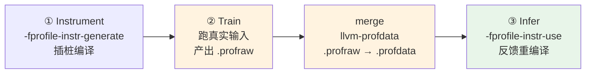

**关键警告——过拟合**：你在训练输入上更好，但**不保证其他输入**。例：场景 1 最热函数是 A，但你拿场景 2 去训练 PGO（那里 B 占主导），编译器可能优化 B、把 A 当冷函数 → 反而**劣化场景 1**。所以要选**贴近真实使用**的工作负载，最好直接拿真实数据训练；多个工作负载可用 **`llvm-profdata` 合并 profile**。

**其他采集方式**：(a) 用 CPU 性能监控计数器跑 profiler 再转成编译器格式（更轻量但不准）；(b) 新兴的**静态机器学习预测**运行时统计，甚至不用跑二进制。

**预期收益**：讲师经验**最多 ~15%**——「免费」但带上述警告。

### 实验与解法

Lua 解释器（提供完整源码）：(1) 用上述选项插桩编译；(2) 在所有 benchmark 输入上跑插桩二进制；(3) 改 `CMakeLists.txt` 把 profile 喂回构建。提交 = 修改后的 CMake 文件 + 生成的统计文件。

| 指标 | 优化前 | 优化后 |
|------|--------|--------|
| 运行时 | 7100 ms | 6600 ms |

> `-fprofile-instr-generate` 会让二进制慢很多（预期，插桩开销），产出 `default.profraw`；`llvm-profdata merge default.profraw -o code.profdata` 转成可用格式。本地实测（[pgo.md](pgo.md)）约 1×（收益不大）。

### 关键结论

- PGO 是「用运行时事实替换编译器猜测」，但**要防止过拟合**——训练负载必须贴近真实使用。
- 加分练习：对比优化前后二进制的 profile，看清编译器到底在哪里改进了。

---

## 25. Vectorization 2（向量化：打破循环依赖）

> 来源：`25. vectorization 2.mp4`（`[English] ... Vectorization 2 [DownSub.com].srt`）
> 实验文档：[vectorization_2.md](vectorization_2.md) · 源码：[../TMA/core_bound/vectorization_2/](../TMA/core_bound/vectorization_2/)

### 背景与原理

遍历一个 `uint16_t` 数组累加，同时**统计无符号溢出次数**：当累加和回绕（wrap around）时，结果会小于刚加的值——这就是溢出信号，于是把第二个累加器加 1。

**Clang 14 生成的**：无向量指令，而是**展开 8×**，产生 **8 条 `add`**（从内存 load 16 位、累加进 `ax` 寄存器，即 `eax` 的低半）与 **8 条 `adc`（add-with-carry，带进位加法）**。`adc` 把上一条指令的**进位标志**当输入：`add` 溢出置进位标志，`adc` 把它加进 `ax`——这样统计无符号溢出。

**为何没向量化**：优化报告给的理由是「**value that could not be identified as reduction is used outside the loop**」，即**循环携带依赖（loop-carried dependency）**。展开 8× 帮助不大，因为 `ax` 寄存器上有**长依赖链**：每条指令都读 `ax` 又写 `ax`，下一条要等上一条完成。

### 实验与解法

原循环同时做两件**互相依赖**的事：累加 + 数溢出。诀窍是**让它们独立**——用**更宽的 32 位累加器**替代 16 位：加两个 16 位值**永不回绕**，溢出改为**递增 32 位整数的高半**。累加完后，**低半 = 和、高半 = 溢出次数**，把**两半相加**得最终结果。边界情况：两半相加本身可能溢出，所以最后那次合并要带溢出处理（要做「两次」求和以兜住潜在溢出）。

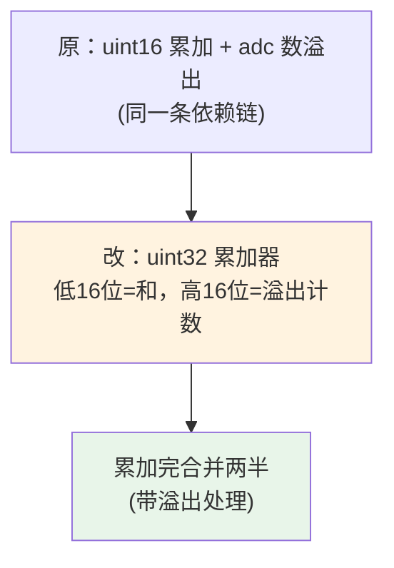

### 优化结果

| 指标 | 优化前 | 优化后 |
|------|--------|--------|
| 加速比 | — | **10×** |

> 打破循环携带依赖后，「盲累加」循环对编译器来说变得平凡（水平归约即可向量化）。本地实测（[vectorization_2.md](vectorization_2.md)）为 20.9×。

### 关键结论

- 编译器不向量化的常见根因是**循环携带依赖**；用「更宽累加器 + 位分割语义」把依赖拆成两个独立量，就能解锁向量化。
- 溢出计数这类「副作用归约」可以和主归约解耦，用高位隐式承载。

---

## 26. Compiler Intrinsics 2（内建函数：SIMD 文本解析）

> 来源：`26. compiler intrinsics 2.mp4`（`[English] ... Compiler Intrinsics 2 [DownSub.com].srt`）
> 实验文档：[compiler_intrinsics_2.md](compiler_intrinsics_2.md) · 源码：[../TMA/core_bound/compiler_intrinsics_2/](../TMA/core_bound/compiler_intrinsics_2/)

### 背景与原理

任务：**找文件里最长的一行**。函数把整个文件内容当一大段字符串，逐字符扫描换行符（EOL），遇到行结束就更新最长值。原始代码编译器不向量化（而且确实难自动向量化）。

**核心思路**：一次处理多个字符，而非逐个。以 **16 字符**为例：

1. 把一块字符 load 进向量寄存器（x86 intrinsics）；
2. 准备一个**填充 EOL 字符的掩码向量**（EOL 分隔行，两个 EOL 之间 = 行长）；
3. **向量比较**这块与掩码 → 0/1 向量，1 标记 EOL 位置（如第 6、11 位）；
4. 用 **`_mm_movemask_epi8`** 把掩码位抽取成一个整数（16 位够用但落在 32 位值里）；用 **TZCNT（trailing zero count）/ LZCNT（leading zero count）** 找置位位置（C++20 的 `std::countl_zero` 映射到同一 x86 指令），然后**把掩码左移**（移动已消费的位数）重复，直到无置位；
5. **边界**：若一块不以 EOL 结尾，不知道行在哪结束 → 把这段长度**带到下一块**（例子里给下一行长 +5）。


**局限**：多个分隔符（空格、制表符等）时效率下降——需要给每块套多个掩码，此时 **shuffle 指令**更高效（留待后续视频）。

### 实验与解法

AVX2 实现：**每迭代 32 字符**（代码注释清晰，贴在视频评论区）。两个实现细节：(1) 用**trailing** zero count 而非 leading、用**右移**而非左移，因为 load 进来的数据**字节序是反的**（利用内存加载顺序）；(2) 字符串长度很少是 32 的倍数，剩余用**串行循环**兜底。

### 优化结果

| 指标 | 优化前 | 优化后 |
|------|--------|--------|
| 加速比 | — | **显著提升** |

> 本地实测（[compiler_intrinsics_2.md](compiler_intrinsics_2.md)）为 15.1×。

### 关键结论

- `movemask + TZCNT/LZCNT` 是「向量比较 → 位掩码 → 找位」的经典 SIMD 文本处理范式。
- 字节序会反过来影响移位方向与 zero-count 的选择——实现时对照内存加载顺序仔细核对。

---

## 27. Dependency Chains 1（依赖链）

> 来源：`27. dependency chains 1.mp4`（`[English] ... Dependency Chains 1 [DownSub.com].srt`）
> 实验文档：[dependency_chains_1.md](dependency_chains_1.md) · 源码：[../TMA/core_bound/dep_chains_1/](../TMA/core_bound/dep_chains_1/)

### 背景与原理

「**唯一的真瓶颈**」。核内瓶颈有四大类：

1. **代码可预测性**（控制流预测）：现代 CPU 常规 **95%+ 预测率**，冠军级分支预测器 **每 1000 条指令不到 3 次 mispredict**——极难超越。
2. **数据可预测性**（隐藏访存时延）：当今的大瓶颈。**缓存时延不再下降、但容量在涨**——录制时笔记本 L3 已到 **10–50 MB**、高端游戏本达 **100 MB**。工作集能装进 L3 就还好，但大缓存**不是银弹**。
3. **执行吞吐**（指令通过 fetch/issue/execute 的流畅度）：某执行资源饱和时停顿——如满是乘法的程序排队，因为后端只有那么多乘法 ALU/端口。
4. **数据依赖链**（执行时延）：执行一段每步都依赖上一步的长序列。

**为什么依赖链独特**：其他三类理论上都可消除——无限执行单元/无限宽流水线（吞吐）、无限缓存 + 完美 ML 预测器 + 完美预取（代码/数据可预测性）。（能否真正实现未证；但确定的是**纯随机控制流**与**真随机访存**无法预测。）而**依赖链是根本性的、无法克服**。`value prediction`（值预测）之类的想法能打破它，但**尚无真实处理器实现**；硬件厂商只能尽力缩短单指令时延、提高频率。

**软件能做的**：有时能**打破或重叠依赖链**。同时强调：要找到**关键依赖链（critical dependency chain）**——否则会把时间浪费在次要问题上。

### 实验与解法

对链表 `l1` 的每个值，到链表 `l2` 里查找匹配（二次方算法、满是指针追逐）：从 l1 取值 → 遍历 l2 找匹配 → 找到则累加其**数位之和**。两链表用 **arena 分配器**使节点内存相邻（加速每次访问）——但这**不能消除依赖链**：必须取到当前节点才能到达下一个。

**洞察与解法**：每次 l2 查找是一条依赖链，而**连续的多次查找（找 x、再找 y）是彼此独立的链** → **重叠它们的执行**。不是搜一个元素，而是**同时搜两个**：同时持有 x 和 y，**只遍历 l2 一遍**，每个节点与两者都比较。这样遍历次数减半；还可并行搜 **4、8、16…** 个。

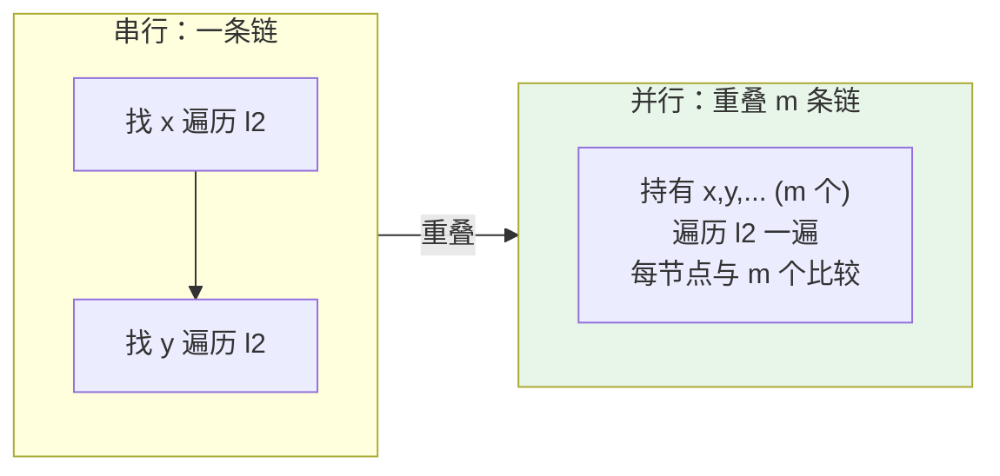

**代码结构**：一个**模板函数，整数参数 `m`** 表示同时搜的元素数。先算 l1 长度；主循环一次处理 m 个元素（从 l1 抓 m 个值进临时 `vals` 数组，然后遍历 l2 与这 m 个都比较），外加一个从 baseline 复制的**余数循环**处理 l1 长度不是 m 倍数时的剩余元素。

### 优化结果

| 指标 | 结果 |
|------|------|
| 加速比 | **6×**（重叠 **4 条**依赖链） |

> 加分：调 `m` 找最优值。本地实测（[dependency_chains_1.md](dependency_chains_1.md)）为 3.6×。

### 关键结论

- 依赖链是唯一无法靠加硬件消除的瓶颈；软件的对策是**重叠多条独立链**（并行处理多个元素）。
- 动手前先**定位关键依赖链**，别在次要路径上白费力气。

---

# 附录

## 附录 A. TMA 自顶向下分析速查

TMA（Top-down Microarchitecture Analysis）把「一个物理核每周期可发射一条 μOP 的位置」称为 **pipeline slot（流水线槽）**，据此把执行槽分成四类：

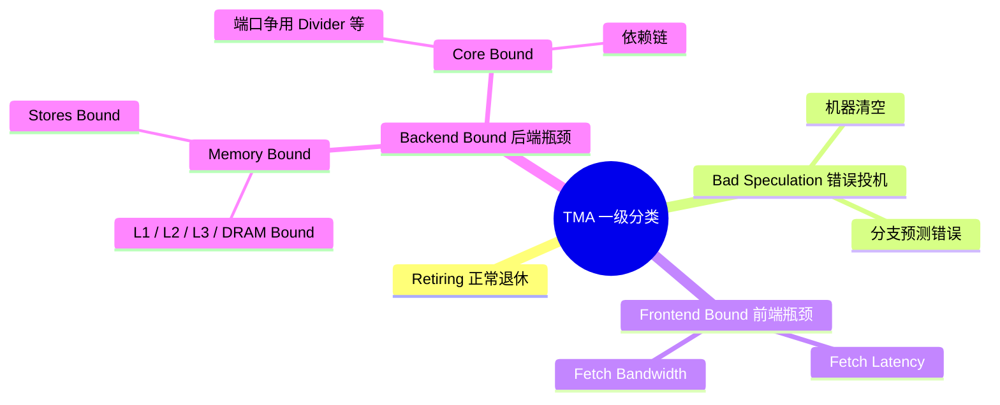

| 层级 | 命令 | 输出示例 |
|------|------|----------|
| 一级 | `perf stat --topdown -a -- taskset -c 0 ./bench` | `Retiring / Bad Speculation / Frontend Bound / Backend Bound` 占比 |
| 二级 | `toplev -l2 --core S0-C0 -- ./bench` | `Backend_Bound.Memory_Bound` / `Backend_Bound.Core_Bound` |
| 三级 | `toplev -l3 --core S0-C0 -- ./bench` | `Memory_Bound.L3_Bound` / `Memory_Bound.DRAM_Bound` |
| 定位 | `perf record` / `perf record -e <event>` | 定位到函数与源码行 |

> 详见 [tma.md](tma.md)。

## 附录 B. 性能分析工具清单

| 工具 | 用途 | 本课程出现的场景 |
|------|------|------------------|
| `perf stat --topdown` | TMA 一级分类 | 各实验瓶颈初判 |
| `toplev.py -l2/-l3` | TMA 二级/三级分类 | 细分 memory/core bound |
| `perf record` / `perf report` | 采样定位热点 | 定位到函数/源码行 |
| `perf c2c` | 缓存一致性争用（伪共享） | False Sharing 实验（HITM） |
| `perf record --run-sample` + `branch-mispredict` 事件 | 定位预测错误分支 | Lookup Tables 实验 |
| Intel VTune Profiler | 快照/热点/微架构探索 | GUI 分析备选 |
| Intel Advisor | Survey/Roofline/指令混合/步长分析 | Loop Interchange 1、Loop Tiling |
| `check_speedup.py` / `compare.py` | 对比 baseline 与 solution | 各实验验收 |

## 附录 C. 全课程关键数字汇总

| 主题 | 关键数字 |
|------|----------|
| 主存访问时延（最坏） | ~1000 cycles（可做 ~1000 次整数加法） |
| DRAM vs CPU 年提升 | ~7%/年 vs 20–50%/年 |
| 缓存层级 | 3 级；L1i/L1d 分离、L2/L3 统一；L3 10–50 MB（当时） |
| 分支预测 | 猜对省 ~3 cycles；猜错 flush ~15–20 cycles；常规 95%+ 正确 |
| L1 访问时延 | ~4 cycles（现代芯片） |
| 分支 mispredict 代价 | ~17 cycles（现代架构） |
| 依赖链 | 4 类 in-core 瓶颈中唯一无法靠加硬件消除 |

各实验加速比（**视频字幕口径** vs **本地实测 docs 口径**）：

| 实验 | 视频字幕口径 | 本地实测（docs） |
|------|-------------|------------------|
| warmup | ~10×+（口误「94×」） | 70× |
| data packing | ~1.3×（口误「~20×」） | 7.5× |
| loop interchange 1 | >6× | 6.9× |
| loop interchange 2 | >10× | 9.7× |
| vectorization 1 | ~5× | 2.1× |
| function inlining 1 | —（无字幕） | 1.63× |
| compiler intrinsics 1 | ~3× | 1.14× |
| sw prefetching 1 | ~54–55% | 3.1× |
| loop tiling 1 | 68/68/74% | 1.75× |
| lookup tables | ~8× | 1.87× |
| false sharing | ~8×（-90%） | 15.8× |
| lto | ~10% | 1.50× |
| pgo | 7100→6600 ms | ~1× |
| vectorization 2 | 10× | 20.9× |
| compiler intrinsics 2 | 显著提升 | 15.1× |
| dependency chains 1 | 6× | 3.6× |

> 字幕口径与本地口径差异主要来自**讲师机器 vs 用户机器、以及 lab 版本/数据规模不同**；两者趋势一致，绝对值不宜直接比较。

## 附录 D. 参考资源

- [perf-ninja（Performance Ninja 官方课程仓库）](https://github.com/dendibakh/perf-ninja)
- [Get Started（官方入门指南）](https://github.com/dendibakh/perf-ninja/blob/main/GetStarted.md)
- [《Performance Analysis and Tuning on Modern CPUs》（课程作者 Denis 著作）](https://products.easyperf.net/perf-book-2)
- [Intel Intrinsics Guide](https://www.intel.com/content/www/us/en/docs/intrinsics-guide/index.html)
- [Intel VTune Profiler User Guide](https://www.intel.com/content/www/us/en/docs/vtune-profiler/user-guide/2025-4/overview.html)
- 本仓库：[总索引](../README.md) · [TMA 方法论](tma.md) · [实验文档目录](../docs/) · [实验源码](../TMA/)
