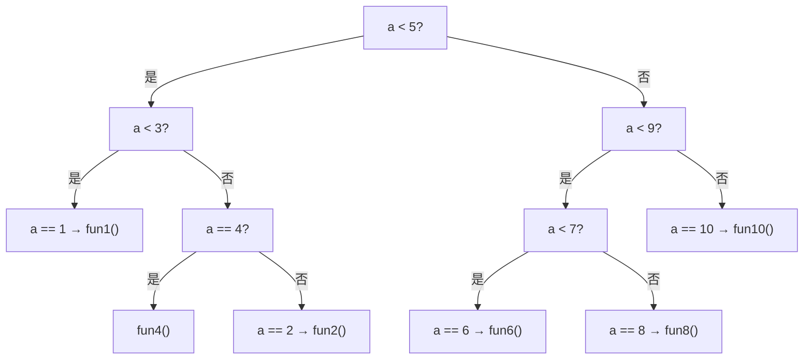

# 程序编写优化

- [程序编写优化](#程序编写优化)
  - [算法优化](#算法优化)
    - [排序算法对比](#排序算法对比)
    - [最大连续子向量和](#最大连续子向量和)
  - [数据结构优化](#数据结构优化)
    - [查找性能对比](#查找性能对比)
    - [数据类型优化](#数据类型优化)
    - [稀疏矩阵存储格式](#稀疏矩阵存储格式)
  - [过程级优化](#过程级优化)
    - [别名消除](#别名消除)
    - [常数传播](#常数传播)
    - [传参优化](#传参优化)
    - [内联优化](#内联优化)
    - [过程克隆](#过程克隆)
    - [全局变量优化](#全局变量优化)
  - [循环级优化](#循环级优化)
    - [循环不变量外提](#循环不变量外提)
    - [循环分布](#循环分布)
    - [循环展开](#循环展开)
    - [循环压紧](#循环压紧)
    - [循环合并](#循环合并)
    - [循环分段](#循环分段)
    - [循环分块](#循环分块)
    - [循环交换](#循环交换)
    - [循环分裂](#循环分裂)
    - [循环倾斜](#循环倾斜)
  - [语句级优化](#语句级优化)
    - [删除冗余语句](#删除冗余语句)
    - [代数变换](#代数变换)
    - [去除相关性](#去除相关性)
    - [公共子表达式优化](#公共子表达式优化)
    - [分支语句优化](#分支语句优化)

## 算法优化

算法是计算机解决问题的方法描述，由一系列求解问题的指令构成，能在有限时间内根据规范输入获得有效输出。

**算法复杂度**用于衡量算法所需的时间和空间：

| 复杂度量级   | 名称       | 执行效率 |
| ------------ | ---------- | -------- |
| $O(1)$       | 常数阶     | 最高     |
| $O(\log n)$  | 对数阶     | ↑        |
| $O(n)$       | 线性阶     | ↑        |
| $O(n\log n)$ | 线性对数阶 | ↑        |
| $O(n^2)$     | 平方阶     | ↓        |
| $O(2^n)$     | 指数阶     | ↓        |
| $O(n!)$      | 阶乘阶     | 最低     |

算法优化可从两方面入手：
1. **选择合适的算法**：不同场景下选择最优的算法策略
2. **优化算法本身**：减少算法复杂度，改进编码方式

### 排序算法对比

常用的排序算法分为基于比较的插入、选择、交换三类，以下介绍几种典型算法：

**冒泡排序**：通过相邻元素两两比较并交换，每次将最大元素"冒泡"到末尾。时间复杂度 $O(n^2)$，每次排序后仍继续下一轮比较，无效计算较多，仅适用于数据量较小的场景。

```c
void bubble_sort(int a[], int n) {
    int i, j, temp;
    for (j = 0; j < n - 1; j++) {
        for (i = 0; i < n - 1 - j; i++) {
            if (a[i] > a[i + 1]) {
                temp = a[i];
                a[i] = a[i + 1];
                a[i + 1] = temp;
            }
        }
    }
}
```

**直接插入排序**：将序列中的值插入已排序序列的对应位置。时间复杂度 $O(n^2)$，但在部分数据有序时效率优于冒泡排序。

```c
void insertSort(int *arr, size_t size) {
    for (int idx = 1; idx <= size - 1; idx++) {
        int end = idx;
        int temp = arr[end];
        while (end > 0 && temp < arr[end - 1]) {
            arr[end] = arr[end - 1];
            end--;
        }
        arr[end] = temp;
    }
}
```

**简单选择排序**：每次从待处理数据中选出最小元素，放到已排序序列末尾。比较次数为 $n(n-1)/2$，时间复杂度 $O(n^2)$，数据移动次数少，在数据量大时效率优于冒泡排序。

```c
void selectSort(int a[], int len) {
    int i, j, temp, minIndex;
    for (i = 0; i < len - 1; i++) {
        minIndex = i;
        for (j = i + 1; j < len; j++) {
            if (a[j] < a[minIndex]) minIndex = j;
        }
        if (minIndex != i) {
            temp = a[i];
            a[i] = a[minIndex];
            a[minIndex] = temp;
        }
    }
}
```

三种排序算法对比：

| 算法     | 平均时间复杂度 | 最坏时间复杂度 | 空间复杂度 | 特点                     |
| -------- | -------------- | -------------- | ---------- | ------------------------ |
| 冒泡排序 | $O(n^2)$       | $O(n^2)$       | $O(1)$     | 简单，无效比较多         |
| 插入排序 | $O(n^2)$       | $O(n^2)$       | $O(1)$     | 部分有序时效率高         |
| 选择排序 | $O(n^2)$       | $O(n^2)$       | $O(1)$     | 移动次数少，适合大数据量 |

### 最大连续子向量和

以**最大连续子向量和**问题为例，展示算法优化对性能的巨大影响。

给定向量 `(8, -33, 16, 9, -12, 45, 67)`，最大连续子向量和为 `x[3..6]` 的总和 `125`。

**方法一：暴力枚举** — $O(n^3)$

遍历所有子向量 `[i, j]`，对每个子向量求和并比较。

```c
for (int i = 0; i < n; i++) {
    for (int j = 0; j <= i; j++) {
        sum = 0;
        for (int k = j; k <= i; k++) {
            sum += x[k];
        }
        ans = max(ans, sum);
    }
}
```

**方法二：枚举优化** — $O(n^2)$

消除内层重复求和，利用累加变量保存之前的运算结果。

```c
for (int i = 0; i < n; i++) {
    sum = 0;
    for (int j = i; j < n; j++) {
        sum += x[j];
        maxsum = max(maxsum, sum);
    }
}
```

**方法三：分治算法** — $O(n\log n)$

将序列从中间分为左右两部分，分别递归求解左半部分最大子向量和 $A_1$、右半部分最大子向量和 $B_1$、跨越中间的最大子向量和 $C_1$，取三者最大值。

```c
// 跨越中点的最大子向量和
for (int i = mid; i >= 0; i--) {
    t += x[i];
    left = max(left, t);
}
int right = x[mid + 1];
t = 0;
for (int i = mid + 1; i <= r; i++) {
    t += x[i];
    right = max(right, t);
}
maxsum = max(maxsum, left + right);
```

**方法四：线性算法** — $O(n)$

从头到尾扫描数组，`f[i]` 表示以 `x[i]` 结尾的最大子向量和：要么是 `x[i]` 本身，要么是 `f[i-1] + x[i]`。

```c
for (int i = 1; i < n; i++) {
    f[i] = max(f[i - 1] + x[i], x[i]);
    maxsofar = max(f[i], maxsofar);
}
return maxsofar;
```

四种方法对比：

| 方法     | 时间复杂度   | 空间复杂度  | 思路             |
| -------- | ------------ | ----------- | ---------------- |
| 暴力枚举 | $O(n^3)$     | $O(1)$      | 三重循环遍历     |
| 枚举优化 | $O(n^2)$     | $O(1)$      | 累加消除内层循环 |
| 分治算法 | $O(n\log n)$ | $O(\log n)$ | 递归分治         |
| 线性算法 | $O(n)$       | $O(1)$      | 动态规划         |

从 $O(n^3)$ 到 $O(n)$，算法优化带来的性能提升远超编译器优化或硬件升级。

## 数据结构优化

数据结构分为**逻辑结构**和**存储结构**。逻辑结构描述数据元素之间的相互关系，是从具体问题抽象出的数学模型：

| 逻辑结构 | 说明               | 示例           |
| -------- | ------------------ | -------------- |
| 集合     | 数据元素无特殊关系 | 数学集合       |
| 线性     | 一对一关系         | 数组、链表、栈 |
| 树形     | 一对多关系         | 二叉树、B 树   |
| 图形     | 多对多关系         | 社交网络、路网 |

常用的数据存储结构各有优缺点：

| 数据结构 | 优点                   | 缺点                         |
| -------- | ---------------------- | ---------------------------- |
| 数组     | 插入快（尾部）         | 查找慢、删除慢、大小固定     |
| 有序数组 | 查找快（二分）         | 插入慢、删除慢、大小固定     |
| 栈       | 后进先出               | 存取其它项慢                 |
| 队列     | 先进先出               | 存取其它项慢                 |
| 链表     | 插入、删除快           | 查找慢                       |
| 二叉树   | 查找、插入、删除快     | 算法复杂                     |
| 哈希表   | 存取快、插入快、删除快 | 无关键字存取慢、空间利用率低 |
| 堆       | 插入快、删除快         | 对其它数据项存取慢           |
| 图       | 依据现实世界建模       | 算法复杂                     |

各数据结构的时间复杂度对比：

| 数据结构       | 查找        | 插入        | 删除        | 遍历   |
| -------------- | ----------- | ----------- | ----------- | ------ |
| 数组           | $O(N)$      | $O(1)$      | $O(N)$      | —      |
| 有序数组       | $O(\log N)$ | $O(N)$      | $O(N)$      | $O(N)$ |
| 链表           | $O(N)$      | $O(1)$      | $O(N)$      | —      |
| 有序链表       | $O(N)$      | $O(N)$      | $O(N)$      | $O(N)$ |
| 二叉树（一般） | $O(\log N)$ | $O(\log N)$ | $O(\log N)$ | $O(N)$ |
| 二叉树（最坏） | $O(N)$      | $O(N)$      | $O(N)$      | $O(N)$ |
| 平衡树         | $O(\log N)$ | $O(\log N)$ | $O(\log N)$ | $O(N)$ |
| 哈希表         | $O(1)$      | $O(1)$      | $O(1)$      | —      |

执行效率快的数据结构复杂度一般较高，但并非使用最快的结构就是最佳方案，需根据实际场景选择。

### 查找性能对比

以查找为例，对比有序数组（二分查找）与有序链表（顺序查找）的性能差异。

**有序数组二分查找**：每次将搜索范围缩小一半，时间复杂度 $O(\log N)$。

```c
int Bin_Search(int* num, int cnt, int target) {
    int first = 0, last = cnt - 1, mid;
    while (first <= last) {
        mid = (first + last) / 2;
        if (num[mid] > target)
            last = mid - 1;
        else if (num[mid] < target)
            first = mid + 1;
        else
            return 1;
    }
    return 0;
}
```

**有序链表顺序查找**：逐个遍历节点，时间复杂度 $O(N)$。

```c
int list_search(struct Node* list, int value) {
    for (struct Node* p = list->next; p; p = p->next) {
        if (p->value == value) return 1;
    }
    return 0;
}
```

测试结果（$10^7$ 个数据）：有序数组二分查找耗时 **0.048ms**，有序链表顺序查找耗时 **19ms**，性能差距约 400 倍。

### 数据类型优化

在满足精度要求的前提下，选择合适的数据类型也能提升性能：

**1. 选择更小的数据类型**

小尺寸类型访问速度更快，且缓存可容纳更多数据。使用 SSE 指令对比 `short`（16 位）与 `int`（32 位）的加法性能：

```c
for (int i = 0; i < N; i += 4) {
    x = _mm_loadu_si128((__m128i*)&op3[i]);
    y = _mm_loadu_si128((__m128i*)&op4[i]);
    z = _mm_add_epi32(x, y);
    _mm_store_si128((__m128i*)&result[i], z);
}
```

测试结果：SSE 指令处理 `short` 数据的速度比 `int` 快约 **2 倍**。

**2. 选择更适合硬件的数据类型**

单精度浮点运算通常比双精度快。以 256×256 矩阵乘法为例，使用 SSE 指令对比单精度与双精度性能：

```c
for (int k = n - 4; k >= 0; k -= 4) {
    t1 = _mm_loadu_ps(a[i] + k);
    t2 = _mm_loadu_ps(b[j] + k);
    t1 = _mm_mul_ps(t1, t2);
    sum = _mm_add_ps(sum, t1);
}
```

测试结果：单精度 **0.036s**，双精度 **0.068s**，加速比 **1.88 倍**。

### 稀疏矩阵存储格式

稀疏矩阵向量乘是科学计算的核心算法，不同存储格式对性能有显著影响。以如下 4×4 稀疏矩阵为例：

```
[1  5  0  0]
[0  2  6  0]
[8  0  3  7]
[0  9  0  4]
```

**坐标存储（COO）**：存储每个非零元素的行索引、列索引和数值，灵活简单。

```
row  = [0, 0, 1, 1, 2, 2, 2, 3, 3]
col  = [0, 1, 1, 2, 0, 2, 3, 1, 3]
data = [1, 5, 2, 6, 8, 3, 7, 9, 4]
```

```c
void spmv(int row[], int col[], DTYPE values[], DTYPE y[], DTYPE x[]) {
    for (int i = 0; i < SIZE; i++) y[i] = 0;
    for (int i = 0; i < NNZ; i++)
        y[row[i]] += values[i] * x[col[i]];
}
```

**行压缩存储（CSR）**：逐行压缩，记录每行首个非零元素位置，是最常用的稀疏矩阵格式。

```
ptr  = [0, 2, 4, 7, 9]       // 每行起始位置
col  = [0, 1, 1, 2, 0, 2, 3, 1, 3]
data = [1, 5, 2, 6, 8, 3, 7, 9, 4]
```

```c
void spmv(int ptr[], int col[], DTYPE data[], DTYPE y[], DTYPE x[]) {
    for (int i = 0; i < NUM_ROWS; i++) {
        DTYPE y0 = 0;
        for (int k = ptr[i]; k < ptr[i + 1]; k++)
            y0 += data[k] * x[col[k]];
        y[i] = y0;
    }
}
```

**对角存储（DIA）**：专为多条非零对角线组成的稀疏矩阵设计，每列存储一条对角线。

```
offsets = [-2, 0, 1]
data    = 稠密矩阵，每列对应一条对角线
```

```c
void spmv(DTYPE data[], int offsets[], DTYPE y[], DTYPE x[]) {
    for (int i = 0; i < SIZE - 1; i++) {
        int k = offsets[i];
        int Istart = max(0, -k);
        int Jstart = max(0, k);
        int N = min(SIZE - Istart, SIZE - Jstart);
        for (int j = 0; j < N; j++)
            y[Istart + j] += data[Istart + i * stride + j] * x[Jstart + j];
    }
}
```

**ELLPACK 存储**：每行最多 k 个非零值，存储于 m×k 的稠密矩阵中，空位用哨兵值填充。

```
indices = 稠密矩阵，存储列索引
data    = 稠密矩阵，存储非零值
```

```c
void spmv(DTYPE data[], int indices[], DTYPE y[], DTYPE x[]) {
    for (int n = 0; n < max_ncols; n++)
        for (int i = 0; i < num_rows; i++)
            if (data[n * num_rows + i] != X)
                y[i] += data[n * num_rows + i] * x[indices[n * num_rows + i]];
}
```

**四种格式对比：**

| 格式    | 优点                                  | 缺点                             |
| ------- | ------------------------------------- | -------------------------------- |
| COO     | 灵活简单，易于按行和按列访问          | 存储冗余（行列索引重复）         |
| CSR     | 压缩存储，行访问高效，最常用          | 动态修改困难                     |
| DIA     | 性能通常最优，适合对角线结构矩阵      | 需要补零，非零元素坐标需计算     |
| ELLPACK | 适合 GPU 并行，每行非零数接近时效率高 | 需要补零，非零元比例低时空间浪费 |

选择建议：
1. 通用场景优先选择 **CSR** 格式
2. 对角线结构矩阵选择 **DIA** 格式
3. 非零元比例较高且每行分布均匀时选择 **ELLPACK** 格式
4. 动态构建矩阵时选择 **COO** 格式
5. 每种格式都需要针对性的优化策略以获得最优性能

## 过程级优化

### 别名消除

C 语言中两个以上的指针可能引用相同的存储位置，编译器无法确定 `a[i]` 和 `b[i-1]` 是否指向同一内存，因此无法对循环做向量化等优化。使用 `restrict` 关键字告诉编译器指针不存在别名，编译器即可安全优化。

```c
// 未消除别名：编译器不敢优化，a[i] 和 b[i-1] 可能指向同一位置
void add(int* a, int* b) {
    int C = 5;
    for (int i = 0; i < N; i++)
        a[i] = b[i - 1] + C;
}

// 使用 restrict 消除别名：编译器可以做向量化等优化
void add(int* restrict a, int* restrict b) {
    int C = 5;
    for (int i = 0; i < N; i++)
        a[i] = b[i - 1] + C;
}
```

### 常数传播

常数传播是将表达式中已知的常数直接替换为计算结果，一般在编译前期进行。实际程序中可能存在复杂的控制流，编译器难以识别所有情况下的常数替换，因此建议优化人员尽量手动进行常数传播。

```c
// 优化前：每次循环都执行 a / 4
for (i = 0; i < n; i++) {
    x[i] = a / 4 + i;
}

// 优化后：手动将 a / 4 替换为常数 4
for (i = 0; i < n; i++) {
    x[i] = 4 + i;
}
```

### 传参优化

函数参数的传递方式和数量直接影响性能。优化要点：

1. **减少参数数量**：参数尽量控制在 4 个以内。超出部分通过结构体打包传递，减少寄存器溢出到栈的开销。
2. **选择合适的传递方式**：小参数（基本类型）用值传递，大结构体用指针传递，避免不必要的内存拷贝。
3. **使用 `const` 修饰**：对不修改的参数使用 `const` 修饰，帮助编译器分析别名关系，利于后续优化。

```c
// 优化前：参数过多，部分参数会溢出到栈上，增加访存开销
void compute(float *a, float *b, float *c, float *d,
             int n, int m, float alpha, float beta) {
    for (int i = 0; i < n; i++)
        a[i] = alpha * b[i] + beta * c[i] + d[i];
}

// 优化后：将相关参数打包为结构体，减少参数数量
struct Params { int n, m; float alpha, beta; };
void compute(float *a, float *b, float *c, float *d,
             const struct Params *p) {
    for (int i = 0; i < p->n; i++)
        a[i] = p->alpha * b[i] + p->beta * c[i] + d[i];
}
```

### 内联优化

内联优化将被调函数体直接复制到调用处，消除函数调用的时空开销。同时形参被替换为实参，为后续优化（如常数传播）创造更多机会。

```c
// 优化前：循环中调用 func1，每次都有函数调用开销
void func1(int* x, int k) {
    x[k] = x[k] + k;
}
for (i = 0; i < n; i++)
    func1(&a[0], i);

// 优化后：func1 内联替换，消除调用开销
for (i = 0; i < n; i++)
    a[i] = a[i] + i;
```

### 过程克隆

过程克隆是指当一个过程在不同调用环境下表现出不同特性时，生成该过程的多个实现版本，便于针对每个版本进行不同的优化。调用点根据上下文属性选择调用某个版本。

```c
// 原始函数：j 值不同导致循环次数和访问模式不同
void func(int *A, int j) {
    int k = 1;
    for (int i = 0; i < N - j; i++) {
        A[i + j] = A[i] + k;
    }
}

// 过程克隆：生成两个版本，分别针对不同场景优化
void func1(int *A, int j) {
    int k = 1;
    for (int i = 0; i < N - j; i++) {
        A[i + j] = A[i] + k;  // j 较大时使用此版本
    }
}

void func2(int *A, int j) {
    int k = 1;
    for (int i = 0; i < N; i++) {
        A[i + j] = A[i] + k;  // j 较小时可向量化优化
    }
}

// 调用点根据上下文选择版本
j = rand() % 10;
if (j == 0 || j > 4)
    func2(A, j);
else
    func1(A, j);
```

### 全局变量优化

全局变量尤其是多个文件共享的全局数据结构会阻碍编译器优化，且使程序员难以追踪其变化。对于并行程序，全局变量除非迫不得已不建议使用，尽量通过参数传递的方式替代。

```c
// 优化前：直接使用全局变量，编译器无法优化，难以追踪变化
int a = 1;
void func() {
    int c = 14;
    a = a + c;
}

// 优化后：通过参数传递，编译器可进行优化
int a = 1;
void func(int *a) {
    int c = 14;
    *a = *a + c;
}
int main() {
    func(&a);
    printf("%d", a);
}
```

## 循环级优化

### 循环不变量外提

循环不变量是指在循环迭代空间内值不发生变化的变量。由于其值在循环中不变，可将其外提到循环外仅计算一次，避免重复计算，削弱计算强度。

```c
// 优化前：dt * dt、W[i] * W[i] 在每次迭代中重复计算
for (int i = 1; i < N; i++)
    for (int j = 1; j < M; j++)
        U[i] = U[i] + W[i] * W[i] * D[j] / (dt * dt);

// 优化后：将循环不变量外提
T1 = 1 / (dt * dt);
for (int i = 1; i < N; i++) {
    T2 = W[i] * W[i];
    for (int j = 1; j < M; j++)
        U[i] = U[i] + T2 * D[j] * T1;
}
```

### 循环分布

循环分布将一个循环分解为多个具有相同迭代空间的循环，每个循环只包含原循环的语句子集。通过循环分布可以减少指令缓存压力，增加寄存器重用，常用于分解出可向量化或可并行化的循环。

```c
// 优化前：S1 有循环依赖，S2 无依赖，混合在一起无法向量化
for (i = 1; i < N; i++) {
    A[i + 1] = A[i] + C;   // S1: 有循环依赖
    B[i] = B[i] + D;       // S2: 无依赖
}

// 优化后：分布为两个循环，S2 部分可向量化
for (i = 1; i < N; i++)
    A[i + 1] = A[i] + C;
ymm0 = _mm_set_ps(D, D, D, D);
for (i = 0; i < N / 4; i++) {
    ymm1 = _mm_load_ps(B + 4 * i);
    ymm2 = _mm_add_ps(ymm0, ymm1);
    _mm_storeu_ps(B + 4 * i, ymm2);
}
```

### 循环展开

循环展开将循环体内的代码复制多次，减少循环分支指令执行次数，增大处理器指令调度空间，获得更多指令级并行。

```c
// 优化前
for (i = 0; i < N; i++) {
    for (j = 0; j < N; j++) {
        A[i][j] = A[i][j] + B[i][j] * C[i][j];
    }
}

// 优化后：内层循环展开 4 次
for (i = 0; i < N; i++) {
    for (j = 0; j < N; j += 4) {
        A[i][j]     = A[i][j]     + B[i][j]     * C[i][j];
        A[i][j + 1] = A[i][j + 1] + B[i][j + 1] * C[i][j + 1];
        A[i][j + 2] = A[i][j + 2] + B[i][j + 2] * C[i][j + 2];
        A[i][j + 3] = A[i][j + 3] + B[i][j + 3] * C[i][j + 3];
    }
}
```

### 循环压紧

循环压紧将多层嵌套循环合并为更少层的循环，减少循环开销，提升数据局部性。

```c
// 优化前：双层循环
for (i = 0; i < N; i++)
    x[i] = a[i] + b[i];
for (i = 0; i < N; i++)
    y[i] = a[i] - b[i];

// 优化后：合并为单层循环，减少迭代开销，增强寄存器重用
for (i = 0; i < N; i++) {
    x[i] = a[i] + b[i];
    y[i] = a[i] - b[i];
}
```

### 循环合并

循环合并将具有相同迭代空间的两个循环合成一个循环，减小循环迭代开销及并行化的启动和通信开销，还可能增强寄存器重用。但并非所有循环都可合并，需满足合法性要求。

```c
// 优化前：两个独立循环
for (i = 1; i < N; i++)
    A[i] = B[i] + C;
for (i = 1; i < N; i++)
    D[i] = A[i + 1] + E;

// 优化后：合并为一个循环（需确保 S1 和 S2 无依赖冲突）
for (i = 1; i < N; i++) {
    A[i] = B[i] + C;
    D[i] = A[i + 1] + E;
}
```

### 循环分段

循环分段将单层循环变换为多层嵌套循环，段长可根据需要选取。通常用于实现外层并行化以及内层向量化，以利用系统多层次并行资源。

```c
// 优化前
for (i = 0; i < N; i++)
    A[i] = B[i] + C[i];

// 优化后：分段 + 向量化
int K = 32;
for (i = 0; i < N; i += K) {
    for (j = i; j < i + K - 1; j += 4) {
        ymm0 = _mm_load_ps(B + j);
        ymm1 = _mm_load_ps(C + j);
        ymm2 = _mm_add_ps(ymm0, ymm1);
        _mm_storeu_ps(A + j, ymm2);
    }
}
```

### 循环分块

循环分块通过增加循环嵌套维度来提升数据局部性，是对多重循环迭代空间的重新划分。循环分块是循环交换和循环分段的结合，将控制分段迭代的循环移到最外层，使单次迭代数据量大幅减少，减少从主存取数的时间。

以矩阵乘法 `C = A × B` 为例，分块后内层数据可完全放入缓存，减少 cache miss：

```c
// 优化前：逐行逐列访问，B[k][j] 的访问跨行，cache 利用率低
for (i = 0; i < N; i++)
    for (j = 0; j < N; j++)
        for (k = 0; k < N; k++)
            C[i][j] += A[i][k] * B[k][j];

// 优化后：分块大小 B 与缓存容量匹配，子块数据常驻缓存
int B = 32;
for (jj = 0; jj < N; jj += B)
    for (kk = 0; kk < N; kk += B)
        for (i = 0; i < N; i++)
            for (j = jj; j < min(jj + B, N); j++) {
                double sum = C[i][j];
                for (k = kk; k < min(kk + B, N); k++)
                    sum += A[i][k] * B[k][j];
                C[i][j] = sum;
            }
```

### 循环交换

循环交换是重排序变换，在向量化、并行化识别以及增强数据局部性方面起重要作用。将携带依赖的循环放在最内层，使可重用的值保留在寄存器中。

```c
// 优化前：最内层循环 i 上 A[i][j] 有依赖，无法向量化
for (j = 0; j < N; j++)
    for (k = 0; k < N; k++)
        for (i = 0; i < N; i++)
            A[i][j] = A[i][j] + B[i][k] * C[k][j];

// 优化后：交换 i 和 k，将依赖循环 i 移到最内层
for (j = 0; j < N; j++)
    for (i = 0; i < N; i++)
        for (k = 0; k < N; k++)
            A[i][j] = A[i][j] + B[i][k] * C[k][j];

// 寄存器重用示例：将携带依赖的循环 i 放在最内层
// 优化前
for (i = 1; i < M; i++)
    for (j = 1; j < N; j++)
        A[i][j] = A[i - 1][j];

// 优化后：交换 i 和 j，A[i-1][j] 保留在寄存器中
for (j = 1; j < N; j++)
    for (i = 1; i < M; i++)
        A[i][j] = A[i - 1][j];
```

### 循环分裂

循环分裂将循环的迭代次数拆分成多段，每段有独立的循环体，常用于消除循环中的条件判断或处理边界情况。

```c
// 优化前：循环中 Vec[M] 在 i == M 时产生不必要的自引用
for (i = 1; i < N; i++)
    Vec[i] = Vec[i] + Vec[M];

// 优化后：分裂为两段，跳过 i == M 的情况
for (i = 1; i < M; i++)
    Vec[i] = Vec[i] + Vec[M];
for (i = M + 1; i < N; i++)
    Vec[i] = Vec[i] + Vec[M];
```

### 循环倾斜

循环倾斜是对循环迭代空间进行仿射变换，将非矩形的依赖关系转换为可并行化的形式，常用于三角循环的优化。

```c
// 优化前：三角循环，依赖关系为非矩形，难以并行化
for (i = 1; i < N; i++)
    for (j = 1; j <= i; j++)
        A[i][j] = A[i][j] + A[i - 1][j - 1];

// 优化后：循环倾斜，令 t = i, j' = j - i，依赖变为可并行化形式
for (t = 1; t < N; t++)
    for (j = 1; j <= t; j++)
        A[t][j] = A[t][j] + A[t - 1][j - 1];

// 进一步：将倾斜后的循环交换，使内层无依赖，可向量化
for (j = 1; j < N; j++)
    for (i = j; i < N; i++)
        A[i][j] = A[i][j] + A[i - 1][j - 1];
```

## 语句级优化

### 删除冗余语句

程序中可能存在死代码（未被执行的代码）或声明但未使用的变量，删除这些冗余语句可避免不相关的运算，减少运行时间。

```c
// 优化前：if-else 和中间赋值都是冗余代码
int a = 1, b = 2;
int c, d;
if (b > 0)
    c = a + b;
else
    c = a - b;
d = c + 1;
d = a + 2;  // 语句 S：d 最终只取决于此行

// 优化后：删除冗余语句
int a = 1, b = 2;
int d;
d = a + 2;
```

### 代数变换

利用代数恒等式简化表达式，减少运算次数。原语句含乘法、加法和除法三种运算，简化后仅需一次乘法。

```c
// 优化前：含乘法、加法、除法
int a = 2, b = 3;
a = (a + a) + (6 * a) / 2;
b = (b + b) + (6 * b) / 2;

// 优化后：代数化简，仅需乘法
int a = 2, b = 3;
a = 5 * a;
b = 5 * b;
```

### 去除相关性

语句间的依赖关系不利于语序调整、向量化等优化。由于编译器优化的局限性，需要优化人员尽量手动消除依赖关系。

**标量扩展**：将循环中的标量引用替换为临时数组引用，消除因内存单元重用导致的依赖。

```c
// 优化前：标量 T 导致循环迭代间有依赖
for (int i = 1; i < N; i++) {
    T = A[i];
    A[i] = B[i];
    B[i] = T;
}

// 优化后：标量扩展为数组，消除依赖
for (int i = 0; i < N; i++) {
    T[i] = A[i];
    A[i] = B[i];
    B[i] = T[i];
}
```

**标量重命名**：引入不同变量替代同一标量，消除输出依赖和真依赖。

```c
// 优化前：标量 T 引起 S1-S3 输出依赖、S1-S2 真依赖
T = 2;          // S1
y = T + T;      // S2
T = a - b;      // S3: 输出依赖 S1
z = T * T;      // S4

// 优化后：引入 T1 消除依赖
T = 2;          // S1
y = T + T;      // S2
T1 = a - b;     // S3: 无依赖
z = T1 * T1;    // S4
```

**数组重命名**：数组存储单元被重用会导致不必要的反依赖和输出依赖，可通过数组重命名消除。

```c
// 优化前：A[i] 在 S1 和 S3 间存在输出依赖
for (int i = 1; i < N; i++) {
    A[i] = A[i - 1] + X;  // S1
    Y[i] = A[i] + Z;      // S2
    A[i] = B[i] + C;      // S3: 输出依赖 S1
}

// 优化后：引入 A1 消除依赖
for (int i = 1; i < N; i++) {
    A1[i] = A[i - 1] + X;  // S1
    Y[i] = A1[i] + Z;      // S2
    A[i] = B[i] + C;       // S3: 无依赖
}
```

> 数组重命名需要与数组大小成比例的额外内存空间，安全性和收益比标量重命名复杂，实施数组重命名时应更加谨慎。

### 公共子表达式优化

当表达式中包含多个相同的子表达式时，仅需计算一次即可。

```c
// 优化前：a + b 计算了三次
int a = 1, b = 5;
if ((a + b) > 3 && (a + b) < 10) {
    a = a + b;
}

// 优化后：a + b 只计算一次
int a = 1, b = 5;
int tmp = a + b;
if (tmp > 3 && tmp < 10) {
    a = tmp;
}
```

### 分支语句优化

**合并判断条件**：将复杂分支判断条件合并为临时变量，简化分支判断，提高流水线性能。

```c
// 优化前：复杂条件表达式
if ((a1 != 0) && (a2 != 0) && (a3 != 0)) {
    a = a + b;
}

// 优化后：合并为临时变量
int temp = (a1 && a2 && a3);
if (temp != 0) {
    a = a + b;
}
```

**生成选择指令**：某些平台支持三目运算的选择指令，可将分支指令替换为选择指令提升效率。

```c
// 优化前：分支跳转
if (a > 0)
    x = a;
else
    x = b;

// 优化后：选择指令，消除分支
x = (a > 0 ? a : b);
```

**运用条件编译**：宏条件在编译时确定，编译器直接忽略不成立的分支，效率优于运行时分支判断。

```c
// 条件编译：编译时判断，不成立的分支不生成代码
#ifdef ON_ARM
void platform_f() { printf("ON_ARM\n"); }
#endif
#ifdef ON_X86
void platform_f() { printf("ON_X86\n"); }
#endif
```

**移除分支语句**：将各分支路径的计算结果放入查找表，将分支跳转转化为表索引访问。

```c
// 优化前：多分支判断
if (score >= 90) printf("A");
else if (score >= 80) printf("B");
else if (score >= 70) printf("C");
else printf("D");

// 优化后：查表法，消除分支
char s[] = {'D', 'D', 'D', 'D', 'D', 'D', 'D', 'C', 'B', 'A'};
printf("%c", s[score / 10]);
```

**平衡分支判断**：将线性的分支判断树转换为平衡树，减少最坏情况下的比较次数。

```c
// 优化前：线性判断，最坏情况需要 6 次比较
switch (a) {
    case 1: fun1(); break;
    case 2: fun2(); break;
    case 4: fun4(); break;
    case 6: fun6(); break;
    case 8: fun8(); break;
    case 10: fun10(); break;
}

// 优化后：平衡判断树，最坏情况仅需 4 次比较（见下方 Mermaid 图）
```


